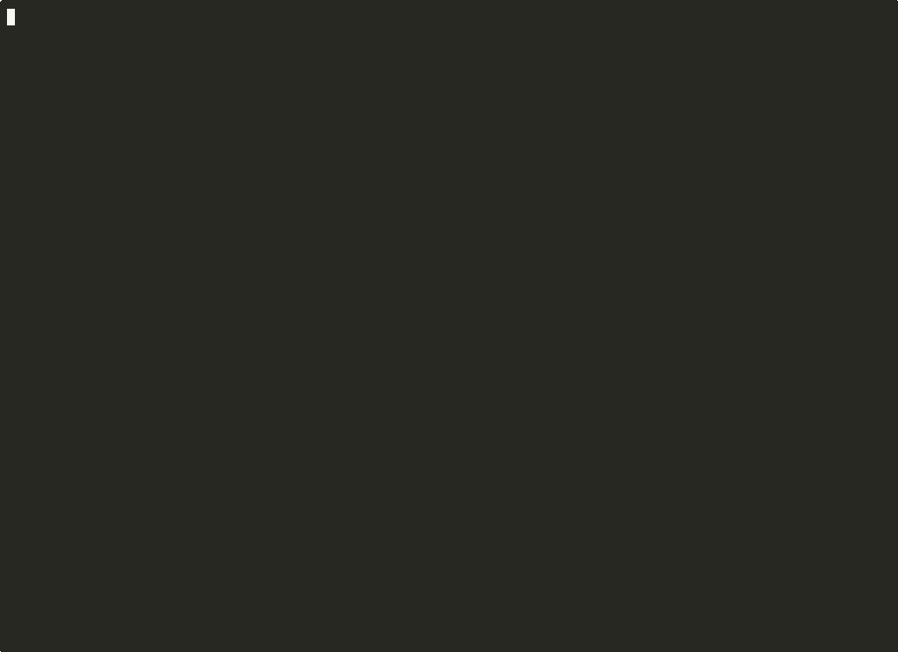

<div align="center">

<h1>Global Capacity Orchestrator (GCO)</h1>

<p><b><i>One API. Every Accelerator. Any Region.</i></b></p>

<p>Multi-region compute orchestration for AWS — NVIDIA GPUs, Trainium, Inferentia, and CPU (amd64 + arm64 / Graviton) — with capacity-aware scheduling, spot fallback, and multi-region autoscaling inference endpoints with automatic failover and latency-aware routing, all from a single REST API and CLI.</p>

<!-- BEGIN BADGE TABLE -->
<p>
  <a href="https://github.com/awslabs/global-capacity-orchestrator-on-aws/actions/workflows/unit-tests.yml"></a>
  <a href="https://github.com/awslabs/global-capacity-orchestrator-on-aws/actions/workflows/integration-tests.yml"></a>
  <a href="https://github.com/awslabs/global-capacity-orchestrator-on-aws/actions/workflows/security.yml"></a>
  <a href="https://github.com/awslabs/global-capacity-orchestrator-on-aws/actions/workflows/lint.yml"></a>
  <a href="https://awslabs.github.io/global-capacity-orchestrator-on-aws/"></a>
</p>
<!-- END BADGE TABLE -->

<details>
<summary>🎬 Live demo recording</summary>


*`gco` CLI demo: capacity discovery, cost visibility, 5 schedulers (Volcano, Kueue, YuniKorn, Slurm, KEDA), FSx, Valkey, live LLM inference, and EFS — all against one already-deployed cluster. ([source](demo/live_demo.sh) · [re-record](demo/record_demo.sh))*

</details>

<details>
<summary>📦 Deploy recording</summary>


*Fresh `gco stacks deploy-all -y` from a clean account ([re-record](demo/record_deploy.sh))*

</details>

<details>
<summary>🗑️ Destroy recording</summary>



*Full teardown with `gco stacks destroy-all -y` ([re-record](demo/record_destroy.sh))*

</details>

</div>

**Deploy everything and tear it all down with one command each:**

```bash
gco stacks deploy-all -y      # stand up every region defined in cdk.json
gco stacks destroy-all -y     # destroy every stack across every region — no orphaned resources
```

---

**What it does.** Spins up [EKS Auto Mode](https://docs.aws.amazon.com/eks/latest/userguide/automode.html) clusters across AWS regions, wired together with [Global Accelerator](https://aws.amazon.com/global-accelerator/) for latency-aware anycast routing and automatic failover. Submit Kubernetes manifests via a single REST API or CLI — GCO handles capacity-aware scheduling, spot fallback, multi-region autoscaling inference endpoints, and output persistence.

**Who it's for.** Teams running accelerated workloads — LLM training and inference, batch ML, HPC, and general CPU jobs — that need multi-region redundancy, automatic capacity discovery, and IAM-based access without per-cluster kubeconfig distribution. Pre-wired nodepools for NVIDIA GPUs (g4dn, g5, and ARM64 g5g), AWS Trainium, AWS Inferentia, and general-purpose CPU on both amd64 and arm64 / Graviton.

**Why it's different.** Capacity-aware routing across regions out of the box, full-stack observability (CloudWatch dashboards, alarms, SNS), and a CDK app validated across 20+ config matrix combinations in CI.

```bash
# Clone and install the CLI (macOS/Linux)
git clone git@github.com:awslabs/global-capacity-orchestrator-on-aws.git
cd global-capacity-orchestrator-on-aws && pipx install -e .
```

See the [Quick Start](#quick-start) for the full install + first-job walkthrough, or [`docs/CLI.md`](docs/CLI.md) for every CLI command.

> **💡 New to the codebase?** GCO ships with an [MCP server](mcp/) exposing 44 tools that index the whole project — docs, examples, source code, K8s manifests, scripts. Connect it to an AI-powered IDE (like [Kiro](https://kiro.dev)) and ask in natural language: *"How does region recommendation work?"*, *"Walk me through the inference deployment flow"*. See [mcp/README.md](mcp/README.md).

<details>
<summary><b>Table of contents</b></summary>

- [Why GCO?](#why-gco)
- [Quick Start](#quick-start)
- [Architecture Overview](#architecture-overview)
- [Key Features](#key-features)
- [Documentation](#documentation)
- [Project Structure](#project-structure)
- [Contributing](#contributing)
- [Support](#support)

</details>

## Why GCO?

Running GPU workloads at scale is hard. You need to find regions with available capacity, provision clusters, handle authentication, deal with failover, and persist outputs after pods terminate. GCO solves all of this with a single deployable platform.

| Challenge | Traditional Approach | With GCO |
|-----------|---------------------|--------------|
| GPU availability | Manually check each region | Auto-routes to available capacity |
| Node provisioning | Pre-provision or wait for scaling | EKS Auto Mode provisions on-demand |
| Multi-region ops | Manage clusters separately | Single API, automatic routing |
| Authentication | Configure per-cluster access | IAM-based, uses existing AWS credentials |
| Job outputs | Lost when pods terminate | Persisted to EFS/FSx storage |
| Inference serving | Deploy and manage per-region | Deploy once, serve globally |
| Failover | Manual intervention required | Automatic via Global Accelerator |

**When to use GCO:**
- You need to run GPU workloads (training, inference, batch processing)
- You want to deploy inference endpoints across multiple regions with a single command
- You want multi-region redundancy without managing multiple clusters
- You prefer IAM authentication over kubeconfig management
- You need job outputs to persist after completion

## Quick Start

### Install and Deploy

```bash
# Install the CLI
brew install pipx && pipx ensurepath  # macOS
pipx install -e .

# Deploy everything (CDK bootstrap runs automatically)
gco stacks deploy-all -y

# Optional: configure kubectl access (requires PUBLIC_AND_PRIVATE endpoint mode)
# The default endpoint mode is PRIVATE — see docs/CUSTOMIZATION.md for details.
# Most users don't need this; submit jobs via SQS or API Gateway instead.
# gco stacks access -r us-east-1
```

### Submit Your First Job

```bash
# Check GPU capacity
gco capacity check --instance-type g4dn.xlarge --region us-east-1

# Submit a job (pick your preferred method)
gco jobs submit-sqs examples/simple-job.yaml --region us-east-1    # via SQS (recommended)
gco queue submit examples/simple-job.yaml --region us-east-1       # via Global DynamoDB queue
gco jobs submit examples/simple-job.yaml -n gco-jobs               # via API Gateway
gco jobs submit-direct examples/simple-job.yaml -r us-east-1       # via kubectl

# Check status and get logs
gco jobs list --all-regions
gco jobs logs hello-gco -n gco-jobs -r us-east-1
```

### Deploy an Inference Endpoint

```bash
gco inference deploy my-llm -i vllm/vllm-openai:v0.20.0 --gpu-count 1
gco inference status my-llm
gco inference scale my-llm --replicas 3
```

See the [Quick Start Guide](QUICKSTART.md) for the full step-by-step walkthrough, or the [CLI Reference](docs/CLI.md) for all available commands.

## Architecture Overview

<details>
<summary>📊 Full Architecture Diagram (click to expand)</summary>


</details>

Regenerate this diagram and every per-stack view on demand with `python diagrams/generate.py` — it synthesises the current CDK app through AWS PDK cdk-graph so the diagrams never drift from the source. See [`diagrams/README.md`](diagrams/README.md) for per-stack flags (`--stack global|api-gateway|regional|regional-api|monitoring|all`).

> The regional stack can be deployed to any AWS region. Add or remove regions by editing the `deployment_regions.regional` array in `cdk.json`.

```
┌───────────────────────────────────────────────────┐
│              User Request                         │
│        (AWS SigV4 Authentication)                 │
└────────────────────┬──────────────────────────────┘
                     │
                     ▼
┌───────────────────────────────────────────────────┐
│      API Gateway (Edge-Optimized, Global)         │
│      ✓ IAM Authentication Required                │
│      ✓ CloudFront Edge Caching                    │
└────────────────────┬──────────────────────────────┘
                     │
                     ▼
┌───────────────────────────────────────────────────┐
│              AWS Global Accelerator               │
│         Routes to nearest healthy region          │
└────────────────────┬──────────────────────────────┘
                     │
        ┌────────────┼────────────┬────────────┐
        │            │            │            │
   ┌────▼────┐  ┌────▼────┐  ┌────▼────┐  ┌────▼────┐
   │us-east-1│  │us-west-2│  │eu-west-1│  │  More   │
   │   ALB   │  │   ALB   │  │   ALB   │  │ Regions │
   │(GA IPs  │  │(GA IPs  │  │(GA IPs  │  |(GA IPs  │
   │  only)  │  │  only)  │  │  only)  │  |  only)  │
   └────┬────┘  └────┬────┘  └────┬────┘  └────┬────┘
        │            │            │            │
   ┌────▼────────────▼────────────▼────────────▼────┐
   │    EKS Auto Mode Cluster (per region)          │
   │  ┌─────────────────────────────────────────┐   │
   │  │  Nodepools: System, General, GPU (x86   │   │
   │  │  + ARM), Inference                      │   │
   │  ├─────────────────────────────────────────┤   │
   │  │  Services: Health Monitor, Manifest     │   │
   │  │  Processor, Inference Monitor           │   │
   │  ├─────────────────────────────────────────┤   │
   │  │  Storage: EFS (shared) + FSx (optional) │   │
   │  └─────────────────────────────────────────┘   │
   └────────────────────────────────────────────────┘
```

### Security Model

Five layers protect every request:

1. **IAM Authentication** — API Gateway validates AWS credentials (SigV4)
2. **Secret Header** — Lambda injects a rotating token from Secrets Manager
3. **IP Restriction** — ALBs only accept Global Accelerator IPs
4. **Header Validation** — Backend services verify the secret token
5. **IRSA** — Pods use IAM roles for AWS access (no static credentials)

```
Request flow: User → API Gateway (SigV4) → Lambda (adds secret) → Global Accelerator
  → ALB (GA IPs only) → Services (validate secret)
```

For private clusters, [Regional API Gateways](docs/CUSTOMIZATION.md#regional-api-gateway-private-access) provide direct VPC access without public ALB exposure.

See [Architecture Details](docs/ARCHITECTURE.md) for the full deep dive.

## Key Features

### Compute & Orchestration
- **EKS Auto Mode** with automatic node provisioning — no pre-scaling needed
- **GPU support** for x86_64 (g4dn, g5) and ARM64 (g5g) via Karpenter nodepools
- **Multiple submission methods**: API Gateway, SQS queues, DynamoDB job queue, or direct kubectl
- **Job pipelines (DAGs)**: Multi-step ML pipelines with dependency ordering and failure handling
- **Helm-managed ecosystem**: KEDA, Volcano, KubeRay, Kueue, GPU Operator, DRA, and more — configurable via `cdk.json`

### Inference Serving
- **Multi-region inference**: Deploy endpoints (vLLM, TGI, Triton, TorchServe, SGLang) across regions with a single command
- **Canary deployments**: A/B test new model versions with weighted traffic routing
- **Model weight management**: Central S3 bucket with KMS encryption, automatic sync to each region
- **Spot instance support**: Run inference on spot GPUs for significant cost savings
- **Autoscaling**: HPA-based scaling with CPU/memory metrics

### Networking & Security
- **Global Accelerator**: Single anycast endpoint with automatic failover
- **IAM authentication**: SigV4 at the API Gateway — no kubeconfig distribution
- **Compliance validated**: CDK-nag checks for AWS Solutions, HIPAA, NIST 800-53, PCI DSS
- **Network policies**: Default-deny with explicit allow rules for all service communication
- **EFA support**: Optional Elastic Fabric Adapter for high-bandwidth distributed training and NIXL-based inference (toggle on/off)

### Storage & Data
- **EFS**: Shared elastic storage for job outputs that persist after pod termination
- **FSx for Lustre**: Optional high-performance parallel file system for ML training (toggle on/off)
- **Valkey cache**: Optional serverless key-value cache for prompt caching and session state
- **Aurora pgvector**: Optional serverless vector database for RAG, semantic search, and embedding storage

### Operations
- **Cost visibility**: Track spend by service, region, and workload via Cost Explorer integration
- **Auto-bootstrap**: CDK bootstrap runs automatically for new regions during deploy
- **Multi-region monitoring**: CloudWatch dashboards, alarms, and SNS alerts across all regions

## Documentation

**New to GCO?** Start here:

| Your Goal | Read This |
|-----------|-----------|
| Understand what GCO does | [Core Concepts](docs/CONCEPTS.md) |
| Get running in under 60 minutes | [Quick Start Guide](QUICKSTART.md) |
| Learn the architecture | [Architecture Details](docs/ARCHITECTURE.md) |

**Day-to-day operations:**

| Your Goal | Read This |
|-----------|-----------|
| CLI commands and usage | [CLI Reference](docs/CLI.md) |
| Deploy inference endpoints | [Inference Guide](docs/INFERENCE.md) |
| Use the REST API directly | [API Reference](docs/API.md) |
| Fix issues | [Troubleshooting](docs/TROUBLESHOOTING.md) |
| Respond to incidents | [Operational Runbooks](docs/RUNBOOKS.md) |

**Customization and development:**

| Your Goal | Read This |
|-----------|-----------|
| Add regions, tune nodepools, enable FSx | [Customization Guide](docs/CUSTOMIZATION.md) |
| Choose a scheduler for your workload | [Schedulers & Orchestrators](docs/SCHEDULERS.md) |
| Configure the SQS queue processor | [Queue Processor Config](docs/CUSTOMIZATION.md#queue-processor-sqs-consumer) |
| Contribute to the project | [Contributing](CONTRIBUTING.md) |
| API client examples (Python, curl, AWS CLI) | [Client Examples](docs/client-examples/README.md) |
| IAM policy templates | [IAM Policies](docs/iam-policies/README.md) |
| Presentation slides and demo scripts | [Demo Starter Kit](demo/README.md) |

### Prerequisites

- AWS CLI configured with appropriate credentials
- Python 3.10+ and Node.js LTS (v24)
- AWS CDK CLI (`npm install -g aws-cdk`)
- Docker or Finch (for building container images)

Or skip local setup entirely with the dev container:

```bash
docker build -f Dockerfile.dev -t gco-dev .
docker run -it --rm -v ~/.aws:/root/.aws:ro -v $(pwd):/workspace -w /workspace gco-dev
```

## Project Structure

```
.
├── app.py                               # CDK app entry point
├── cdk.json                             # CDK configuration (regions, features, thresholds)
├── pyproject.toml                       # Project metadata, dependencies, and CLI installation
│
├── cli/                                 # GCO CLI (jobs, stacks, capacity, inference, costs, DAGs)
├── diagrams/                            # Auto-generated architecture diagrams
├── docs/                                # Documentation (architecture, CLI, API, inference, customization)
├── examples/                            # Example manifests (jobs, inference, Ray, Volcano, Kueue, Slurm, YuniKorn)
├── gco/
│   ├── config/                          # Configuration loader with validation
│   ├── models/                          # Data models for k8s clusters, health monitor, inference monitor and manifest processor
│   ├── services/                        # K8s services (health monitor, inference monitor, manifest processor, queue processor)
│   └── stacks/                          # CDK stacks (global, regional, API gateway, monitoring)
│       └── constants.py                 # Pinned versions: EKS addons, Lambda runtime, Aurora engine
│
├── lambda/                              # Lambda functions
│   ├── alb-header-validator/            # ALB header validation for auth tokens
│   ├── api-gateway-proxy/               # API Gateway → Global Accelerator proxy
│   ├── cross-region-aggregator/         # Cross-region job/health aggregation
│   ├── ga-registration/                 # Global Accelerator endpoint registration
│   ├── helm-installer/                  # Installs Helm charts (schedulers, GPU operators, cert-manager)
│   │   └── charts.yaml                  # Helm chart configuration (schedulers, GPU operators, cert-manager)
│   ├── kubectl-applier-simple/          # Applies K8s manifests during deployment
│   │   └── manifests/                   # Kubernetes manifests (nodepools, RBAC, services, storage)
│   ├── proxy-shared/                    # Shared utilities for proxy Lambdas
│   ├── regional-api-proxy/              # Regional API Gateway → internal ALB proxy
│   └── secret-rotation/                 # Daily secret rotation
│
├── mcp/                                 # MCP server for LLM interaction (44 tools wrapping the CLI)
├── scripts/                             # Utility scripts (version bump, cluster access setup)
└── tests/                               # PyTest + BATS test suites (counts tracked via badges)
```

## Contributing

See [CONTRIBUTING.md](CONTRIBUTING.md) for development setup, testing, the GitHub Actions CI/CD layout, release process, and dependency scanning schedules.

Quick start for contributors:

```bash
python3 -m venv .venv && source .venv/bin/activate
pip install -e ".[dev]"
pytest tests/ -v --cov=gco --cov=cli
```

## License

See the [LICENSE](LICENSE) file for details.

## Support

- Check [Troubleshooting](docs/TROUBLESHOOTING.md) for common issues
- Review CloudWatch logs for Lambda and EKS errors
- Open an issue on [GitHub](https://github.com/awslabs/global-capacity-orchestrator-on-aws/issues)

## Security

For security issues, **do not open a public GitHub issue.** See [`SECURITY.md`](.github/SECURITY.md) for the disclosure process.

---
