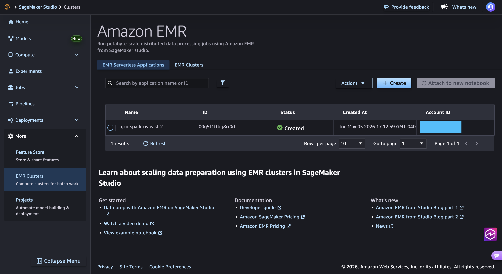
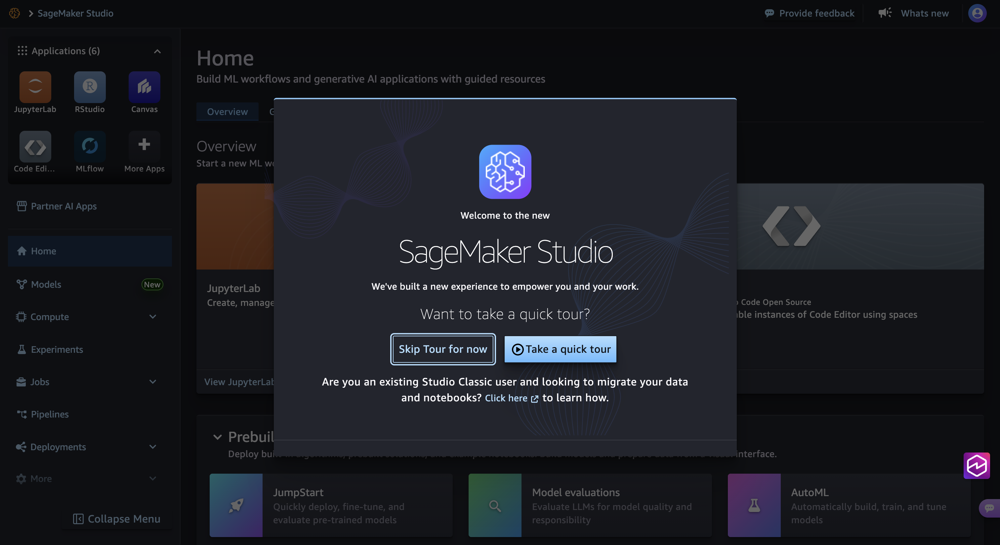
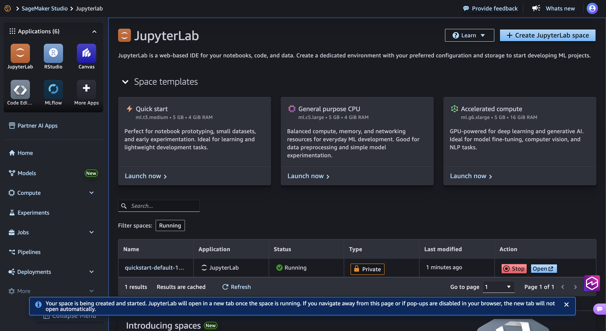
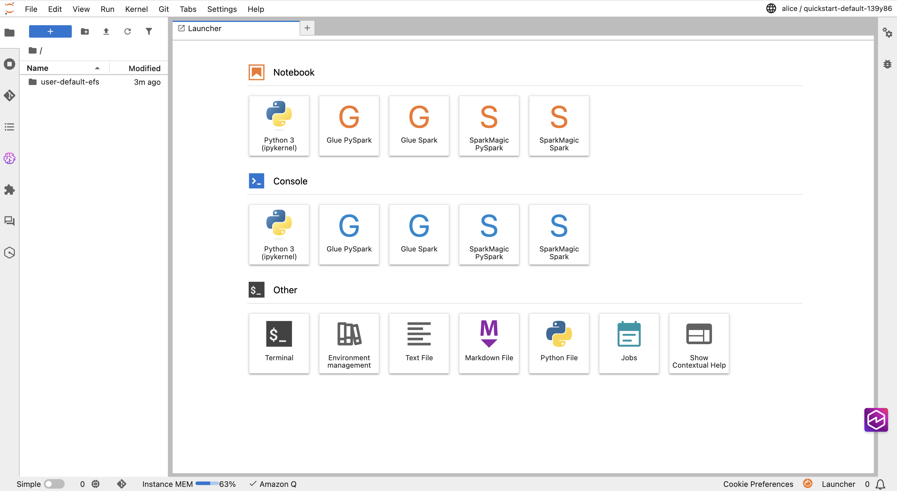
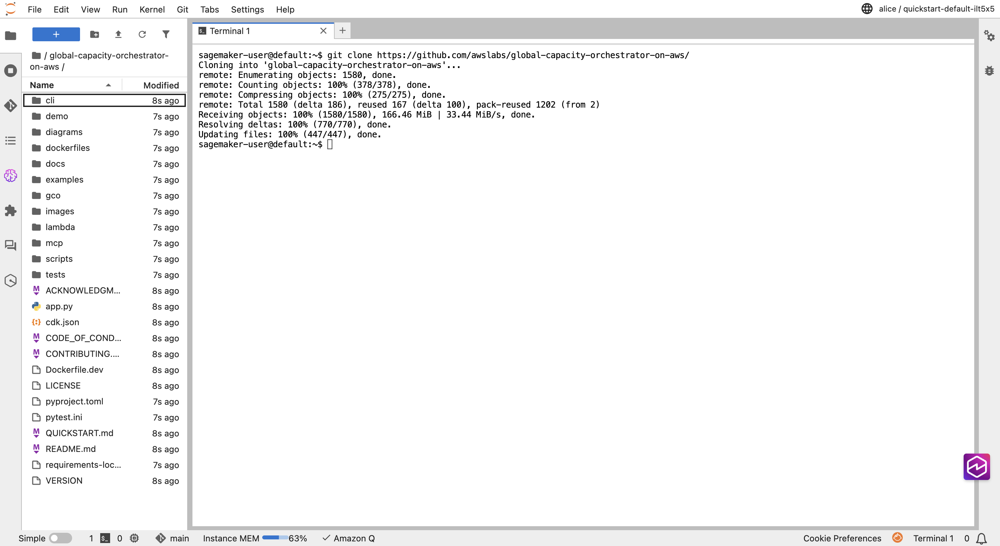
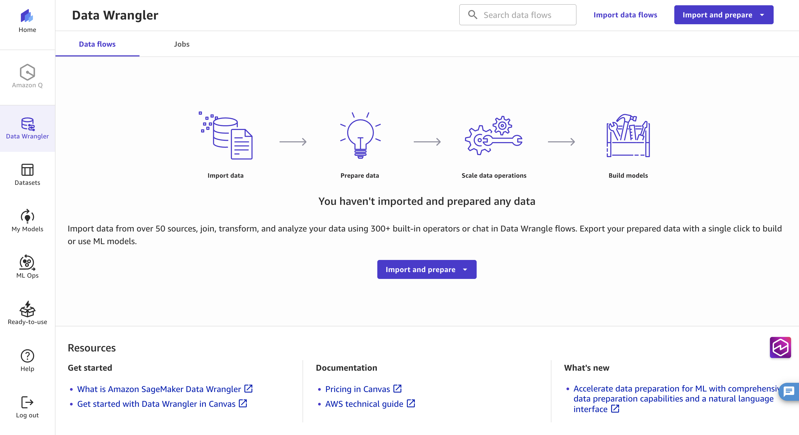
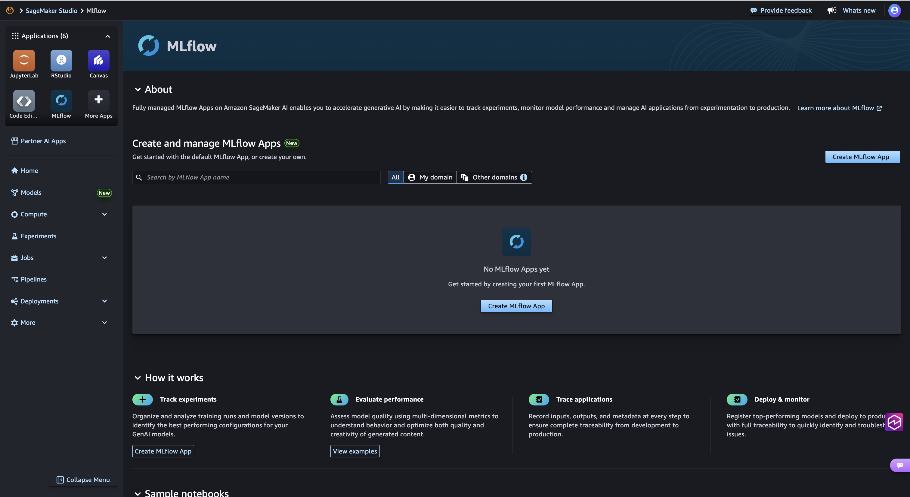

# Analytics Environment

End-to-end guide to the optional GCO analytics environment — a
SageMaker Studio domain plus EMR Serverless, Cognito user pool, and
presigned-URL API gateway route, bolted onto an existing GCO
deployment via a single toggle.

The analytics environment is **off by default**. Enable it only when
you want interactive notebook analytics; the rest of GCO works exactly
the same whether or not it is deployed. The always-on
`Cluster_Shared_Bucket` that cluster jobs read and write is **not**
part of this feature's toggle — it is always on regardless of whether
analytics is enabled. See
[`docs/CLUSTER_SHARED_BUCKET.md`](CLUSTER_SHARED_BUCKET.md) for that
bucket's reference.

## Table of Contents

> **Region placeholders.** The examples throughout this guide use
> `us-east-1` for regional clusters and `us-east-2` for the global /
> API-gateway region. Substitute your own regions wherever they appear
> — check `deployment_regions.regional` and
> `deployment_regions.api_gateway` in your `cdk.json` for the values
> that match your deployment.

- [Cost](#cost)
- [Default image](#default-image)
- [(a) What the analytics environment provisions](#a-what-the-analytics-environment-provisions)
- [(b) Enabling and deploying the stack](#b-enabling-and-deploying-the-stack)
- [(c) Managing Cognito users via the CLI](#c-managing-cognito-users-via-the-cli)
- [(d) Logging into Studio](#d-logging-into-studio)
- [(e) Optional user-driven install of GCO CLI and MCP server](#e-optional-user-driven-install-of-gco-cli-and-mcp-server)
- [(f) Using the GCO CLI once installed inside JupyterLab](#f-using-the-gco-cli-once-installed-inside-jupyterlab)
- [(g) Submitting HyperPod jobs when the sub-toggle is enabled](#g-submitting-hyperpod-jobs-when-the-sub-toggle-is-enabled)
- [(g2) Launching SageMaker Canvas when the sub-toggle is enabled](#g2-launching-sagemaker-canvas-when-the-sub-toggle-is-enabled)
- [(g3) Tracking experiments with managed MLflow](#g3-tracking-experiments-with-managed-mlflow)
- [(h) Opening the environment in Kiro](#h-opening-the-environment-in-kiro)
- [(i) Running the example cluster jobs and reading their output from a notebook](#i-running-the-example-cluster-jobs-and-reading-their-output-from-a-notebook)
- [(j) Two-bucket access model](#j-two-bucket-access-model)
- [(k) EFS persistent-home-folder behavior](#k-efs-persistent-home-folder-behavior)
- [(l) The `gco-cluster-shared-bucket` ConfigMap schema](#l-the-gco-cluster-shared-bucket-configmap-schema)
- [(m) Cross-region data-transfer caveat](#m-cross-region-data-transfer-caveat)

## Cost

The analytics environment is **off by default** and incurs zero cost
until you run `gco analytics enable` + `gco stacks deploy gco-analytics`.
When enabled, these resources drive cost:

- **SageMaker Studio** — per-user JupyterLab apps on `ml.t3.medium` by
  default. Charged per app-hour while the app is running. Shut idle
  apps down from the Studio UI to stop the meter.
- **EMR Serverless** — SPARK application, charged per vCPU-hour and
  GB-hour of actual job execution. Zero cost when no jobs are
  running.
- **KMS** — `Analytics_KMS_Key` ($1/month) and `Cluster_Shared_KMS_Key`
  ($1/month if you count it under this feature — it is actually owned
  by `gco-global` and always on). Plus per-request charges on key
  usage.
- **S3** — `Studio_Only_Bucket` and its access-logs bucket. Typical
  notebook usage is sub-dollar; the cost depends on how much data
  you stage.
- **Cognito** — The Lite tier includes 50,000 monthly active users (MAUs) for free (no automatic expiry). Advanced security features on the Essentials and Plus tiers are additional; see the [Amazon Cognito pricing page](https://aws.amazon.com/cognito/pricing/) for current rates. The new tier names (Lite / Essentials / Plus) landed in November 2024, so older blog posts may reference the legacy free-tier structure.
- **Lambda** — The presigned-URL Lambda is invoked once per Studio
  login. Effectively free at human-scale usage.
- **Studio_EFS** — Per-user home folders on EFS. Charged per GB-month
  of storage plus per-GB for IA-tier transitions.
- **VPC endpoints** — The analytics VPC creates interface endpoints
  for `SAGEMAKER_API`, `SAGEMAKER_RUNTIME`, `SAGEMAKER_STUDIO`,
  `SAGEMAKER_NOTEBOOK`, `STS`, `CLOUDWATCH_LOGS`, `ECR`, `ECR_DOCKER`,
  and `ELASTIC_FILE_SYSTEM`. Each interface endpoint is roughly
  $7/month per AZ plus per-GB processing. The gateway endpoint for
  `S3` is free.

To see the running cost:

```bash
gco costs summary --days 7
gco costs regions --days 7
```

Disable the feature at any time with `gco analytics disable` followed
by `gco stacks destroy gco-analytics`. The analytics resources are all
`RemovalPolicy.DESTROY` so destroy cleanly removes them without
orphaned retained resources (see section (l) for the opt-in retain
override on `Studio_EFS`).

A cleanup Lambda (`lambda/analytics-cleanup/`) runs automatically as a
CloudFormation custom resource during stack deletion. It removes all
SageMaker user profiles and EFS access points that were created at
runtime by the presigned-URL Lambda — resources CloudFormation doesn't
know about because they weren't in the original template. Control flow:
[interactive HTML](../diagrams/code_diagrams/lambda/analytics-cleanup/handler.handler.html) ·
[PNG](../diagrams/code_diagrams/lambda/analytics-cleanup/handler.handler.png).

## Default image

The Studio domain uses the **stock AWS-published SageMaker
Distribution image**. There is no custom image build, no
`sagemaker.CfnImage` resource, no ECR repository, and no Dockerfiles
in this repo for the Studio runtime. `DefaultUserSettings.JupyterLabAppSettings.CustomImages`
is explicitly empty, and that emptiness is a tested invariant.

If a user needs extra Python packages inside JupyterLab, install them
into `/home/sagemaker-user` using `pip install --user`:

```bash
pip install --user pandas pyarrow duckdb
```

Because `/home/sagemaker-user` is mounted from `Studio_EFS`, packages
installed this way **persist across JupyterLab app restarts and user
sessions**. No container image rebuild is required, and no operator
intervention is needed to support new libraries.

System-level tooling (for example, a binary published via `apt`) is
out of scope for this feature — use a shell-out to `subprocess` or a
vendored wheel instead.

## (a) What the analytics environment provisions

<details>
<summary>📊 Analytics stack architecture diagram (click to expand)</summary>


*Auto-generated from the CDK app via AWS PDK cdk-graph. Regenerate with `python diagrams/infra_diagrams/generate.py --stack analytics`.*

</details>

When `analytics_environment.enabled=true` and `gco-analytics` is
deployed, the following resources appear in the API-gateway region
(default `us-east-2`):

- **SageMaker Studio domain** (`gco-analytics-domain`) with
  `auth_mode=IAM` and `app_network_access_type=VpcOnly`. No public
  network exposure for notebooks.
- **EMR Serverless application** (`SPARK` type) pinned to
  `EMR_SERVERLESS_RELEASE_LABEL` from
  [`gco/stacks/constants.py`](../gco/stacks/constants.py).
  Once deployed, the application is visible from the Studio Data
  panel:

  

  Studio notebooks can submit Spark jobs to this application without
  any additional IAM plumbing. The SageMaker execution role carries
  the full submission surface
  (`emr-serverless:StartJobRun`, `GetJobRun`, `ListJobRuns`,
  `CancelJobRun`, `GetDashboardForJobRun`, `AccessLivyEndpoints`,
  plus the lifecycle actions on `Application`) so three paths work
  out of the box:

  1. **Studio's "Run on EMR Serverless" tile** — click-to-run from
     the Data panel; Studio auto-discovers the application in the
     same account/region and wires the presigned Livy endpoint for
     you. No code change to the notebook required.
  2. **SparkMagic `%%spark` kernel** — the built-in PySpark kernel
     uses `AccessLivyEndpoints` to open a remote Spark session on
     the EMR Serverless app and executes cells against it.
  3. **Native `boto3`** — for scripted pipelines, call
     `boto3.client("emr-serverless").start_job_run(...)` with the
     application id (published as a CfnOutput on `gco-analytics`)
     and `executionRoleArn=` set to the role the Studio kernel is
     already assuming. Job inputs can come from either
     `Cluster_Shared_Bucket` (cross-region read via the SageMaker
     role's grant) or `Studio_Only_Bucket`, and outputs can write
     back to either — no extra per-user IAM configuration needed.

  Because the application is idle between jobs you pay zero EMR
  Serverless cost when no jobs are running; charges start at the
  first `StartJobRun` and stop when the pre-initialized capacity
  times out. See the [EMR Serverless pricing
  page](https://aws.amazon.com/emr/serverless/pricing/) for the
  current per-vCPU and per-GB rates.

- **SageMaker-managed MLflow + MLflow Apps** — the SageMaker
  execution role is attached to the AWS-managed
  `AmazonSageMakerFullAccess` policy (always on when
  `analytics_environment.enabled=true`), plus an inline
  `sagemaker-mlflow:*` statement scoped to the api-gateway region.
  The managed policy covers both MLflow surfaces in Studio —
  the classic **MLflow Tracking Servers** (`sagemaker:*Mlflow*`
  control-plane actions) and the newer **MLflow Apps**
  (`sagemaker:CreateMlflowApp` / `ListMlflowApps` /
  `DescribeMlflowApp`) — along with the SageMaker Model Registry
  (`sagemaker:*ModelPackage*`) that MLflow's `register_model`
  round-trips through. The inline `sagemaker-mlflow:*` statement
  covers the data-plane namespace the MLflow SDK's SigV4 plug-in
  talks to (`log_metric`, `log_artifact`, `register_model`, etc.)
  — that service prefix is not in the managed policy. Notebook
  users can spin up a tracking server, log experiments, and
  register models directly from a Studio cell; Canvas's "Register
  model" flow writes to the same Model Registry. GCO does not
  pre-create the tracking server or app itself — the first
  `sagemaker.client.create_mlflow_tracking_server(...)` or
  `create_mlflow_app(...)` call (typically from `%%sh` or `boto3`
  inside a notebook) brings one up; the server / app is billed
  per hour it's running. See [section (g3)](#g3-tracking-experiments-with-managed-mlflow)
  for the end-to-end notebook workflow.

- **Cognito user pool** with a strong password policy (12+ chars,
  digits/symbols/uppercase required), SRP auth flow, and a hosted
  `UserPoolDomain` at prefix `gco-studio-<account>`.
- **Analytics VPC** — private-isolated subnets only, plus interface
  endpoints for the SageMaker, STS, CloudWatch Logs, ECR, and EFS
  services; gateway endpoint for S3.
- **Studio_EFS** — encrypted EFS file system for per-user home
  folders, one access point per Studio user profile.
- **Studio_Only_Bucket** — KMS-encrypted S3 bucket scoped to the
  SageMaker execution role only. Not accessible from cluster pods.
  Comes with a dedicated access-logs bucket.
- **Analytics_KMS_Key** — customer-managed KMS key encrypting the
  VPC's logs, Studio_Only_Bucket, Studio_EFS, and the Cognito user
  pool's message attributes.
- **SageMaker_Execution_Role** — role name begins with
  `AmazonSageMaker-gco-analytics-exec-<region>` (SageMaker requires
  the prefix). Granted RW on `Studio_Only_Bucket` and
  `Cluster_Shared_Bucket`, plus invoke rights on the GCO API for
  job/inference submission, plus the SageMaker-managed MLflow +
  Model Registry API surface (tracking-server lifecycle, MLflow
  experiments/runs/metrics/artifacts/models, and Model Registry
  read/write). When the `hyperpod` sub-toggle is on, the role
  additionally gets
  `sagemaker:CreateTrainingJob|DescribeTrainingJob|StopTrainingJob`
  and `sagemaker:ClusterInstance*`. When the `canvas` sub-toggle is
  on, the role additionally gets the AWS-managed
  `AmazonSageMakerCanvasFullAccess` policy (see section (g2)).
- **Presigned-URL Lambda** — the backend for the `/studio/login`
  API Gateway route. Calls
  `CreatePresignedDomainUrl` and creates per-user profiles on first
  login. Full control-flow diagram:
  [interactive HTML](../diagrams/code_diagrams/lambda/analytics-presigned-url/handler.lambda_handler.html) ·
  [PNG](../diagrams/code_diagrams/lambda/analytics-presigned-url/handler.lambda_handler.png).
- **API Gateway `/studio/*` routes** — grafted onto the existing
  `gco-api-gateway` via an `analytics_config` constructor parameter
  (no second API Gateway). The `/studio/login` route uses Cognito
  authorization; the existing `/api/v1/*` and `/inference/*` routes
  keep IAM authorization unchanged.

When `analytics_environment.enabled=false`, none of these resources
exist. The regional stacks and the always-on `Cluster_Shared_Bucket`
are unaffected.

## (b) Enabling and deploying the stack

Two commands, in order:

```bash
gco analytics enable
gco stacks deploy gco-analytics
```

`gco analytics enable` flips `analytics_environment.enabled` to `true`
in `cdk.json` and prints the follow-up deploy command — it does not
deploy automatically. This is deliberate: you review the diff, then
decide to apply.

With HyperPod:

```bash
gco analytics enable --hyperpod
gco stacks deploy gco-analytics
```

The `--hyperpod` flag additionally sets
`analytics_environment.hyperpod.enabled=true`, which adds HyperPod
training-job permissions to the SageMaker execution role. See
section (g) for what that unlocks.

With SageMaker Canvas:

```bash
gco analytics enable --canvas
gco stacks deploy gco-analytics
```

The `--canvas` flag additionally sets
`analytics_environment.canvas.enabled=true`, which attaches the
AWS-managed `AmazonSageMakerCanvasFullAccess` policy to the SageMaker
execution role. The policy is sufficient for Canvas to surface on the
Studio landing page — SageMaker auto-detects the entitlement when a
user opens Studio and lights up the Canvas tile. See section (g2)
for the walkthrough.

`--hyperpod` and `--canvas` are independent — pass both to enable
both sub-toggles at once.

Skip the confirmation prompt with `-y`:

```bash
gco analytics enable -y
gco analytics enable --hyperpod -y
gco analytics enable --canvas -y
gco analytics enable --hyperpod --canvas -y
```

Run the pre-flight checks before deploying:

```bash
gco analytics doctor
```

`doctor` verifies that `gco-global`, `gco-api-gateway`, and every
regional stack listed in `deployment_regions.regional` are
`CREATE_COMPLETE`; that the three `/gco/cluster-shared-bucket/*` SSM
parameters are present in the global region; and that no orphaned
analytics resources are left over from a previous retain-policy
destroy. Exits non-zero on any failure, with a remediation line per
check.

Deploy takes about 15-20 minutes end-to-end. After the first
`gco-analytics` deploy, you must redeploy `gco-api-gateway` once so
the `/studio/*` routes appear on the existing REST API (cold-start
ordering — the analytics stack is in the same region as the API
Gateway stack and the `analytics_config` flows in as a constructor
parameter):

```bash
gco stacks deploy gco-api-gateway
```

Check status at any time:

```bash
gco analytics status
```

This prints the current `cdk.json` toggle state and the deployment
state of `gco-analytics`. Useful for confirming whether the stack is
enabled/deployed, disabled/deployed (about to be destroyed), or
disabled/undeployed (the steady state when unused).

Disable and tear down:

```bash
gco analytics disable
gco stacks destroy gco-analytics
```

`disable` leaves the `hyperpod`, `canvas`, `cognito`, and `efs`
sub-blocks untouched so a subsequent `enable` preserves your
preferences.

## (c) Managing Cognito users via the CLI

The analytics CLI wraps the Cognito admin APIs so you never need the
AWS console to onboard users. All commands auto-discover the user-pool
ID from the `gco-analytics` CloudFormation outputs.

Create a user:

```bash
gco analytics users add --username alice --email alice@example.com
```

The command calls `cognito-idp:AdminCreateUser`, prints the
temporary password exactly once to stdout, and (by default) sends
Cognito's welcome email to the address on file. Suppress the email
with `--no-email` — useful when you want to hand the credentials over
out-of-band:

```bash
gco analytics users add --username bob --email bob@example.com --no-email
```

Example output:

```text
✓ Created Cognito user: alice
  Temporary password (printed exactly once): Tmp#V2xQ!f1yPq
```

List users:

```bash
gco analytics users list
gco analytics users list --as-json
```

The default output is a formatted table via the existing
`OutputFormatter`. `--as-json` emits a JSON array for scripting.

Remove a user:

```bash
gco analytics users remove --username alice
gco analytics users remove --username alice --yes
```

The first form prompts for confirmation. `--yes` skips the prompt.
Removing a user in Cognito does **not** automatically delete their
Studio user profile; the presigned-URL Lambda creates profiles on
first login and leaves them in place. If you need to clean up the
profile side, use `aws sagemaker delete-user-profile` directly.

Error path — when `gco-analytics` is not deployed:

```bash
$ gco analytics users list
✗ gco-analytics stack not deployed — run `gco analytics enable` then
  `gco stacks deploy gco-analytics`
```

## (d) Logging into Studio

```bash
gco analytics studio login --username alice
```

The command prompts for the password (use `--password <p>` or set
`$GCO_STUDIO_PASSWORD` to pass it non-interactively — for example in
CI), performs an SRP authentication against the Cognito user pool
using `USER_SRP_AUTH`, retrieves the Cognito `IdToken`, and exchanges
it for a SageMaker Studio presigned URL via
`GET {API_Gateway_URL}/prod/studio/login`.

The URL is printed on its own line on stdout so it's pipe-friendly.
Add `--open` to launch the default browser automatically:

```bash
gco analytics studio login --username alice --open
```

Override the API endpoint if auto-discovery can't find it (for
example, during local testing against a deployed API from a machine
without CloudFormation access):

```bash
gco analytics studio login \
  --username alice \
  --api-url https://abc123.execute-api.us-east-2.amazonaws.com
```

The password, the `IdToken`, and the Studio URL are never written to
disk. If login fails, the CLI prints the Cognito error code (for
example `NotAuthorizedException`, `UserNotFoundException`) or the
HTTP status + correlation ID from the `/studio/login` call, and exits
with status 1 or 2 respectively.

SRP flow explained:

1. CLI calls `InitiateAuth` with `AuthFlow=USER_SRP_AUTH`.
2. Cognito returns an SRP challenge; the CLI computes the password
   verifier locally using the pure-Python SRP implementation (no
   password is sent over the wire as a hash).
3. CLI calls `RespondToAuthChallenge`; Cognito returns an
   `AuthenticationResult` containing `IdToken`, `AccessToken`, and
   `RefreshToken`.
4. CLI sends the `IdToken` in the `Authorization` header to
   `/studio/login`. API Gateway's Cognito authorizer validates the
   JWT against the user-pool ARN.
5. Presigned-URL Lambda looks up the Studio domain, creates the user
   profile if it doesn't exist, and calls
   `CreatePresignedDomainUrl` with a 300-second expiry.
6. Lambda returns `{url, expires_in}`; API Gateway returns it to
   the CLI; the CLI prints `url` on its own line.

The URL expires in 5 minutes — open it promptly.

After opening the URL, Studio presents the landing screen where you
can create or open a JupyterLab space:



Click into a JupyterLab space to open the notebook IDE:



The JupyterLab landing page shows the file browser and launcher:



## (e) Optional user-driven install of GCO CLI and MCP server

Nothing in this section is installed by CDK. Every step below is
**manual, user-driven, and runs from inside a JupyterLab terminal**
on the SageMaker Studio instance. The CDK deploy only provisions the
Studio domain and the user profile; the tooling inside the notebook
is yours to install.

### Installing the GCO CLI inside SageMaker Studio

Open a JupyterLab terminal (`File` → `New` → `Terminal`) and run:

```bash
git clone https://github.com/awslabs/global-capacity-orchestrator-on-aws ~/gco
pip install -e ~/gco
```



Because `/home/sagemaker-user` (which contains `~/gco`) is mounted
from `Studio_EFS`, the install **persists across JupyterLab restarts
and kernel switches**. You install it once, and every subsequent
session has `gco` on the `PATH`.

Point the CLI at your deployment. Add these to `~/.bashrc` so they
survive terminal restarts (replace the region values with your own —
see the note at the top of this guide):

```bash
cat >> ~/.bashrc <<'BASHRC_EOF'
export GCO_API_ENDPOINT=https://<api-id>.execute-api.us-east-2.amazonaws.com
export GCO_DEFAULT_REGION=us-east-1
BASHRC_EOF
source ~/.bashrc
```

Replace `<api-id>` with the API Gateway ID from
`aws cloudformation describe-stacks --stack-name gco-api-gateway`
(or from the `ApiGatewayUrl` output in the AWS console). The
`GCO_DEFAULT_REGION` should point at the regional region you want
the CLI to talk to by default — typically the region closest to the
Studio domain.

Verify:

```bash
gco --help
gco capacity status
```

Because the Studio execution role has the invoke permissions the CLI
needs (SQS send, API Gateway invoke, CloudWatch read), the CLI works
out of the box without additional IAM configuration.

### Optional: wiring GCO's MCP server into Amazon Q inside Studio

If you want to talk to the GCO MCP server from Amazon Q's chat
interface inside Studio, add an entry to `~/.aws/amazonq/default.json`:

```json
{
  "mcpServers": {
    "gco": {
      "command": "python",
      "args": ["-m", "mcp.run_mcp"],
      "cwd": "/home/sagemaker-user/gco",
      "env": {
        "GCO_DEFAULT_REGION": "us-east-1"
      }
    }
  }
}
```

This is **manual and user-driven, not part of the CDK deploy**. The
CDK code knows nothing about Amazon Q. You edit the file once inside
your Studio home directory and the MCP server is available to Amazon
Q from then on.

Restart Amazon Q from inside Studio to pick up the new server.

## (f) Using the GCO CLI once installed inside JupyterLab

With the CLI installed and env vars exported per section (e), every
`gco` command works from a JupyterLab terminal or from a notebook
cell via `!` shell-out. Replace `-r us-east-1` with your regional
cluster region in the examples below.

Submit a job directly to a cluster:

```bash
gco jobs submit-direct examples/cluster-shared-bucket-upload-job.yaml -r us-east-1
```

Get a capacity recommendation before launching a training run:

```bash
gco capacity recommend-region --gpu --instance-type g5.xlarge
```

Deploy an inference endpoint from a notebook:

```bash
gco inference deploy exploration-llm \
  --image vllm/vllm-openai:v0.20.1 \
  --replicas 1 --gpu-count 1 \
  --region us-east-1
```

List jobs across all regions:

```bash
gco jobs list --all-regions
```

Tail logs for a specific job:

```bash
gco jobs logs analytics-s3-upload -r us-east-1 -n gco-jobs
```

All of these commands work identically from a workstation — the
Studio instance simply happens to have AWS credentials and network
access to the deployed stacks, so the same CLI invocations succeed
there too.

## (g) Submitting HyperPod jobs when the sub-toggle is enabled

When `analytics_environment.hyperpod.enabled=true` (flipped via
`gco analytics enable --hyperpod`), the SageMaker execution role gets
these additional permissions:

- `sagemaker:CreateTrainingJob`
- `sagemaker:DescribeTrainingJob`
- `sagemaker:StopTrainingJob`
- `sagemaker:ClusterInstance*` (cluster-instance management actions)

Notebook users can then launch HyperPod training jobs directly from
a Studio cell via `boto3` — no additional IAM setup, no cluster-side
changes:

```python
import boto3

sm = boto3.client("sagemaker")

response = sm.create_training_job(
    TrainingJobName="exploration-run-001",
    AlgorithmSpecification={
        "TrainingImage": "763104351884.dkr.ecr.us-east-1.amazonaws.com/pytorch-training:2.4.0-gpu-py311-cu124-ubuntu22.04-sagemaker",
        "TrainingInputMode": "File",
    },
    RoleArn="arn:aws:iam::123456789012:role/AmazonSageMaker-gco-analytics-exec-us-east-2",
    InputDataConfig=[{
        "ChannelName": "training",
        "DataSource": {"S3DataSource": {
            "S3DataType": "S3Prefix",
            "S3Uri": "s3://gco-cluster-shared-123456789012-us-east-2/training-data/",
            "S3DataDistributionType": "FullyReplicated",
        }},
    }],
    OutputDataConfig={
        "S3OutputPath": "s3://gco-cluster-shared-123456789012-us-east-2/training-output/",
    },
    ResourceConfig={
        "InstanceType": "ml.p4d.24xlarge",
        "InstanceCount": 2,
        "VolumeSizeInGB": 100,
    },
    StoppingCondition={"MaxRuntimeInSeconds": 3600},
)
print(response["TrainingJobArn"])
```

Notes:

- Replace the `RoleArn` with the actual role ARN from the
  `gco-analytics` stack outputs (key
  `SageMakerExecutionRoleArn`).
- `Cluster_Shared_Bucket` works as both input and output because
  the SageMaker role has RW on it (always, whenever analytics is
  enabled).
- HyperPod-style multi-node jobs use the same API — set
  `InstanceCount > 1` and configure a VPC peering between the
  training job and the analytics VPC if you want EFS access from
  the training containers.

Disable HyperPod later by flipping the sub-toggle off in `cdk.json`
and redeploying `gco-analytics`:

```bash
python3 -c "import json; d=json.load(open('cdk.json')); d['context']['analytics_environment']['hyperpod']['enabled']=False; json.dump(d, open('cdk.json','w'), indent=2)"
gco stacks deploy gco-analytics
```

## (g2) Launching SageMaker Canvas when the sub-toggle is enabled

When `analytics_environment.canvas.enabled=true` (flipped via
`gco analytics enable --canvas`), the analytics stack attaches the
AWS-managed `AmazonSageMakerCanvasFullAccess` policy to
`SageMaker_Execution_Role`. This is the managed policy that AWS
publishes specifically for Canvas — it grants the full Canvas
permission surface (Bedrock for generative AI, Forecast for time
series, Rekognition for image classification, Athena for SQL
sources, S3 writes for datasets, and so on). Using the managed
policy means we pick up new Canvas capabilities automatically as
AWS ships them. The corresponding `AwsSolutions-IAM4` nag finding
carries a scoped suppression that explains the trade-off.

Studio users open Canvas from the Studio landing page once the stack
is deployed — no CLI-side setup is required on the user's behalf.
SageMaker auto-detects the Canvas entitlement on the execution role
and lights up the Canvas tile; the first click provisions a per-user
Canvas backend, subsequent launches reuse it.

Once inside Canvas, the Data Wrangler tab is the typical
starting point — notebook-free dataset import, transformation,
and feature-engineering on top of the `Studio_Only_Bucket` or
`Cluster_Shared_Bucket` (notebooks can stage data via `boto3`
first, then point Canvas at the S3 URI):



Canvas workspaces use Canvas's own default artifact locations
(typically a Canvas-managed S3 bucket in the analytics region).
Per-feature Canvas configuration — workspace S3 artifact path,
Bedrock role for generative AI, time-series forecasting settings,
direct-deploy / model-register defaults — lives on
`AWS::SageMaker::UserProfile` rather than `AWS::SageMaker::Domain`,
so any defaults you want to pin have to be set at the user-profile
level rather than from CDK.

Disable Canvas later by flipping the sub-toggle off in `cdk.json`
and redeploying `gco-analytics`:

```bash
python3 -c "import json; d=json.load(open('cdk.json')); d['context']['analytics_environment']['canvas']['enabled']=False; json.dump(d, open('cdk.json','w'), indent=2)"
gco stacks deploy gco-analytics
```

## (g3) Tracking experiments with managed MLflow

MLflow is always on whenever `analytics_environment.enabled=true` —
no sub-toggle required. The SageMaker execution role has the
AWS-managed `AmazonSageMakerFullAccess` policy attached, which
covers both the classic **MLflow Tracking Servers** and the newer
**MLflow Apps** control plane, plus an inline `sagemaker-mlflow:*`
statement covering the data-plane namespace the MLflow SDK's SigV4
plug-in uses to write experiments, runs, metrics, artifacts, and
registered-model versions.

End-to-end flow from a Studio notebook:

1. **Install the SageMaker MLflow SigV4 plug-in** (not pre-installed
    on stock SageMaker Distribution images):

    ```bash
    pip install sagemaker-mlflow mlflow
    ```

2. **Create a tracking server** from the notebook. The server is
    billed per hour it's running; delete it when you're done.

    ```python
    import boto3

    region = boto3.Session().region_name
    sm = boto3.client("sagemaker", region_name=region)
    bucket = boto3.client("ssm", region_name=region).get_parameter(
        Name="/gco/cluster-shared-bucket/name"
    )["Parameter"]["Value"]

    sm.create_mlflow_tracking_server(
        TrackingServerName="gco-mlflow",
        ArtifactStoreUri=f"s3://{bucket}/mlflow/",
        TrackingServerSize="Small",
        RoleArn=sm.describe_domain(
            DomainId="d-<your-domain-id>"
        )["DefaultUserSettings"]["ExecutionRole"],
    )
    ```

    Wait for the server to report `Created` (a few minutes on
    first provision):

    ```python
    import time

    while True:
        status = sm.describe_mlflow_tracking_server(
            TrackingServerName="gco-mlflow"
        )["TrackingServerStatus"]
        print(status)
        if status in ("Created", "CreateFailed"):
            break
        time.sleep(30)
    ```

3. **Log your first experiment.** Point MLflow at the tracking
    server ARN and the SigV4 plug-in handles auth automatically:

    ```python
    import mlflow

    tracking_arn = sm.describe_mlflow_tracking_server(
        TrackingServerName="gco-mlflow"
    )["TrackingServerArn"]
    mlflow.set_tracking_uri(tracking_arn)
    mlflow.set_experiment("my-first-experiment")

    with mlflow.start_run(run_name="baseline"):
        mlflow.log_param("learning_rate", 0.01)
        mlflow.log_param("epochs", 10)
        mlflow.log_metric("train_loss", 0.42, step=0)
        mlflow.log_metric("val_loss", 0.55, step=0)
        mlflow.log_artifact("confusion_matrix.png")
    ```

4. **Browse runs in Studio.** Open the **Experiments** panel from
    the Studio sidebar and pick your tracking server. The SageMaker
    Studio MLflow UI lands on the experiment-tracking view:

    

    From here you can compare runs, inspect metrics over time, and
    drill into artifacts. The same view is reachable from MLflow
    Apps (a lighter-weight alternative to tracking servers — faster
    startup, cross-account sharing) via `create_mlflow_app(...)` if
    you prefer not to manage a long-running server.

5. **Register a model to the SageMaker Model Registry.** MLflow's
    `register_model` round-trips through
    `sagemaker:CreateModelPackage` — covered by the managed policy —
    so Canvas's "Register model" flow and MLflow's
    `register_model` write to the same registry:

    ```python
    mlflow.register_model(
        model_uri=f"runs:/{run_id}/model",
        name="my-first-experiment",
    )
    ```

6. **Stop the tracking server when you're done** to avoid idle
    charges:

    ```python
    sm.stop_mlflow_tracking_server(TrackingServerName="gco-mlflow")
    ```

## (h) Opening the environment in Kiro

[Kiro](https://kiro.dev) is an AI-powered IDE that can connect to a
remote JupyterLab instance. The combination lets you edit code in
Kiro (with its inline agent) while running it on SageMaker compute.

End-to-end flow:

1. **Obtain the Studio login URL** from the CLI:

    ```bash
    gco analytics studio login --username alice
    ```

    Copy the URL from stdout.

2. **Open Studio in a browser** by pasting the URL. This creates a
    signed Studio session. Leave this tab open — the session token
    is needed for the Kiro connection.

3. **Connect Kiro to the JupyterLab instance** via its remote
    workspace feature. Kiro's connection mechanics (whether via a
    Jupyter server URL, an SSH tunnel, or an SSM port-forward) are
    documented in the official Kiro docs — **refer there** rather
    than copying the steps here, since they evolve independently
    of GCO.

4. **Verify the connection** by opening a terminal inside Kiro
    (attached to the Studio instance) and running:

    ```bash
    gco --help
    ```

    If the CLI was installed per section (e), `--help` prints the
    full command tree. If not, install it first via:

    ```bash
    git clone https://github.com/awslabs/global-capacity-orchestrator-on-aws ~/gco
    pip install -e ~/gco
    ```

GCO does not add Kiro-specific configuration beyond what's documented
above. No workspace URL, SSH key, or SSM tunnel is provisioned by
CDK. If Kiro's connection mechanism requires additional setup (for
example, a public JupyterLab server endpoint), that setup is entirely
on the Kiro side and is not a GCO feature.

If Kiro eventually needs in-repo configuration (for example a
`.kiro/workspace.json` file) to connect to Studio, that will be a
separate feature with its own spec — the current feature explicitly
scopes itself to documentation only for the Kiro path.

## (i) Running the example cluster jobs and reading their output from a notebook

Three example manifests ship with the repo specifically for this
workflow. See
[`docs/CLUSTER_SHARED_BUCKET.md`](CLUSTER_SHARED_BUCKET.md#consuming-from-job-manifests)
for their full descriptions.

End-to-end example — cluster writes, notebook reads:

**Step 1 — submit the upload job from a CLI** (from your workstation
or from a JupyterLab terminal once section (e) is done):

```bash
gco jobs submit-direct examples/analytics-s3-upload-job.yaml -r us-east-1
```

The job reads the `gco-cluster-shared-bucket` ConfigMap via
`envFrom`, uploads a small CSV + schema manifest under
`s3://$sharedBucketName/analytics-data/`, and exits. Takes about 30
seconds end-to-end.

**Step 2 — wait for the job to complete**:

```bash
gco jobs list -r us-east-1 -n gco-jobs
gco jobs logs analytics-s3-upload -r us-east-1 -n gco-jobs
```

**Step 3 — read the output from a Studio notebook cell**:

```python
import boto3
import pandas

# The Studio execution role has RW on Cluster_Shared_Bucket whenever
# analytics is enabled, plus ssm:GetParameter on the
# /gco/cluster-shared-bucket/* tree in the global region (default us-east-2),
# so the bucket name can be resolved at runtime with zero setup.

ssm = boto3.client("ssm", region_name="us-east-2")
bucket = ssm.get_parameter(Name="/gco/cluster-shared-bucket/name")["Parameter"]["Value"]
region = ssm.get_parameter(Name="/gco/cluster-shared-bucket/region")["Parameter"]["Value"]

s3 = boto3.client("s3", region_name=region)
obj = s3.get_object(Bucket=bucket, Key="analytics-data/dataset.csv")
df = pandas.read_csv(obj["Body"])
df.head()
```

The SSM parameters (`/gco/cluster-shared-bucket/{name,arn,region}`) are
the canonical source of truth — they're populated by `GCOGlobalStack`
and never go stale across deploys.

**Step 4 — cross-region consideration**: the bucket lives in the
global region (default `us-east-2`). If your Studio domain is also
in `us-east-2` (the default), the notebook-to-S3 calls are
same-region — no egress charges. Cluster pods, however, may be in
`us-east-1` or elsewhere — their uploads cross a region boundary.
See section (n) and
[`docs/CLUSTER_SHARED_BUCKET.md`](CLUSTER_SHARED_BUCKET.md#cross-region-egress)
for the full discussion.

## (j) Two-bucket access model

The analytics environment introduces a clear split between two S3
buckets. Understanding which bucket to write to is the main
user-facing decision when designing a notebook-plus-cluster workflow.

| Bucket | Owned by | Home region | RW for cluster pods | RW for SageMaker role | Read by notebooks | Always on |
|--------|----------|-------------|---------------------|------------------------|-------------------|-----------|
| `Cluster_Shared_Bucket` | `gco-global` | Global region (default `us-east-2`) | **Yes** (unconditional) | **Yes** (when analytics enabled) | **Yes** (when analytics enabled) | **Yes** |
| `Studio_Only_Bucket` | `gco-analytics` | API-gateway region (default `us-east-2`) | **No** (never — no IAM grant) | **Yes** | **Yes** | No — analytics-only |

Use cases:

- **Cluster job writes, notebook reads** → use `Cluster_Shared_Bucket`.
  This is the default handoff path. Cluster pods write via the
  `gco-cluster-shared-bucket` ConfigMap; notebooks read via the
  SageMaker execution role. See
  [`docs/CLUSTER_SHARED_BUCKET.md`](CLUSTER_SHARED_BUCKET.md) for the
  authoritative reference.
- **Notebook-only scratch** → use `Studio_Only_Bucket`. Artifacts
  stay inside the analytics VPC's KMS boundary and are invisible to
  cluster pods. No risk of a cluster job accidentally writing to or
  reading from a user's personal notebook data.
- **Both at the same time**: a notebook can read both buckets via
  `boto3` in the same cell — the SageMaker role has RW on both.

The cluster-pod side is asymmetric by design: no cluster pod ever
gets access to `Studio_Only_Bucket`, because the bucket's purpose is
notebook-private scratch. IAM is verified by a property-based test,
which asserts (for all toggle states and all regional regions) that
regional job-pod IAM statements reference
`arn:aws:s3:::gco-cluster-shared-*` and never
`arn:aws:s3:::gco-analytics-studio-*`.

### Accessing `Cluster_Shared_Bucket` from Studio

Notebooks reach the cluster-shared bucket through `boto3`. The
SageMaker execution role carries the cross-region RW grant on the
bucket (attached in the analytics stack's
``_grant_sagemaker_role_on_cluster_shared_bucket`` helper), so no
per-user export step is required:

```python
# Inside a Studio notebook — list every object a GCO cluster job
# has written to the shared bucket. The bucket name is published
# as an SSM parameter in the global region so the code doesn't
# have to hardcode the suffix.
import boto3
ssm = boto3.client("ssm", region_name="us-east-2")  # global region
bucket = ssm.get_parameter(Name="/gco/cluster-shared-bucket/name")["Parameter"]["Value"]
s3 = boto3.client("s3")
for obj in s3.list_objects_v2(Bucket=bucket).get("Contents", []):
    print(obj["Key"])
```

A previous revision of this stack also tried to expose the bucket
as a SageMaker S3 custom file system at ``/mount/cluster-shared``.
aws-cdk-lib exposes the property and CloudFormation synths it
cleanly, but the SageMaker Studio service itself rejects the domain
at create time with ``Invalid request provided: S3FileSystemConfig
for SageMaker AI Studio is not supported yet``, so the mount is
deliberately absent. Revisit this section when SageMaker Studio
lights up S3 custom file systems.

### GCO API submission from a notebook

The SageMaker execution role is granted the full HTTP-method surface
on both `/prod/*/api/v1/*` and `/prod/*/inference/*` — notebooks can
submit jobs (`POST`), update templates (`PUT`), and tear things down
(`DELETE`) via SigV4-signed requests in addition to read-only
`GET`s. In practice you will usually reach for the `gco` CLI from a
JupyterLab terminal (see section (f)) — the broader IAM surface is
there so `boto3` / `requests_aws4auth`-style SigV4 scripting works
the same way it does from a developer workstation.

## (k) EFS persistent-home-folder behavior

Each Studio user gets a per-user home folder on `Studio_EFS`,
accessed via a per-user EFS access point created by the presigned-
URL Lambda on first login. The access point POSIX-isolates the user
to `/home/<username>` on the EFS file system.

### Default removal policy: DESTROY

By default, `Studio_EFS` uses `RemovalPolicy.DESTROY`. This means:

- `cdk destroy gco-analytics` cleanly removes the EFS file system,
  its mount targets, and every access point.
- User home folders (installed packages, notebook history,
  checkpoints saved under `/home/sagemaker-user`) are **lost on
  destroy**.
- The iteration loop (section (j)) relies on this — each
  deploy/destroy cycle leaves no retained EFS behind.

### Opt-in: retain across destroys

Set `analytics_environment.efs.removal_policy = "retain"` in
`cdk.json` to preserve user home folders across `cdk destroy`:

```json
{
  "context": {
    "analytics_environment": {
      "enabled": true,
      "efs": {
        "removal_policy": "retain"
      }
    }
  }
}
```

Redeploy `gco-analytics` to apply the change. With retain enabled:

- The EFS file system survives `cdk destroy gco-analytics`.
- On next `cdk deploy gco-analytics`, CDK creates a **new** EFS
  file system (not re-uses the retained one — CDK has no first-
  class import-retained-resource flow). The retained file system
  becomes an orphaned AWS resource that you pay for until you
  manually delete it.
- You must therefore either (a) destroy the retained EFS manually
  before redeploying (defeating the point of retain), or (b) use
  retain as a one-way off-ramp when permanently decommissioning
  the feature.

### Manual cleanup steps when using retain

To clean up a retained EFS after a destroy, run these commands in
order:

```bash
# 1. Discover the retained file system
aws efs describe-file-systems --region us-east-2 \
  --query 'FileSystems[?contains(Tags[?Key==`Project`].Value, `GCO`)]'

# 2. For each mount target on the file system, delete it
aws efs describe-mount-targets --file-system-id fs-xxxxxxxx --region us-east-2
aws efs delete-mount-target --mount-target-id fsmt-xxxxxxxx --region us-east-2
# Repeat for every mount target

# 3. Delete per-user access points
aws efs describe-access-points --file-system-id fs-xxxxxxxx --region us-east-2
aws efs delete-access-point --access-point-id fsap-xxxxxxxx --region us-east-2
# Repeat for every access point

# 4. Delete the file system itself
aws efs delete-file-system --file-system-id fs-xxxxxxxx --region us-east-2
```

`gco analytics doctor` flags retained orphans on next
`analytics enable` and prints these remediation commands inline so
you don't need to hunt them down — but they are reproduced above so
you can script the cleanup yourself if you prefer.

Cognito pools support the same retain opt-in via
`analytics_environment.cognito.removal_policy = "retain"` with
analogous cleanup steps (`aws cognito-idp delete-user-pool-domain`
before `aws cognito-idp delete-user-pool`).

## (l) The `gco-cluster-shared-bucket` ConfigMap schema

The always-on `gco-cluster-shared-bucket` ConfigMap is the
cluster-side interface for `Cluster_Shared_Bucket`. It is applied
into the `gco-jobs`, `gco-system`, and `gco-inference` namespaces in
every regional cluster, regardless of the analytics toggle. The
authoritative reference is
[`docs/CLUSTER_SHARED_BUCKET.md`](CLUSTER_SHARED_BUCKET.md#configmap-schema);
what follows is a recap.

Schema (live cluster):

```yaml
apiVersion: v1
kind: ConfigMap
metadata:
  name: gco-cluster-shared-bucket
  namespace: gco-jobs
data:
  sharedBucketName: "gco-cluster-shared-123456789012-us-east-2"
  sharedBucketArn: "arn:aws:s3:::gco-cluster-shared-123456789012-us-east-2"
  sharedBucketRegion: "us-east-2"
```

Consumption from a job manifest — use `envFrom.configMapRef` to
inject all three keys as env vars in one block:

```yaml
apiVersion: batch/v1
kind: Job
metadata:
  name: my-uploader
  namespace: gco-jobs
spec:
  template:
    spec:
      serviceAccountName: gco-service-account
      containers:
      - name: uploader
        image: python:3.14.4-slim
        command: ["python", "-c", "import os; print(os.environ['sharedBucketName'])"]
        envFrom:
        - configMapRef:
            name: gco-cluster-shared-bucket
      restartPolicy: Never
```

Inside the container, `os.environ["sharedBucketName"]`,
`os.environ["sharedBucketArn"]`, and
`os.environ["sharedBucketRegion"]` are all populated.

Cross-reference: [`docs/CLUSTER_SHARED_BUCKET.md`](CLUSTER_SHARED_BUCKET.md)
is the single source of truth for this ConfigMap — the schema,
`envFrom` pattern, and ownership semantics are all documented there.
This section is a pointer, not a replacement.

## (m) Cross-region data-transfer caveat

`Cluster_Shared_Bucket` lives in the global region (default
`us-east-2`). Cluster pods writing to it from other regions incur
small cross-region egress charges on every API call and every byte
transferred. For small artifacts the cost is negligible; for large
datasets, batch uploads or keep the data on regional EFS/FSx
instead.

Full explanation with guidance on what to put in
`Cluster_Shared_Bucket` vs. local regional storage is in
[`docs/CLUSTER_SHARED_BUCKET.md` → Cross-region egress](CLUSTER_SHARED_BUCKET.md#cross-region-egress).
