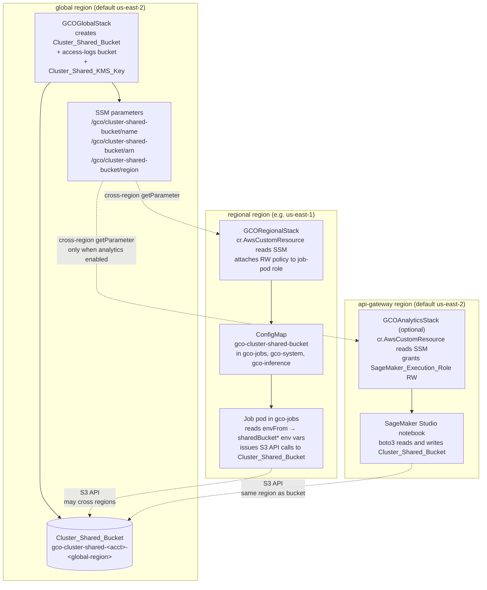

# Cluster Shared Bucket

Reference for the always-on `Cluster_Shared_Bucket` — the S3 bucket every
regional GCO cluster can read and write by default, regardless of whether
the analytics environment is enabled.

## Table of Contents

- [Overview](#overview)
- [Architecture](#architecture)
- [SSM Parameters](#ssm-parameters)
- [ConfigMap schema](#configmap-schema)
- [Consuming from job manifests](#consuming-from-job-manifests)
- [IAM grants](#iam-grants)
- [Cross-region egress](#cross-region-egress)
- [Removal policy](#removal-policy)
- [Migration note for first deploy](#migration-note-for-first-deploy)

## Overview

`Cluster_Shared_Bucket` is a customer-managed, KMS-encrypted S3 bucket that
every regional GCO cluster's job-pod role can read and write. It is
**always on** — the bucket is not gated by any `cdk.json` toggle and is
present on every deploy of `gco-global`, regardless of whether the
analytics environment is enabled. The bucket, its access-logs bucket, and
the `Cluster_Shared_KMS_Key` that encrypts it are all owned by
`GCOGlobalStack`; no other stack creates, destroys, or mutates them.

Bucket name pattern: `gco-cluster-shared-<account>-<global-region>`.
Default global region: `us-east-2` (from `cdk.json::deployment_regions.global`).

Every regional cluster automatically:

1. Reads the bucket's identity (name, ARN, home region) from three SSM
   parameters published by `GCOGlobalStack` in the global region.
2. Applies the `gco-cluster-shared-bucket` ConfigMap into `gco-jobs`,
   `gco-system`, and `gco-inference`, exposing those values to pods.
3. Attaches an unconditional RW IAM policy to the regional job-pod role
   so any Batch Job in `gco-jobs` can issue S3 API calls against the
   bucket without extra credentials.

When `analytics_environment.enabled=true`, `GCOAnalyticsStack` additionally
grants the `SageMaker_Execution_Role` RW on the same bucket so Studio
notebook users can read cluster-produced artifacts directly. See
[`docs/ANALYTICS.md`](ANALYTICS.md) for the analytics-side consumer.

## Architecture



Key points:

- `GCOGlobalStack` is the sole owner. `Cluster_Shared_Bucket`,
  `Cluster_Shared_KMS_Key`, and the three SSM parameters are created
  unconditionally in `gco-global` and survive analytics toggle flips.
- Regional stacks consume the bucket via the SSM namespace
  (`cr.AwsCustomResource` with `service="SSM"`, `action="getParameter"`,
  `region=<global-region>`). This matches the cross-region SSM pattern
  already used for the Global Accelerator endpoint-group parameters.
- The analytics stack consumes the same SSM namespace only when
  enabled; the regional plumbing is unaffected by the toggle.

## SSM Parameters

Three `ssm.StringParameter`s are published by `GCOGlobalStack` in the
global region under the `/gco/cluster-shared-bucket/` namespace:

| Name | Type | Value |
|------|------|-------|
| `/gco/cluster-shared-bucket/name` | `String` | Bucket name (`gco-cluster-shared-<account>-<global-region>`) |
| `/gco/cluster-shared-bucket/arn` | `String` | Bucket ARN (`arn:aws:s3:::gco-cluster-shared-<account>-<global-region>`) |
| `/gco/cluster-shared-bucket/region` | `String` | The bucket's home region (same as `deployment_regions.global`, default `us-east-2`) |

These parameters are:

- **Published by** `GCOGlobalStack._publish_cluster_shared_bucket_ssm_params`.
- **Read by** every `GCORegionalStack` (unconditional) and
  `GCOAnalyticsStack` (when enabled) via `cr.AwsCustomResource`.
- Created exactly once in the global region — there are no regional
  copies. Regional stacks always issue a cross-region `GetParameter`
  targeting `deployment_regions.global`.

Read each parameter manually to confirm the plumbing is in place:

```bash
aws ssm get-parameter --name /gco/cluster-shared-bucket/name   --region us-east-2
aws ssm get-parameter --name /gco/cluster-shared-bucket/arn    --region us-east-2
aws ssm get-parameter --name /gco/cluster-shared-bucket/region --region us-east-2
```

`GCOGlobalStack` also emits four CloudFormation outputs for the same
values: `ClusterSharedBucketName`, `ClusterSharedBucketArn`,
`ClusterSharedBucketRegion`, and `ClusterSharedKmsKeyArn`.

## ConfigMap schema

Every regional cluster gets a `gco-cluster-shared-bucket` ConfigMap
applied into three namespaces — `gco-jobs`, `gco-system`, and
`gco-inference` — by the `kubectl-applier-simple` Lambda during regional
deploy. The manifest source is
`lambda/kubectl-applier-simple/manifests/22-storage-cluster-shared-bucket.yaml`;
the `{{CLUSTER_SHARED_BUCKET*}}` placeholders are resolved from SSM at
deploy time.

Schema (copy from `kubectl get cm gco-cluster-shared-bucket -n gco-jobs -oyaml`):

```yaml
apiVersion: v1
kind: ConfigMap
metadata:
  name: gco-cluster-shared-bucket
  namespace: gco-jobs
data:
  sharedBucketName: "gco-cluster-shared-123456789012-us-east-2"
  sharedBucketArn: "arn:aws:s3:::gco-cluster-shared-123456789012-us-east-2"
  sharedBucketRegion: "us-east-2"
```

The **same ConfigMap is also applied** to `gco-system` (so GCO services
that need to read/write the bucket can do so using the same env-var
contract) and to `gco-inference` (so inference endpoints can access
shared artifacts using the same pattern). Only the `namespace` field
differs across the three copies; the three `data` keys are identical in
every namespace.

Exactly three keys, always:

| Key | Meaning |
|-----|---------|
| `sharedBucketName` | The bucket's `Name` for `boto3.client('s3').get_object(Bucket=..., Key=...)`. |
| `sharedBucketArn` | The bucket's ARN — useful for logging or building ARN-scoped IAM conditions. |
| `sharedBucketRegion` | The bucket's home region — always equal to `deployment_regions.global`. |

## Consuming from job manifests

The standard way to consume the ConfigMap is `envFrom.configMapRef`,
which binds all three keys as env vars in the container:

```yaml
apiVersion: batch/v1
kind: Job
metadata:
  name: my-uploader
  namespace: gco-jobs
spec:
  template:
    spec:
      serviceAccountName: gco-service-account
      containers:
      - name: uploader
        image: python:3.14.4-slim
        command: ["python", "-c", "import os; print(os.environ['sharedBucketName'])"]
        envFrom:
        - configMapRef:
            name: gco-cluster-shared-bucket
      restartPolicy: Never
```

With `envFrom`, the pod's process sees `sharedBucketName`,
`sharedBucketArn`, and `sharedBucketRegion` as environment variables
with the exact ConfigMap key names (Kubernetes does not uppercase the
keys). Use `valueFrom.configMapKeyRef` if you need to rename them.

Three worked examples ship with the repo:

| Example | What it does |
|---------|--------------|
| [`examples/cluster-shared-bucket-upload-job.yaml`](../examples/cluster-shared-bucket-upload-job.yaml) | Minimal Batch Job that uploads a JSON blob to `s3://$sharedBucketName/uploads/<timestamp>.json`. Works with `analytics_environment.enabled=false`. |
| [`examples/analytics-s3-upload-job.yaml`](../examples/analytics-s3-upload-job.yaml) | Publishes a CSV snapshot + schema manifest under `analytics-data/` so a SageMaker Studio notebook can read it. Identical ConfigMap wiring — differs only in intent. |
| [`examples/analytics-database-export-job.yaml`](../examples/analytics-database-export-job.yaml) | Exports Aurora pgvector rows to `s3://$sharedBucketName/analytics-data/vectors-export.csv`. Combines `envFrom` for the shared bucket with `configMapKeyRef` for the optional Aurora ConfigMap. |

Submit any of them with:

```bash
gco jobs submit-direct examples/cluster-shared-bucket-upload-job.yaml -r us-east-1
gco jobs submit-direct examples/analytics-s3-upload-job.yaml          -r us-east-1
gco jobs submit-direct examples/analytics-database-export-job.yaml    -r us-east-1
```

## IAM grants

### Regional job-pod role — unconditional RW

Every `GCORegionalStack` attaches an inline IAM policy to the regional
job-pod role (the role assumed by `gco-service-account` in `gco-jobs`).
The policy has two statements, both **always present** regardless of
`analytics_environment.enabled`:

Statement 1 — S3 object access:

- `Action`: `s3:GetObject`, `s3:PutObject`, `s3:DeleteObject`,
  `s3:ListBucket`, `s3:GetBucketLocation`.
- `Resource`: the `Cluster_Shared_Bucket` ARN (from SSM) and
  `<arn>/*`.

Statement 2 — KMS access, scoped to S3:

- `Action`: `kms:Decrypt`, `kms:GenerateDataKey`.
- `Resource`: the `Cluster_Shared_KMS_Key` ARN (resolvable from the
  bucket's SSE-KMS configuration).
- `Condition`: `StringEquals: { kms:ViaService:
  s3.<global-region>.amazonaws.com }` — the key can be exercised only
  via the S3 service, not directly.

The grant is **role-side**: `Cluster_Shared_Bucket`'s bucket policy
contains zero `Principal: "*"` Allow statements. Access is always
gated by the role policy, never by a wildcard on the bucket.

### SageMaker execution role — conditional RW (analytics only)

When `analytics_environment.enabled=true`, `GCOAnalyticsStack` runs
`_grant_sagemaker_role_on_cluster_shared_bucket`, which resolves
`/gco/cluster-shared-bucket/arn` via `cr.AwsCustomResource` in the
global region, then attaches an inline policy to
`SageMaker_Execution_Role` with the **same two statements** as the
regional role's grant. This is a role-side grant; the bucket policy is
not modified.

When `analytics_environment.enabled=false`, the SageMaker role does
not exist and no grant is attached. The regional job-pod grants are
unaffected.

| Principal | Access | Gated on |
|-----------|--------|----------|
| Regional job-pod role (`gco-service-account` in `gco-jobs`) | RW | Always |
| `SageMaker_Execution_Role` | RW | `analytics_environment.enabled=true` |
| Any other AWS principal | None | — |

## Cross-region egress

`Cluster_Shared_Bucket` lives in the **global region**
(`deployment_regions.global`, default `us-east-2`). Jobs run in the
region where you submit them — typically one of
`deployment_regions.regional` (default `us-east-1`). Unless the regional
region happens to equal the global region, **every S3 API call crosses
an AWS region boundary**.

What this means in practice:

- Inter-region `GET`/`PUT`/`HEAD` and `LIST` requests incur data-
  transfer charges on the response (inbound to the region where the
  pod runs). AWS charges for inter-region transfer are per GB, small
  but non-zero.
- API-call count, not bytes, drives most of the marginal cost for
  metadata-heavy workloads (many small files). Batch into fewer
  larger objects.
- Latency is higher than same-region S3 — typically tens of
  milliseconds extra per call.

Recommendations:

- **Small artifacts** (metadata, manifests, JSON summaries, notebook
  inputs): use `Cluster_Shared_Bucket`. The cross-region cost is
  negligible at single-digit MB per day.
- **Large regional data** (training checkpoints, shards, model
  weights staged for training jobs): keep on each region's local
  EFS/FSx. Those are same-region and don't cross the boundary.
- **Bulk uploads**: batch many small objects into one tarball or
  Parquet file before uploading — one cross-region `PUT` is cheaper
  than thousands.
- **Multi-region read patterns**: if every region needs the same
  large dataset, replicate into the regional S3 bucket (owned by the
  regional stack) via S3 Cross-Region Replication or a scheduled copy
  job, and keep `Cluster_Shared_Bucket` as the control-plane handoff.

The example manifests print `sharedBucketRegion` at startup so operators
can confirm the region-crossing behavior in practice.

## Removal policy

`Cluster_Shared_Bucket`, the `Cluster_Shared_Bucket` access-logs bucket,
and `Cluster_Shared_KMS_Key` all use:

- `RemovalPolicy.DESTROY`
- `auto_delete_objects=True` (on the two S3 buckets)
- `pending_window=Duration.days(7)` (on the KMS key)

This matches the iteration-loop posture of the rest of the analytics
feature — `cdk destroy gco-global` empties and deletes the buckets, and
the KMS key enters a 7-day pending-delete window (the AWS minimum).
During those 7 days the key can be cancelled with
`aws kms cancel-key-deletion` if a destroy was accidental, providing
the recovery grace period. The bucket's own `RemovalPolicy.DESTROY`
provides no grace period — deleted buckets are immediately unavailable.

This is the intended behavior per:

- "`Cluster_Shared_KMS_Key` uses `RemovalPolicy.DESTROY`
  with `pending_window=Duration.days(7)` and `enable_key_rotation=True`."
- "`Cluster_Shared_Bucket` uses `RemovalPolicy.DESTROY`
  with `auto_delete_objects=True`, `block_public_access=BLOCK_ALL`,
  `enforce_ssl=True`, `versioned=True`, and a dedicated access-logs
  bucket."

If you need to preserve bucket contents across `cdk destroy`, copy the
data out before destroying — there is no `retain` opt-in for the shared
bucket (unlike the per-user Studio EFS, which accepts
`analytics_environment.efs.removal_policy = "retain"`). Keeping the
posture uniform is deliberate: the bucket is a deployment artifact, not
a data store of record.

## Migration note for first deploy

On first deploy of this feature on an existing cluster, the following
changes land. All are **additive** — no existing behavior changes, no
data migration is required, and no running jobs are affected.

`gco-global`:

- A new `Cluster_Shared_Bucket` appears (`gco-cluster-shared-<account>-<global-region>`).
- A new access-logs bucket appears
  (`gco-cluster-shared-access-logs-<account>-<global-region>`).
- A new `Cluster_Shared_KMS_Key` is created with rotation enabled.
- Three new SSM parameters are published under
  `/gco/cluster-shared-bucket/`.
- Four new CloudFormation outputs are emitted
  (`ClusterSharedBucketName`, `ClusterSharedBucketArn`,
  `ClusterSharedBucketRegion`, `ClusterSharedKmsKeyArn`).

Regional stacks:

- The `gco-cluster-shared-bucket` ConfigMap is applied into
  `gco-jobs`, `gco-system`, and `gco-inference`. Existing
  ConfigMaps in those namespaces are unaffected.
- A new inline IAM policy is attached to the regional job-pod role
  with the RW grant described in [IAM grants](#iam-grants). The
  existing IRSA/pod-identity setup is unchanged.
- A new cross-region `cr.AwsCustomResource` is created to read the
  three SSM parameters at deploy time; this adds a few seconds to
  `cdk deploy gco-<region>` but no runtime dependency.

Running jobs:

- Unaffected. The ConfigMap and IAM grant are new additions; they do
  not rename, remove, or rewrite any existing resources.
- Pods that do not reference `gco-cluster-shared-bucket` via
  `envFrom` or `configMapKeyRef` see no change at all.

Data migration:

- **None required.** The bucket is empty on first deploy. Operators
  do not need to copy, rename, or backfill anything.

Deploy order:

1. `gco stacks deploy gco-global` — provisions the bucket, KMS key,
   and SSM parameters.
2. `gco stacks deploy gco-<region>` for each regional region —
   attaches the ConfigMap and RW grant. The regional deploy will
   fail fast (before any kubectl apply) if step 1 was skipped,
   because the SSM `GetParameter` call returns `ParameterNotFound`.

No `docs/MIGRATION.md` exists in this repo — no migration is required.
If you find yourself needing migration steps, something unexpected
happened; open an issue with the deploy logs attached.
