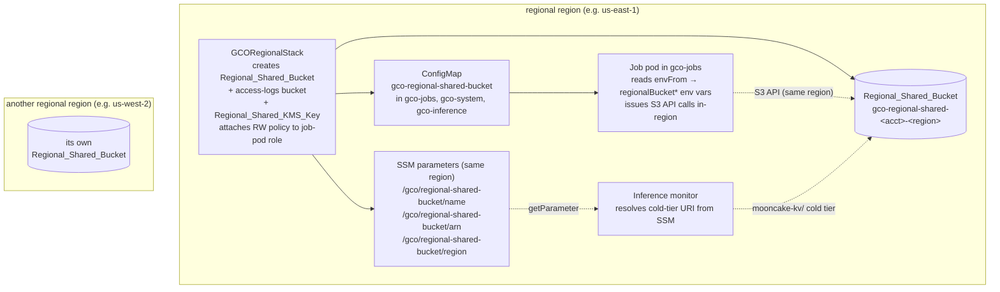

# Regional Shared Bucket

Reference for the always-on `Regional_Shared_Bucket` — the per-region S3
bucket each regional GCO cluster's job pods can read and write in their
own region, with no cross-region egress.

## Table of Contents

- [Overview](#overview)
- [Choosing between the two shared buckets](#choosing-between-the-two-shared-buckets)
- [Architecture](#architecture)
- [SSM Parameters](#ssm-parameters)
- [ConfigMap schema](#configmap-schema)
- [Consuming from job manifests](#consuming-from-job-manifests)
- [IAM grants](#iam-grants)
- [Reserved key prefixes](#reserved-key-prefixes)
- [Removal policy](#removal-policy)
- [Migration note for first deploy](#migration-note-for-first-deploy)

## Overview

`Regional_Shared_Bucket` is a customer-managed, KMS-encrypted S3 bucket
created once per region by `GCORegionalStack`. It is **always on** — there
is no `cdk.json` toggle and no feature flag that can suppress it, so every
region that has been deployed has exactly one. The bucket, its access-logs
bucket, and the `Regional_Shared_KMS_Key` that encrypts it are all owned by
the region's own `GCORegionalStack`; no other stack creates, destroys, or
mutates them.

Bucket name pattern: `gco-regional-shared-<account>-<region>`.

Every regional cluster automatically:

1. Provisions the bucket, its KMS key, and its access-logs bucket in the
   region being deployed.
2. Publishes the bucket's identity (name, ARN, home region) as three SSM
   parameters in that same region's parameter store.
3. Applies the `gco-regional-shared-bucket` ConfigMap into `gco-jobs`,
   `gco-system`, and `gco-inference`, exposing those values to pods.
4. Attaches an unconditional read/write IAM policy to the regional job-pod
   role so any Batch Job in `gco-jobs` can issue S3 API calls against the
   bucket without extra credentials.

The bucket is general purpose: any in-region workload may use it. The
per-region cold KV tier also auto-targets it when an inference endpoint
requests cold-tier storage — see [Reserved key prefixes](#reserved-key-prefixes).

## Choosing between the two shared buckets

GCO ships two always-on buckets that job pods can write to. They differ
only in where they live, and that difference is the whole decision:

| | `Regional_Shared_Bucket` | `Cluster_Shared_Bucket` |
|---|---|---|
| Name | `gco-regional-shared-<account>-<region>` | `gco-cluster-shared-<account>-<global-region>` |
| Owning stack | `GCORegionalStack` (one per region) | `GCOGlobalStack` (exactly one) |
| Location | the cluster's **own** region | the global region (default `us-east-2`) |
| Region crossing | never | every call, unless the cluster happens to run in the global region |
| Reachable from other regions | no (one bucket per region) | yes — single central bucket |
| ConfigMap | `gco-regional-shared-bucket` | `gco-cluster-shared-bucket` |
| ConfigMap keys | `regionalBucketName` / `regionalBucketArn` / `regionalBucketRegion` | `sharedBucketName` / `sharedBucketArn` / `sharedBucketRegion` |
| Job-pod role access | RW, always | RW, always |

Rules of thumb:

- **Large, write-heavy, or latency-sensitive** — training checkpoints,
  model artifacts, intermediate shards: use `Regional_Shared_Bucket`. The
  writes stay in-region, so there is no per-GB transfer charge and no
  extra round-trip latency.
- **Needs to be readable from another region, or by SageMaker Studio** —
  control-plane handoffs, dataset manifests, analytics snapshots: use
  `Cluster_Shared_Bucket`. See
  [`docs/CLUSTER_SHARED_BUCKET.md`](CLUSTER_SHARED_BUCKET.md).
- **Both at once** is supported and is the reason the ConfigMap keys are
  named differently. A pod can `envFrom` both ConfigMaps and neither set of
  env vars clobbers the other, which gives you the common read-central,
  write-local shape.

Note that neither bucket is a data store of record — see
[Removal policy](#removal-policy).

## Architecture



Key points:

- Each region's `GCORegionalStack` is the sole owner of its own bucket.
  There is no cross-region reference and no shared ownership, so a region
  can be deployed or destroyed without touching another region's bucket.
- Unlike the cluster-shared bucket, the regional stack needs **no
  cross-region SSM read** to wire this up: the bucket is a local construct,
  so its name and ARN are ordinary CloudFormation references resolved at
  deploy time.
- There is no single "regional shared bucket" across the fleet. `N`
  deployed regions means `N` independent buckets with the same name shape.

## SSM Parameters

Three `ssm.StringParameter`s are published by each `GCORegionalStack` **in
its own region** under the `/gco/regional-shared-bucket/` namespace:

| Name | Type | Value |
|------|------|-------|
| `/gco/regional-shared-bucket/name` | `String` | Bucket name (`gco-regional-shared-<account>-<region>`) |
| `/gco/regional-shared-bucket/arn` | `String` | Bucket ARN (`arn:aws:s3:::gco-regional-shared-<account>-<region>`) |
| `/gco/regional-shared-bucket/region` | `String` | The bucket's home region (equal to the deploying region) |

These parameters are:

- **Published by** `GCORegionalStack._create_regional_shared_bucket`.
- **Read by** the per-region inference monitor
  (`_resolve_regional_shared_bucket`) to resolve the Mooncake cold-tier
  object-store URI, and by the `gco inference populate-kv` upload surface.
- Created once per region. Because the bucket is unconditional, they are
  always present once that region's stack is deployed.

The namespace comes from
`constants.regional_shared_ssm_parameter_prefix(project_name)`, which is
the single source of truth. The inference monitor rebuilds the same path at
runtime from its injected `PROJECT_NAME` environment variable rather than
importing the CDK constant, so keep the two in lockstep.

Read each parameter manually to confirm the plumbing is in place:

```bash
aws ssm get-parameter --name /gco/regional-shared-bucket/name   --region us-east-1
aws ssm get-parameter --name /gco/regional-shared-bucket/arn    --region us-east-1
aws ssm get-parameter --name /gco/regional-shared-bucket/region --region us-east-1
```

Pods do **not** need these parameters — the job-pod role carries no
`ssm:GetParameter` grant. Pods read the ConfigMap instead.

## ConfigMap schema

Every regional cluster gets a `gco-regional-shared-bucket` ConfigMap
applied into three namespaces — `gco-jobs`, `gco-system`, and
`gco-inference` — by the `kubectl-applier-simple` Lambda during regional
deploy. The manifest source is
`lambda/kubectl-applier-simple/manifests/27-storage-regional-shared-bucket.yaml`;
the `{{REGIONAL_SHARED_BUCKET*}}` placeholders are resolved from the
stack's own constructs at deploy time.

Schema (copy from `kubectl get cm gco-regional-shared-bucket -n gco-jobs -oyaml`):

```yaml
apiVersion: v1
kind: ConfigMap
metadata:
  name: gco-regional-shared-bucket
  namespace: gco-jobs
data:
  regionalBucketName: "gco-regional-shared-123456789012-us-east-1"
  regionalBucketArn: "arn:aws:s3:::gco-regional-shared-123456789012-us-east-1"
  regionalBucketRegion: "us-east-1"
```

The **same ConfigMap is also applied** to `gco-system` (so GCO services
that need to read/write the bucket can do so using the same env-var
contract) and to `gco-inference` (so inference endpoints can access
regional artifacts using the same pattern). Only the `namespace` field
differs across the three copies; the three `data` keys are identical in
every namespace.

Exactly three keys, always:

| Key | Meaning |
|-----|---------|
| `regionalBucketName` | The bucket's `Name` for `boto3.client('s3').put_object(Bucket=..., Key=...)`. |
| `regionalBucketArn` | The bucket's ARN — useful for logging or building ARN-scoped IAM conditions. |
| `regionalBucketRegion` | The bucket's home region — always equal to the cluster's own region. |

Because the placeholders always resolve, this file is never gated out of
the applier. The applier skips manifests that still contain an unresolved
`{{UPPER_SNAKE}}` token after substitution, which is how optional features
(FSx, Valkey, Aurora) are pruned; this ConfigMap is never in that category.

## Consuming from job manifests

The standard way to consume the ConfigMap is `envFrom.configMapRef`,
which binds all three keys as env vars in the container:

```yaml
apiVersion: batch/v1
kind: Job
metadata:
  name: my-checkpointer
  namespace: gco-jobs
spec:
  template:
    spec:
      serviceAccountName: gco-service-account
      automountServiceAccountToken: true
      containers:
      - name: trainer
        image: python:3.14.7-slim
        command: ["python", "-c", "import os; print(os.environ['regionalBucketName'])"]
        envFrom:
        - configMapRef:
            name: gco-regional-shared-bucket
      restartPolicy: Never
```

With `envFrom`, the pod's process sees `regionalBucketName`,
`regionalBucketArn`, and `regionalBucketRegion` as environment variables
with the exact ConfigMap key names (Kubernetes does not uppercase the
keys). Use `valueFrom.configMapKeyRef` if you need to rename them.

To read from the central bucket and write locally in the same pod, list
both ConfigMaps:

```yaml
        envFrom:
        - configMapRef:
            name: gco-cluster-shared-bucket   # sharedBucket*  — central, cross-region
        - configMapRef:
            name: gco-regional-shared-bucket  # regionalBucket* — local, same-region
```

The worked example that ships with the repo:

| Example | What it does |
|---------|--------------|
| [`examples/regional-shared-bucket-upload-job.yaml`](../examples/regional-shared-bucket-upload-job.yaml) | Minimal Batch Job that uploads a JSON blob to `s3://$regionalBucketName/uploads/<timestamp>.json`. No prerequisites. |

Submit it with:

```bash
gco jobs submit-direct examples/regional-shared-bucket-upload-job.yaml -r us-east-1
```

### Credentials

The pod needs no credential wiring beyond naming the service account.
`gco-service-account` in `gco-jobs` is annotated with
`eks.amazonaws.com/role-arn` for IRSA and additionally has an EKS Pod
Identity Association, so the AWS SDK finds credentials for the regional
job-pod role either way. The example sets
`automountServiceAccountToken: true` explicitly because the ServiceAccount
object itself defaults it to `false`.

## IAM grants

### Regional job-pod role — unconditional RW

Every `GCORegionalStack` attaches an inline IAM policy to the regional
job-pod role (the role used by `gco-service-account` in `gco-jobs`,
`gco-system`, and `gco-inference`) via
`_grant_regional_shared_bucket_to_service_account`. The policy has two
statements, both **always present** — the grant runs unconditionally as
part of provisioning the always-on bucket:

Statement 1 — S3 object access:

- `Action`: `s3:GetObject`, `s3:PutObject`, `s3:DeleteObject`,
  `s3:ListBucket`, `s3:GetBucketLocation`.
- `Resource`: the `Regional_Shared_Bucket` ARN and `<arn>/*`.

Statement 2 — KMS access:

- `Action`: `kms:Decrypt`, `kms:Encrypt`, `kms:GenerateDataKey`,
  `kms:DescribeKey`.
- `Resource`: the literal `Regional_Shared_KMS_Key` ARN.

Because both resources are local constructs in the same stack, each ARN is
a concrete CloudFormation reference rather than a wildcard, so the role
gains access to precisely this bucket and this key. The only wildcard is
the `<arn>/*` object-key suffix within the single bucket. This is tighter
than the equivalent cluster-shared grant, which needs `Resource: "*"` on
its KMS statement (constrained by `kms:ViaService`) because the global key
ARN is not exported to the regional stack.

### Relationship to the broader `gco-*` read grant

The job-pod role separately carries a read-only statement over
`arn:<partition>:s3:::gco-*` and `gco-*/*` (`s3:GetObject`,
`s3:ListBucket`), used by inference init containers pulling model weights.
That wildcard does match this bucket, but it grants **reads only** — the
write path comes exclusively from the scoped grant above.

### Bucket policy

The grant is **role-side**. `Regional_Shared_Bucket`'s bucket policy
contains zero `Principal: "*"` Allow statements; its only statement is an
explicit `Deny` on `aws:SecureTransport=false` under the SID
`DenyInsecureTransport` (belt-and-braces alongside `enforce_ssl=True`).
Access is always gated by the role policy, never by a wildcard on the
bucket.

| Principal | Access | Gated on |
|-----------|--------|----------|
| Regional job-pod role (`gco-service-account`) | RW on this region's bucket | Always |
| Regional job-pod role | Read on any `gco-*` bucket | Always |
| Any other AWS principal | None | — |

## Reserved key prefixes

The bucket is general purpose, but one prefix is already in use by the
platform. Avoid it for your own objects:

| Prefix | Owner | Purpose |
|--------|-------|---------|
| `mooncake-kv/<endpoint>/` | inference monitor / `gco inference populate-kv` | Mooncake cold-tier KV objects for a disaggregated inference endpoint. The prefix constant is `MOONCAKE_COLD_TIER_KEY_PREFIX`. |

The example job writes under `uploads/`, and nothing in the platform reads
that prefix — it is illustrative only, not reserved.

## Removal policy

Teardown behavior is configurable through
`cdk.json::regional_shared_bucket.removal_policy`, covering
`Regional_Shared_Bucket`, its access-logs bucket, and
`Regional_Shared_KMS_Key` together (a retained bucket whose key was
scheduled for deletion would be undecryptable, so the three always share a
fate):

```json
{
  "regional_shared_bucket": {
    "removal_policy": "destroy"
  }
}
```

**`destroy` (the default).** `gco stacks destroy gco-<region>` empties and
deletes the bucket:

- `RemovalPolicy.DESTROY`
- `auto_delete_objects=True` (on the two S3 buckets)
- `pending_window=Duration.days(7)` (on the KMS key)

The KMS key enters a 7-day pending-delete window (the AWS minimum) and can
be recovered with `aws kms cancel-key-deletion` if the destroy was
accidental, but the bucket's own `RemovalPolicy.DESTROY` provides no grace
period — deleted objects are gone. This matches the posture of
`Cluster_Shared_Bucket` and stays the default so existing deployments'
teardown behavior (including deploy/destroy validation cycles) does not
change underneath them.

**`retain`.** The bucket, its access-logs bucket, and the KMS key all
survive `gco stacks destroy gco-<region>`:

- artifacts a job just produced outlive the region;
- all three resources become unmanaged by CloudFormation — they keep
  billing and must be deleted manually when genuinely done
  (`aws s3 rb --force`, `aws kms schedule-key-deletion`);
- a subsequent redeploy of the same region **fails on the bucket-name
  collision** until the retained bucket is deleted or the deployment uses
  a different project name — plan for one or the other before destroying.

Apply a change with `gco stacks deploy gco-<region> -y` per region. An
invalid value fails synthesis; `gco storage s3-inventory` reports the
policy the next deploy will apply in its `removal_policy` field.

Practical consequences under `destroy`:

- **Do not treat this bucket as the durable home for a deliverable.** If a
  training run's checkpoints are the output you care about, copy them out
  before tearing the region down:

  ```bash
  gco storage sync regional-shared:<region> ./checkpoints --prefix <prefix>
  ```

  or flip the region to `retain` and redeploy before the destroy.
- The access-logs bucket carries a lifecycle rule expiring objects after
  `s3_access_logs.retention_days` (default 90).
- Versioning is enabled, which protects against accidental overwrite
  *within* the bucket's life, not against stack deletion.

Nothing about a region's bucket is affected by destroying a different
region's stack.

## Migration note for first deploy

On first deploy of the ConfigMap on an existing cluster, the following
changes land. All are **additive** — no existing behavior changes, no data
migration is required, and no running jobs are affected.

Regional stacks:

- The `gco-regional-shared-bucket` ConfigMap is applied into `gco-jobs`,
  `gco-system`, and `gco-inference`. Existing ConfigMaps in those
  namespaces are unaffected.
- Three new `{{REGIONAL_SHARED_BUCKET*}}` entries appear in the
  kubectl-applier `ImageReplacements` property.

Unchanged by this addition:

- The bucket, its KMS key, its access-logs bucket, and the three SSM
  parameters already existed — they are provisioned unconditionally by
  `GCORegionalStack` and are not new.
- The job-pod role's RW grant already existed. **No IAM change is part of
  this addition**; pods could already write to the bucket, they just had no
  in-cluster way to learn its name.

Running jobs:

- Unaffected. Pods that do not reference `gco-regional-shared-bucket` via
  `envFrom` or `configMapKeyRef` see no change at all.

Data migration:

- **None required.**

Deploy order:

1. `gco stacks deploy gco-<region>` for each regional region — creates (or
   confirms) the bucket and applies the ConfigMap.

There is no dependency on `gco-global` for this bucket, unlike
`Cluster_Shared_Bucket`.
