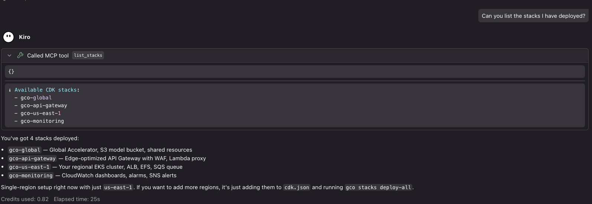
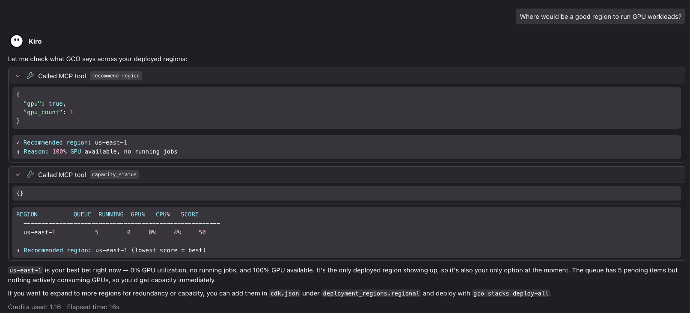
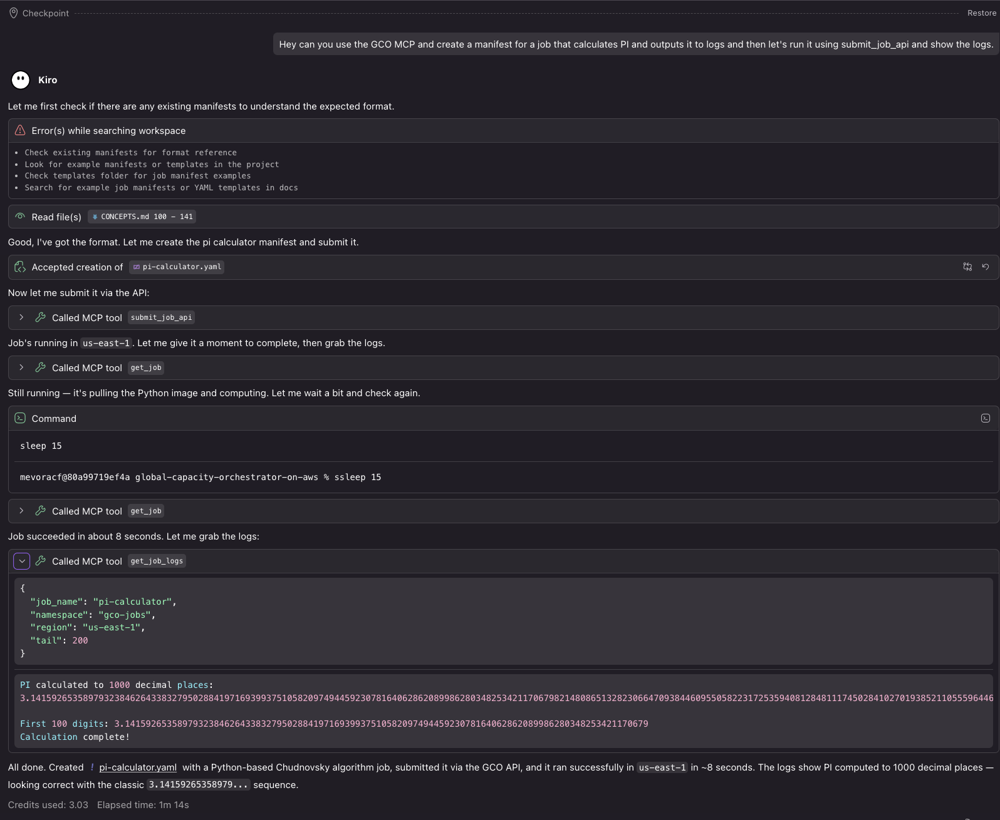
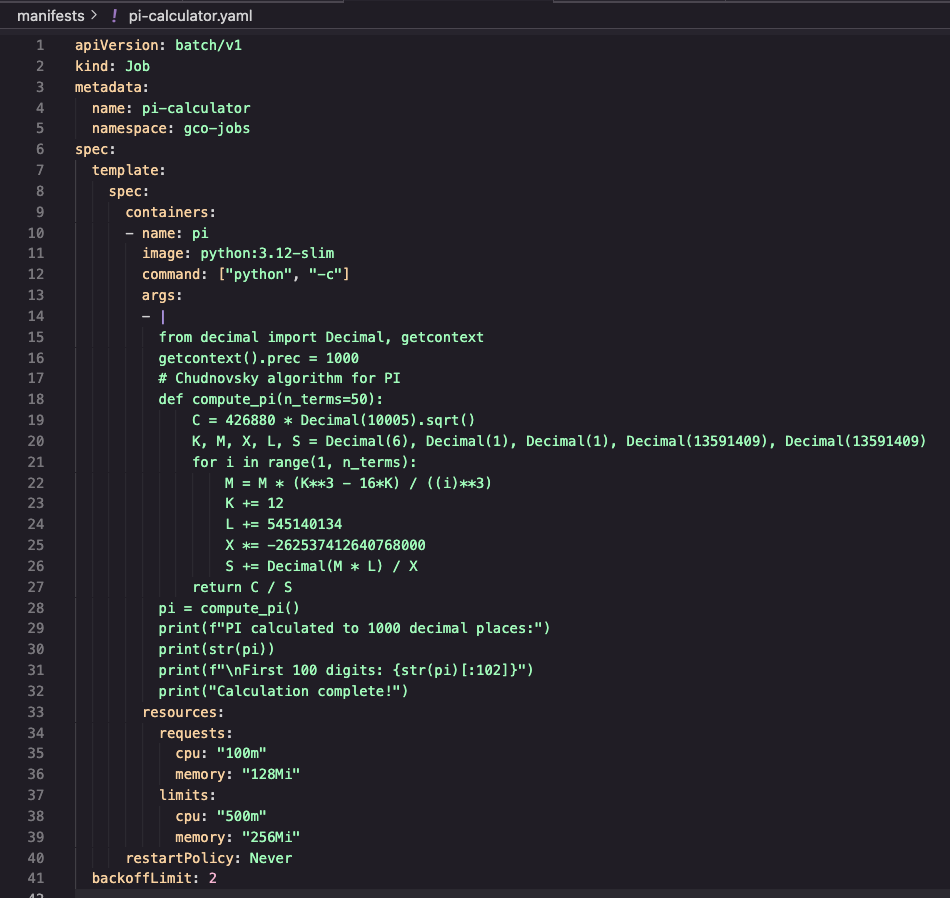
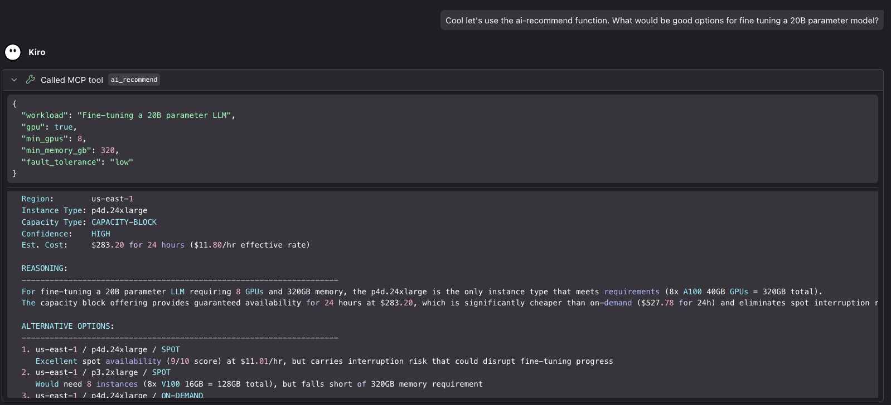
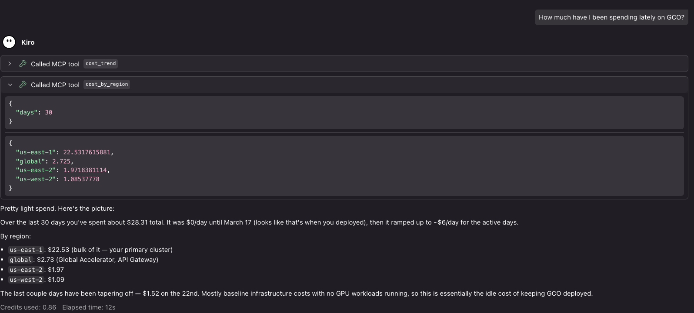

# GCO MCP Server

Some MCP tools are disabled by default and gated behind environment-variable feature flags — see [Feature Flags](#feature-flags) before enabling deploys, destroys, capacity purchases, model uploads, image publishes, local filesystem writes, or destructive operations.

An MCP (Model Context Protocol) server that exposes the Global Capacity Orchestrator (GCO) CLI as tools for LLM interaction. This lets you manage your multi-region [EKS](https://docs.aws.amazon.com/eks/latest/userguide/what-is-eks.html) infrastructure through natural language in an AI-powered IDE with MCP support like [Kiro](https://kiro.dev).

## Table of Contents

- [Overview](#overview)
  - [Screenshots](#screenshots)
- [Prerequisites](#prerequisites)
- [Setup](#setup)
  - [Install with uv (recommended)](#install-with-uv-recommended)
  - [Kiro](#kiro)
  - [Claude Desktop](#claude-desktop)
  - [Claude Code](#claude-code)
  - [OpenAI Codex](#openai-codex)
  - [Cursor](#cursor)
  - [Other MCP Clients](#other-mcp-clients)
- [Feature Flags](#feature-flags)
- [Available Tools](#available-tools)
  - [Job Management](#job-management)
  - [Queue Management](#queue-management)
  - [Capacity](#capacity)
  - [Inference Endpoints](#inference-endpoints)
  - [Cost Tracking](#cost-tracking)
  - [Infrastructure](#infrastructure)
  - [Storage](#storage)
  - [Metrics](#metrics)
  - [Model Weights](#model-weights)
  - [Templates](#templates)
  - [Webhooks](#webhooks)
  - [DAG Pipelines](#dag-pipelines)
  - [NodePools](#nodepools)
  - [Analytics](#analytics)
  - [Monitoring](#monitoring)
  - [Cluster](#cluster)
  - [Config](#config)
  - [Image Registry](#image-registry)
  - [Examples Discovery](#examples-discovery)
  - [Docs Discovery](#docs-discovery)
  - [Mission (Goal-Directed Loop)](#mission-goal-directed-loop)
  - [Swarm (Supervisor of Missions)](#swarm-supervisor-of-missions)
  - [Task Observability](#task-observability)
  - [Live State](#live-state)
- [Available Resources](#available-resources)
  - [Documentation](#documentation-docs)
  - [Kubernetes Manifests](#kubernetes-manifests-k8s)
  - [IAM Policies](#iam-policies-iam)
  - [Infrastructure](#infrastructure-infra)
  - [CI & GitHub Actions](#ci--github-actions-ci)
  - [Image Registry](#image-registry-images)
  - [Source Code](#source-code-source)
  - [Demos & Walkthroughs](#demos--walkthroughs-demos)
  - [API Client Examples](#api-client-examples-clients)
  - [Utility Scripts](#utility-scripts-scripts)
  - [Test Suite](#test-suite-tests)
  - [Configuration](#configuration-config)
  - [Live Operational State](#live-operational-state-gco-costs-tasks-and-mission)
  - [MCP Introspection](#mcp-introspection-mcp)
- [Getting Started with the MCP Server](#getting-started-with-the-mcp-server)
- [Architecture](#architecture)
- [Examples](#examples)
- [Recommended Companion MCP Servers](#recommended-companion-mcp-servers)
  - [AWS-focused](#aws-focused)
  - [Development \& docs](#development--docs)
  - [Reasoning \& workflow](#reasoning--workflow)
  - [Utilities](#utilities)
- [Troubleshooting](#troubleshooting)

## Overview

The MCP server exposes 139 tools by default (up to 196 with all flags enabled) across the full lifecycle of accelerated-workload management:

- Submit and monitor jobs across regions
- Deploy and manage inference endpoints with canary deployments
- Check GPU capacity and get region recommendations
- Track costs by service, region, and workload
- Manage infrastructure stacks and storage
- Build, push, and replicate container images across regions

### Screenshots

<details>
<summary>GCO MCP tools connected in Kiro</summary>


</details>

<details>
<summary>Listing stacks via natural language</summary>


</details>

<details>
<summary>Checking GPU capacity</summary>


</details>

<details>
<summary>Calculating PI on available capacity</summary>


</details>

<details>
<summary>PI calculation manifest</summary>


</details>

<details>
<summary>AI-powered capacity recommendation</summary>


</details>

<details>
<summary>Viewing cost summary</summary>


</details>

## Prerequisites

The quickest way to *run* the server — no clone, no manual dependency install — is [`uv`](https://docs.astral.sh/uv/). Install it once with the [official uv installation guide](https://docs.astral.sh/uv/getting-started/installation/) (`uvx` ships with `uv`), then jump to [Install with `uv` (recommended)](#install-with-uv-recommended) below; `uv` resolves the pinned GCO dependencies into an isolated environment for you.

For **development** — or when you need the local-clone-only resources (`docs://`, `source://`, `k8s://`, `infra://`, …) and CDK/stack lifecycle operations — work from a checkout instead. The GCO [dev container](../QUICKSTART.md#step-1-clone-and-build-the-dev-container) is the smoothest path here: it ships the `gco` CLI and the `.[dev,mcp]` extras (including `fastmcp` **and** the `[cdk]` [CDK](https://docs.aws.amazon.com/cdk/v2/guide/home.html) toolchain, plus the Node CDK CLI, `kubectl`, Docker + Buildx, and the AWS CLI) pre-installed at the right versions, so you only point your MCP client at `python3 gco_mcp/run_mcp.py` running inside the container. This sidesteps the dependency-resolver issues that often hit users layering the many pinned GCO packages onto an existing Python environment.

To set up that clone on your host instead:

- Python 3.14+
- GCO CLI installed (`pipx install -e .` from the project root)
- AWS credentials configured (the CLI handles [SigV4](https://docs.aws.amazon.com/IAM/latest/UserGuide/reference_sigv.html) auth)
- Dependencies installed from the project root, in a fresh venv if possible:
  - `pip install -e ".[mcp]"` for the base tool surface (jobs, capacity, costs, inference, …).
  - `pip install -e ".[cdk,mcp]"` if you also want the CDK/stack lifecycle tools (`deploy_*`, `destroy_*`, `bootstrap_cdk`, `stack_synth`/`diff`/`list`). The `[cdk]` extra pulls `aws-cdk-lib` + `cdk-nag`; without it those tools fail fast with an actionable error. See [Deploy-capable setup](#deploy-capable-setup-infrastructure-tools).

> If `pip install -e ".[cdk,mcp]"` errors out with `ResolutionImpossible`, see [Troubleshooting → Installation Issues](../docs/TROUBLESHOOTING.md#pip-install-fails-with-dependency-conflicts).

## Setup

> **Version note:** the GCO MCP server (`gco-mcp`) first shipped in **v3.2.0** — earlier release tags do not include it. Use `v3.2.0` or any newer release tag that fits your needs; browse the [releases page](https://github.com/aws-solutions-library-samples/global-capacity-orchestrator-on-aws/releases) to pick one.

The **recommended** way to run the server is [`uv`](https://docs.astral.sh/uv/), straight from a release tag — no clone and no manual dependency install (see [Install with `uv` (recommended)](#install-with-uv-recommended) just below). The **clone-based** per-client configs further down are the secondary path: reach for them when you are developing GCO or need the local-clone-only resources (`docs://`, `source://`, `k8s://`, `infra://`) and CDK/stack lifecycle operations.

### Install with `uv` (recommended)

If you have [`uv`](https://docs.astral.sh/uv/) installed, you can run the GCO MCP server straight from a tagged GitHub release — no clone, no manual dependency install. `uv` resolves the pinned GCO dependencies into an isolated environment and exposes the `gco-mcp` console script:

```bash
# v3.2.0 is the first release that ships gco-mcp; v3.2.0 or newer works — see the releases page.
GCO_REF=v3.2.0

# Run it ad hoc — uvx builds a cached, throwaway environment:
uvx --python 3.14 --from "git+https://github.com/aws-solutions-library-samples/global-capacity-orchestrator-on-aws.git@${GCO_REF}" gco-mcp

# …or install the gco + gco-mcp console scripts onto your PATH:
uv tool install --python 3.14 "git+https://github.com/aws-solutions-library-samples/global-capacity-orchestrator-on-aws.git@${GCO_REF}"
```

> **Always pass `--python 3.14`.** GCO requires Python >= 3.14, but `uvx` / `uv tool install` resolve against the host's default interpreter unless told otherwise — on a machine whose default Python is older (3.13 or below) the install fails with `No solution found … does not satisfy Python>=3.14`. With `--python 3.14`, uv selects a matching interpreter and [downloads a managed CPython 3.14 automatically](https://docs.astral.sh/uv/concepts/python-versions/) when the host has none, so the same command works everywhere.

Then point any stdio MCP client at that same command. For Kiro (`~/.kiro/settings/mcp.json`):

```json
{
  "mcpServers": {
    "gco": {
      "command": "uvx",
      "args": [
        "--python",
        "3.14",
        "--from",
        "git+https://github.com/aws-solutions-library-samples/global-capacity-orchestrator-on-aws.git@v3.2.0",
        "gco-mcp"
      ],
      "env": {
        "GCO_ENABLE_INFRASTRUCTURE_DEPLOY": "true"
      }
    }
  }
}
```

> The `@v3.2.0` pin in JSON is a floor, not a ceiling — any release `>= v3.2.0` works, so bump the tag as newer ones ship. (Shell snippets can interpolate `${GCO_REF}`; JSON cannot, so the tag is written inline.)
>
> **Heads-up on `GCO_ENABLE_INFRASTRUCTURE_DEPLOY` (shown above):** a bare `uvx` install runs the AWS-facing cluster tools, but the infra/stack tools this flag gates also need the CDK toolchain and a checkout. On a base install they register and then fail fast with an actionable error — to actually deploy, use the [Deploy-capable setup](#deploy-capable-setup-infrastructure-tools).

The identical `command` / `args` pair works in Claude Desktop, Claude Code, and Cursor — drop the `env` block if you do not need any [feature flags](#feature-flags), or use `@main` to track the latest. `uv` caches the build so subsequent launches start quickly.

What this install covers, and what still needs a checkout:

- **Works out of the box, no separate CLI setup** — `uv` installs the `gco` CLI and the `gco-mcp` server together (both are console scripts of the single `gco-cli` package), and the server shells out to its own bundled, version-matched `gco` — so there is nothing extra to install and no dev container needed. Every AWS-facing tool (jobs, capacity, costs, inference, images, queues, nodepools, …) works once your AWS credentials are configured.
- **Needs a local clone *and* the `[cdk]` extra** — CDK/stack lifecycle operations (`deploy_*`, `destroy_*`, `bootstrap_cdk`, `stack_synth`/`diff`/`list`) plus the resources that read the project tree (`docs://`, `source://`, `k8s://`, `infra://`, `ci://`, …). The base `uvx`/`pip` install does **not** ship `aws-cdk-lib`/`cdk-nag`, so those tools need the CDK toolchain in the same environment as `gco` (the `[cdk]` extra) and a checkout providing `app.py`/`cdk.json` — otherwise they fail fast with an actionable error. See [Deploy-capable setup](#deploy-capable-setup-infrastructure-tools).

The per-client sections below also include a **secondary, clone-based** config (`python3 gco_mcp/run_mcp.py`) for development or when you want the full resource and CDK surface.

### Deploy-capable setup (infrastructure tools)

The `deploy_*`, `destroy_*`, `bootstrap_cdk`, and `stack_synth`/`diff`/`list` tools shell out to the CDK, which imports `aws-cdk-lib` + `cdk-nag` and reads `app.py`/`cdk.json`. A base `uvx`/`pip` install has neither, so those tools fail fast with an actionable error until you use one of the setups below. (The AWS-facing cluster tools — jobs, capacity, costs, inference, … — need none of this.)

**Option 1 — dev container (turnkey, recommended for infra).** The [dev container](../QUICKSTART.md#step-1-clone-and-build-the-dev-container) bundles everything: the `.[dev,mcp]` Python extras (which include `[cdk]`) plus the Node CDK CLI, `kubectl`, Docker + Buildx, and the AWS CLI. Point your client at `python3 gco_mcp/run_mcp.py` inside the container.

**Option 2 — `uv`, with the `[cdk]` extra, from a clone.** Put the `[cdk]` extra in the `--from` spec so the CDK toolchain lands in the server's environment, and point the server at your checkout so `app.py`/`cdk.json` resolve — either with the client's `cwd` setting (shown below; the server walks up from its working directory to find `cdk.json`), or, for MCP clients that cannot set a working directory, with the `GCO_PROJECT_ROOT` environment variable in the `env` block (it takes precedence over `cwd` when both are set):

```json
{
  "mcpServers": {
    "gco": {
      "command": "uvx",
      "args": [
        "--python",
        "3.14",
        "--from",
        "gco-cli[cdk] @ git+https://github.com/aws-solutions-library-samples/global-capacity-orchestrator-on-aws.git@v3.13.3",
        "gco-mcp"
      ],
      "cwd": "/path/to/global-capacity-orchestrator-on-aws",
      "env": { "GCO_ENABLE_INFRASTRUCTURE_DEPLOY": "true" }
    }
  }
}
```

**Option 3 — `pip`, from a clone.** In a fresh venv at the repo root run `pip install -e ".[cdk,mcp]"`, then point the client at `python3 gco_mcp/run_mcp.py` (add `cwd` on Kiro).

All three also need the non-Python tooling the CDK drives: **Node.js + the AWS CDK CLI** (`cdk`), **`kubectl`**, a **container runtime** (Docker/Finch/Podman, plus Buildx for image builds and CDK [Lambda](https://docs.aws.amazon.com/lambda/latest/dg/welcome.html) bundling), and the **AWS CLI** with credentials configured. The dev container ships all of these; on a host, install them yourself.

> **Optional metric-file formats.** Reading Parquet or TensorBoard `tfevents` metric files (via `metrics_from_shared_storage_file` / `metrics_from_local_file`) needs extra libraries, added the same way: `.[metrics-parquet]` (pandas + pyarrow), `.[metrics-tfevents]` (tbparse + tensorboard), or `.[metrics]` for both — e.g. `pip install -e ".[cdk,metrics,mcp]"`, or `gco-cli[cdk,metrics] @ git+…@v3.13.3` for the `uvx` form. Every other metric source ([CloudWatch](https://docs.aws.amazon.com/AmazonCloudWatch/latest/monitoring/WhatIsCloudWatch.html), job logs, and JSON/CSV/JSONL/YAML/HF-Trainer-state files) works without them.

### Kiro

Add to your MCP config at `~/.kiro/settings/mcp.json`. The recommended `uvx` form needs no clone:

```json
{
  "mcpServers": {
    "gco": {
      "command": "uvx",
      "args": [
        "--python",
        "3.14",
        "--from",
        "git+https://github.com/aws-solutions-library-samples/global-capacity-orchestrator-on-aws.git@v3.2.0",
        "gco-mcp"
      ]
    }
  }
}
```

To enable a feature flag, add an `env` block alongside `args`:

```json
{
  "mcpServers": {
    "gco": {
      "command": "uvx",
      "args": [
        "--python",
        "3.14",
        "--from",
        "git+https://github.com/aws-solutions-library-samples/global-capacity-orchestrator-on-aws.git@v3.2.0",
        "gco-mcp"
      ],
      "env": {
        "GCO_ENABLE_INFRASTRUCTURE_DEPLOY": "true"
      }
    }
  }
}
```

Any release `>= v3.2.0` works — bump the `@v3.2.0` tag as needed.

**From a local clone (development).** When you need the clone-only resources or CDK/stack operations, point Kiro at `run_mcp.py` instead. Kiro additionally honors a `cwd` field, so you can use the absolute-path form or the `cwd` shorthand:

```json
{
  "mcpServers": {
    "gco": {
      "command": "python3",
      "args": ["gco_mcp/run_mcp.py"],
      "cwd": "/path/to/global-capacity-orchestrator-on-aws"
    }
  }
}
```

If the server fails to start in Kiro, switch to the absolute-path form — `cwd` handling differs between clients.

### Claude Desktop

Add to your MCP config at `~/Library/Application Support/Claude/claude_desktop_config.json` (macOS) or `%APPDATA%\Claude\claude_desktop_config.json` (Windows). The recommended `uvx` form:

```json
{
  "mcpServers": {
    "gco": {
      "command": "uvx",
      "args": [
        "--python",
        "3.14",
        "--from",
        "git+https://github.com/aws-solutions-library-samples/global-capacity-orchestrator-on-aws.git@v3.2.0",
        "gco-mcp"
      ],
      "env": {
        "GCO_ENABLE_DESTRUCTIVE_OPERATIONS": "true"
      }
    }
  }
}
```

Drop the `env` block if you do not need a [feature flag](#feature-flags). Any release `>= v3.2.0` works — bump the `@v3.2.0` tag as needed.

**From a local clone (development).** For the clone-only resources or CDK/stack operations, point Claude Desktop at the absolute path to `run_mcp.py` instead:

```json
{
  "mcpServers": {
    "gco": {
      "command": "python3",
      "args": ["/path/to/global-capacity-orchestrator-on-aws/gco_mcp/run_mcp.py"]
    }
  }
}
```

Replace `/path/to/global-capacity-orchestrator-on-aws` with the absolute path to your GCO clone, then fully quit and reopen Claude Desktop for the new server to be picked up.

### Claude Code

> **Shortcut: `gco autopilot`.** If you have the [GCO CLI](../docs/CLI.md) installed, `gco autopilot` launches Claude Code by default and `gco autopilot --engine codex` launches OpenAI Codex. Both run on Amazon Bedrock with this GCO MCP server and every [recommended companion server](#recommended-companion-mcp-servers) below already wired up. See [docs/AUTOPILOT.md](../docs/AUTOPILOT.md). The manual steps below remain the right path for adding GCO to an existing Claude Code setup.

[Claude Code](https://code.claude.com/docs/en/mcp) registers stdio servers with the `claude mcp add` CLI. The recommended `uvx` form needs no clone — everything after `--` is the launch command:

```bash
claude mcp add gco -- uvx --python 3.14 --from "git+https://github.com/aws-solutions-library-samples/global-capacity-orchestrator-on-aws.git@v3.2.0" gco-mcp
```

Add a feature flag with `--env`:

```bash
claude mcp add --env GCO_ENABLE_INFRASTRUCTURE_DEPLOY=true gco -- uvx --python 3.14 --from "git+https://github.com/aws-solutions-library-samples/global-capacity-orchestrator-on-aws.git@v3.2.0" gco-mcp
```

Pass `--scope project` to write a shareable `.mcp.json` at the project root (checked into version control) instead of your personal config. That file uses the same `mcpServers` schema as the other clients:

```json
{
  "mcpServers": {
    "gco": {
      "command": "uvx",
      "args": [
        "--python",
        "3.14",
        "--from",
        "git+https://github.com/aws-solutions-library-samples/global-capacity-orchestrator-on-aws.git@v3.2.0",
        "gco-mcp"
      ],
      "env": {
        "GCO_ENABLE_INFRASTRUCTURE_DEPLOY": "true"
      }
    }
  }
}
```

Any release `>= v3.2.0` works — bump the `@v3.2.0` tag as needed. For a local clone (development), swap the launch command for `python3 /absolute/path/to/global-capacity-orchestrator-on-aws/gco_mcp/run_mcp.py`.

### OpenAI Codex

> **Shortcut: `gco autopilot --engine codex`.** This is the recommended path: Autopilot selects the reviewed Amazon Bedrock provider/model/reasoning settings, generates an isolated `CODEX_HOME`, and wires in this GCO MCP server plus the [recommended companions](#recommended-companion-mcp-servers). See [docs/AUTOPILOT.md](../docs/AUTOPILOT.md).

To add only the GCO server to an existing Codex setup instead, add this table to `~/.codex/config.toml`:

```toml
[mcp_servers.gco]
command = "uvx"
args = [
  "--python",
  "3.14",
  "--from",
  "git+https://github.com/aws-solutions-library-samples/global-capacity-orchestrator-on-aws.git@v3.2.0",
  "gco-mcp",
]
enabled = true
startup_timeout_sec = 60.0
```

That table configures the MCP server only; it does not select Codex's model provider, Bedrock profile, reasoning effort, or isolation policy. Use `gco autopilot --engine codex` for the complete reviewed session configuration. Any release `>= v3.2.0` works—bump the tag as newer releases ship. For a local clone, replace `command`/`args` with the interpreter and absolute `gco_mcp/run_mcp.py` path used by the other clone-based examples above.

### Cursor

Add to your MCP config at `~/.cursor/mcp.json`. The recommended `uvx` form:

```json
{
  "mcpServers": {
    "gco": {
      "command": "uvx",
      "args": [
        "--python",
        "3.14",
        "--from",
        "git+https://github.com/aws-solutions-library-samples/global-capacity-orchestrator-on-aws.git@v3.2.0",
        "gco-mcp"
      ],
      "env": {
        "GCO_ENABLE_CAPACITY_PURCHASE": "true"
      }
    }
  }
}
```

Drop the `env` block if you do not need a [feature flag](#feature-flags). Any release `>= v3.2.0` works — bump the `@v3.2.0` tag as needed.

**From a local clone (development).** For the clone-only resources or CDK/stack operations, point Cursor at the absolute path to `run_mcp.py` instead:

```json
{
  "mcpServers": {
    "gco": {
      "command": "python3",
      "args": ["/path/to/global-capacity-orchestrator-on-aws/gco_mcp/run_mcp.py"]
    }
  }
}
```

Replace `/path/to/global-capacity-orchestrator-on-aws` with the absolute path to your GCO clone. After saving, hit the reload icon next to the `gco` server in Cursor → Settings → MCP so the tool descriptors get picked up.

### Other MCP Clients

The server uses stdio transport (the MCP default). Any MCP client that supports stdio can launch the `gco-mcp` console script — the recommended `uvx` form needs no clone:

```bash
GCO_REF=v3.2.0 # v3.2.0 or newer — see the releases page
uvx --python 3.14 --from "git+https://github.com/aws-solutions-library-samples/global-capacity-orchestrator-on-aws.git@${GCO_REF}" gco-mcp
```

Any release `>= v3.2.0` works. From a local clone (development), run the entrypoint directly instead:

```bash
python3 /absolute/path/to/global-capacity-orchestrator-on-aws/gco_mcp/run_mcp.py
```

Set environment variables on the launching shell to enable any feature flags (see [Feature Flags](#feature-flags) for the full list).

## Feature Flags

A handful of GCO MCP tools can incur AWS charges, mutate live infrastructure, delete data, or run for tens of minutes at a time. Those tools are disabled by default and gated behind environment-variable feature flags so an LLM can't reach them through a stray prompt — you opt in only the categories you actually want enabled for a given client. Each flag is opt-in, defaults off, and is read fresh from the environment at server startup.

> **A few flags need more than a base install.** `GCO_ENABLE_INFRASTRUCTURE_DEPLOY` and `GCO_ENABLE_INFRASTRUCTURE_DESTROY` require the CDK toolchain (the `[cdk]` extra) plus a repository checkout — see [Deploy-capable setup](#deploy-capable-setup-infrastructure-tools) — and `GCO_ENABLE_IMAGE_PUBLISH` needs a container runtime (Docker/Finch/Podman). On a bare `uvx`/`pip` install these tools still register, but they fail fast with an actionable error until the prerequisites are present. Every other flag works on a base install once AWS credentials are configured.

| Flag | Default | Tools Gated | Why It's Gated |
|------|---------|-------------|----------------|
| `GCO_ENABLE_ALL_TOOLS` | `false` | All flagged tools below | Umbrella switch. Setting this to `true` enables every gated tool at once and overrides any per-flag value (even per-flag values explicitly set to `false`). Use sparingly — prefer per-flag opt-in for production clients. |
| `GCO_ENABLE_CAPACITY_PURCHASE` | `false` | `reserve_capacity`, `create_reservation` | Reserve capacity that incurs AWS charges — either purchasing a fixed-term [Capacity Block](https://docs.aws.amazon.com/AWSEC2/latest/UserGuide/ec2-capacity-blocks.html) (`reserve_capacity`, not cancellable once committed) or creating an [On-Demand Capacity Reservation](https://docs.aws.amazon.com/AWSEC2/latest/UserGuide/ec2-capacity-reservations.html) (`create_reservation`, billed until cancelled via `cancel_reservation`). |
| `GCO_ENABLE_MODEL_UPLOAD` | `false` | `models_upload`, `upload_to_regional_bucket` | Uploads local model data to central or regional S3. Both tools require a source confined beneath `GCO_STORAGE_LOCAL_ROOT` and build a private descriptor-backed snapshot that rejects symlinks, special files, cross-filesystem entries, and pre-existing hard links; transfers can be many GB and incur network and storage costs. |
| `GCO_ENABLE_IMAGE_PUBLISH` | `false` | `images_build`, `images_push`, `images_mirror` | Builds, publishes, and mirrors container images to ECR. `images_build` / `images_push` run a long-running build (FastMCP background task) and push binaries that get replicated across every deployed region; `images_mirror` copies third-party images (Volcano's docker.io images) into the project's `gco/*` ECR. |
| `GCO_ENABLE_INFRASTRUCTURE_DEPLOY` | `false` | `deploy_stack`, `deploy_all`, `bootstrap_cdk`, `addons_install` | Creates or updates [CloudFormation](https://docs.aws.amazon.com/AWSCloudFormation/latest/UserGuide/Welcome.html) stacks or starts Helm add-on re-convergence. A full `deploy_all` runs 30-60 minutes wall-clock and can provision EKS clusters, NodePools, and storage that incur ongoing charges. |
| `GCO_ENABLE_INFRASTRUCTURE_DESTROY` | `false` | `destroy_stack`, `destroy_all` | Tears down CloudFormation stacks. Cancellation mid-flight can leave partial state behind that has to be cleaned up by hand. |
| `GCO_ENABLE_DESTRUCTIVE_OPERATIONS` | `false` | `delete_job`, `delete_inference`, `delete_template`, `delete_webhook`, `delete_model`, `delete_nodepool`, `analytics_user_remove`, `monitoring_user_remove`, `cancel_queue_job`, `cancel_reservation`, `images_cleanup`, `images_prune`, `images_delete_tag`, `images_delete_repo`, `task_prune` | Delete operations are irreversible — once data, jobs, models, images, capacity reservations, or local task history are removed they can't be recovered without a backup. |
| `GCO_ENABLE_MISSION` | `false` | `mission_start`, `mission_status`, `mission_iterate`, `mission_checkpoint`, `mission_complete`, `mission_abort`, `mission_resume`, `mission_history`, `mission_list`, `mission_memory_search` | Runs an autonomous goal-directed loop that can call any tool in its allowlist. Gated to prevent unattended autonomous execution. |
| `GCO_ENABLE_SWARM` | `false` | `swarm_start`, `swarm_iterate`, `swarm_status`, `swarm_abort`, `swarm_list`, `swarm_plan` | One orchestrator Mission session spawning and supervising concurrent child Mission sessions under hard rails (fleet cap, pooled iteration budget, finite child budgets). Gated because loop-spawning-loops multiplies the blast radius of whatever other flags are enabled. Recommended together with `GCO_ENABLE_MISSION` so children are inspectable via `mission_status`. See [`docs/SWARM.md`](../docs/SWARM.md). |
| `GCO_ENABLE_LOCAL_METRICS` | `false` | `metrics_from_local_file` | Reads a metric file from the MCP host beneath `GCO_METRICS_LOCAL_ROOT`; disabled by default to prevent unintended host-file access. |
| `GCO_ENABLE_LOCAL_STORAGE_SYNC` | `false` | `sync_storage_bucket` | Reads from or writes to the MCP host and can upload objects to S3. A large or unintended sync can consume local disk or [S3](https://docs.aws.amazon.com/AmazonS3/latest/userguide/Welcome.html) storage and network capacity, so the operator must opt in and confine local paths with `GCO_STORAGE_LOCAL_ROOT`. |
| `GCO_ENABLE_SEMANTIC_PROGRESS` | `false` | `metrics_semantic_progress` | Invokes an LLM-as-judge progress scorer, which can incur model-call cost and sends the supplied scoring inputs to the configured model. |
| `GCO_ENABLE_CONFIG_MANAGEMENT` | `false` | `list_deployment_regions`, `add_deployment_region`, `remove_deployment_region`, `set_deployment_region`, `set_eks_endpoint_access`, `set_mission_default_model`, `set_capacity_advisor_default_model`, `set_claude_code_default_model`, `set_codex_default_model`, `set_codex_reasoning_effort` | Edits the deployment configuration (`cdk.json`) on the MCP host through the managed-config engine — validated against the same rules CDK synth enforces, atomic, idempotent, and audited. Config-only (deploying is separately gated), but still a local-file mutation an agent could chain into a topology change, so the operator must opt in. Installed (`uvx`/`pip`) servers see a read-only packaged `cdk.json` and refuse with guidance; run from a checkout to use these tools. |

### Enabling a Flag

Set the flag in the MCP client `env` block. The same `env` block works whether you launch via `uvx` (recommended) or a local clone — only `command` / `args` differ. The recommended `uvx` form:

#### Kiro (`~/.kiro/settings/mcp.json`)

```json
{
  "mcpServers": {
    "gco": {
      "command": "uvx",
      "args": [
        "--python",
        "3.14",
        "--from",
        "git+https://github.com/aws-solutions-library-samples/global-capacity-orchestrator-on-aws.git@v3.2.0",
        "gco-mcp"
      ],
      "env": {
        "GCO_ENABLE_CAPACITY_PURCHASE": "true"
      }
    }
  }
}
```

#### Claude Desktop (`~/Library/Application Support/Claude/claude_desktop_config.json`)

```json
{
  "mcpServers": {
    "gco": {
      "command": "uvx",
      "args": [
        "--python",
        "3.14",
        "--from",
        "git+https://github.com/aws-solutions-library-samples/global-capacity-orchestrator-on-aws.git@v3.2.0",
        "gco-mcp"
      ],
      "env": {
        "GCO_ENABLE_INFRASTRUCTURE_DEPLOY": "true"
      }
    }
  }
}
```

#### Cursor (`~/.cursor/mcp.json`)

```json
{
  "mcpServers": {
    "gco": {
      "command": "uvx",
      "args": [
        "--python",
        "3.14",
        "--from",
        "git+https://github.com/aws-solutions-library-samples/global-capacity-orchestrator-on-aws.git@v3.2.0",
        "gco-mcp"
      ],
      "env": {
        "GCO_ENABLE_DESTRUCTIVE_OPERATIONS": "true"
      }
    }
  }
}
```

Each `@v3.2.0` above is a floor — any release `>= v3.2.0` works, so bump the tag as needed. For a clone-based client, swap `command` / `args` for the `python3 gco_mcp/run_mcp.py` form (plus `cwd` on Kiro) shown in [Setup](#setup); the `env` block is identical.

To enable everything for a development client, set the umbrella flag instead of every individual flag:

```json
{
  "env": {
    "GCO_ENABLE_ALL_TOOLS": "true"
  }
}
```

Multiple per-flag entries can be combined in the same `env` block — set only the flags you actually need.

### Non-Gating Environment Variables

These environment variables tune the MCP server's behaviour but **do not gate any tools** — they only control discovery and transport. They're called out here so they don't get conflated with the gating family above.

| Variable | Values | Default | What It Does |
|----------|--------|---------|--------------|
| `GCO_MCP_TOOL_SEARCH` | `off` \| `bm25` \| `regex` \| `code_mode` | `bm25` | Selects the catalog-replacement transform. `bm25` (default) replaces `list_tools()` with a BM25-ranked `search_tools` plus a small set of always-visible entry-point tools. `regex` swaps in a regex-based search. `code_mode` is experimental and exposes Code Mode meta-tools (`search` / `get_schemas` / `execute`). `off` returns the legacy full catalog. An unknown value falls back to `bm25`. |
| `GCO_STORAGE_LOCAL_ROOT` | Directory path | — | Shared confinement root for `models_upload`, `upload_to_regional_bucket`, and `sync_storage_bucket`. Relative paths resolve beneath this root; lexical traversal and symlink escapes fail closed. Short uploads additionally use a same-filesystem descriptor-backed snapshot and reject descendant symlinks, special files, and pre-existing hard links. Required when model upload or local storage sync is enabled. POSIX hosts with `/dev/fd` only for short uploads. |
| `GCO_METRICS_LOCAL_ROOT` | Directory path | — | Confinement root for `metrics_from_local_file`; required when `GCO_ENABLE_LOCAL_METRICS=true`. |
| `GCO_TASK_STATUS_DIR` | Directory path | `~/.gco/tasks` | Private directory for bounded long-task status and log artifacts. |
| `GCO_DISABLE_TASK_STATUS` | Boolean | `false` | Disable disk-backed long-task status/log emission when set to `1`, `true`, or `yes`. |
| `FASTMCP_DOCKET_URL` | URL | `memory://` | Controls where FastMCP's background-task store lives. The default `memory://` keeps task state in-process for the lifetime of the server. Set to e.g. `redis://localhost:6379` to persist task state across restarts and share it with other consumers. |

### Breaking Changes in This Version

Three tools that previously accepted broader access are now gated or additionally confined:

- `upload_to_regional_bucket` now requires `GCO_ENABLE_MODEL_UPLOAD=true` and a source beneath `GCO_STORAGE_LOCAL_ROOT`.
- `models_upload` remains gated by `GCO_ENABLE_MODEL_UPLOAD` and now also requires a source beneath `GCO_STORAGE_LOCAL_ROOT`.
- Both short-upload tools fail closed unless they can create a private descriptor-backed, same-filesystem snapshot. Descendant symlinks, special files, and pre-existing hard links are rejected rather than followed.
- `delete_job` and `delete_inference` remain gated behind `GCO_ENABLE_DESTRUCTIVE_OPERATIONS`.

If your client relied on uploads, set the model-upload gate and an absolute confinement root. If it relied on deletes, set the destructive-operations gate. A client that needs both can use:

```json
{
  "mcpServers": {
    "gco": {
      "command": "uvx",
      "args": [
        "--python",
        "3.14",
        "--from",
        "git+https://github.com/aws-solutions-library-samples/global-capacity-orchestrator-on-aws.git@v3.2.0",
        "gco-mcp"
      ],
      "env": {
        "GCO_ENABLE_MODEL_UPLOAD": "true",
        "GCO_STORAGE_LOCAL_ROOT": "/absolute/path/to/approved-upload-data",
        "GCO_ENABLE_DESTRUCTIVE_OPERATIONS": "true"
      }
    }
  }
}
```

Any release `>= v3.2.0` works — bump the `@v3.2.0` tag as needed.

Setting the umbrella `GCO_ENABLE_ALL_TOOLS=true` enables every gated tool, but local-data tools still require their confinement-root variables.

## Available Tools

Each table lists the `Risk Tier` and `Gated By` columns alongside the description so you can spot the operational impact of every tool at a glance. `—` in the Gated By column means the tool is registered by default and needs no flag.

### Job Management

| Tool | Description | Risk Tier | Gated By |
|------|-------------|-----------|----------|
| `list_jobs` | List jobs across GCO clusters (all regions or specific) | safe | — |
| `submit_job_sqs` | Submit a job via [SQS](https://docs.aws.amazon.com/AWSSimpleQueueService/latest/SQSDeveloperGuide/welcome.html) queue (recommended for production) | low-risk | — |
| `submit_job_api` | Submit a job via [API Gateway](https://docs.aws.amazon.com/apigateway/latest/developerguide/welcome.html) with SigV4 auth | low-risk | — |
| `get_job` | Get details of a specific job | safe | — |
| `get_job_logs` | Get logs from a job | safe | — |
| `get_job_events` | Get Kubernetes events for a job (debugging) | safe | — |
| `get_job_pods` | Get pod placement, phase, and container status for a job | safe | — |
| `get_pod_logs` | Get a bounded log tail from one specific pod and optional container | safe | — |
| `get_job_metrics` | Get CPU and memory usage for every pod in a job | safe | — |
| `retry_job` | Create a new retry Job while preserving the failed original | low-risk | — |
| `delete_job` | Delete a job (irreversible) | destructive | `GCO_ENABLE_DESTRUCTIVE_OPERATIONS` |
| `cluster_health` | Get health status of clusters | safe | — |
| `queue_status` | View SQS queue status (pending, in-flight, DLQ) | safe | — |

### Queue Management

| Tool | Description | Risk Tier | Gated By |
|------|-------------|-----------|----------|
| `queue_list` | List jobs in the global queue (filter by status, namespace, region) | safe | — |
| `queue_get` | Fetch a single job record from the global queue | safe | — |
| `queue_stats` | Aggregate queue stats per region | safe | — |
| `queue_submit` | Submit a manifest to the global queue | low-risk | — |
| `cancel_queue_job` | Cancel a job that is still in the `queued` state | destructive | `GCO_ENABLE_DESTRUCTIVE_OPERATIONS` |

### Capacity

| Tool | Description | Risk Tier | Gated By |
|------|-------------|-----------|----------|
| `check_capacity` | Check spot and on-demand capacity for an instance type | safe | — |
| `instance_info` | Get hardware and pricing metadata for an [EC2](https://docs.aws.amazon.com/AWSEC2/latest/UserGuide/concepts.html) instance type | safe | — |
| `recommend_capacity` | Recommend spot or on-demand capacity from interruption tolerance | safe | — |
| `capacity_status` | View capacity across all deployed regions | safe | — |
| `recommend_region` | Get optimal region recommendation (supports instance-type-aware weighted scoring) | safe | — |
| `spot_prices` | Get current spot prices for an instance type | safe | — |
| `ai_recommend` | Get AI-powered capacity recommendation using Amazon [Bedrock](https://docs.aws.amazon.com/bedrock/latest/userguide/what-is-bedrock.html) | safe | — |
| `list_reservations` | List On-Demand Capacity Reservations (ODCRs) across regions | safe | — |
| `reservation_check` | Check reservation availability and Capacity Block offerings | safe | — |
| `find_capacity_blocks` | Search Capacity Block offerings across regions, durations, and a start-date window | safe | — |
| `find_capacity_reservations` | Find existing ODCRs across regions in one parallel, ranked, priced report | safe | — |
| `capacity_history_show` | Show recorded capacity time-series data for an instance type and region | safe | — |
| `capacity_history_stats` | Summarize historical capacity metrics with percentiles and dispersion | safe | — |
| `capacity_history_patterns` | Show day-of-week and hour capacity patterns | safe | — |
| `capacity_predict` | Predict a favorable acquisition time from historical capacity signals using Bedrock | safe | — |
| `reserve_capacity` | Purchase a Capacity Block offering by ID (supports dry-run) | cost-incurring | `GCO_ENABLE_CAPACITY_PURCHASE` |
| `create_reservation` | Create a new On-Demand Capacity Reservation (supports dry-run) | cost-incurring | `GCO_ENABLE_CAPACITY_PURCHASE` |
| `cancel_reservation` | Cancel an ODCR, releasing its reserved capacity (supports dry-run) | destructive | `GCO_ENABLE_DESTRUCTIVE_OPERATIONS` |

### Inference Endpoints

| Tool | Description | Risk Tier | Gated By |
|------|-------------|-----------|----------|
| `deploy_inference` | Deploy an inference endpoint across regions | low-risk | — |
| `list_inference_endpoints` | List all inference endpoints | safe | — |
| `inference_status` | Get detailed status with per-region breakdown | safe | — |
| `inference_health` | Health-check an inference endpoint | safe | — |
| `list_endpoint_models` | List models loaded on an inference endpoint | safe | — |
| `invoke_inference` | Send a prompt to an inference endpoint and return a buffered response | safe | — |
| `chat_inference` | Send a buffered multi-turn chat conversation to an inference endpoint | safe | — |
| `scale_inference` | Scale an endpoint's replica count | low-risk | — |
| `update_inference_image` | Rolling update to a new container image | low-risk | — |
| `stop_inference` | Stop an endpoint (scales to zero, keeps config) | low-risk | — |
| `start_inference` | Start a stopped endpoint | low-risk | — |
| `canary_deploy` | A/B test a new image version with weighted traffic | low-risk | — |
| `promote_canary` | Promote canary to primary (100% traffic) | low-risk | — |
| `rollback_canary` | Rollback canary (100% traffic to primary) | low-risk | — |
| `deploy_disaggregated_inference` | Deploy a split prefill/decode (Mooncake) endpoint | low-risk | — |
| `set_mooncake_topology` | Resize a disaggregated endpoint's prefill/decode replica counts | low-risk | — |
| `configure_mooncake_store` | Update shared-store, cold-tier, offload, and buffer settings | low-risk | — |
| `mooncake_topology_status` | Show a disaggregated endpoint's per-role topology status | safe | — |
| `populate_kv_cache` | Upload data into an endpoint's Mooncake KV-cache cold tier | low-risk | — |
| `delete_inference` | Delete an endpoint (irreversible) | destructive | `GCO_ENABLE_DESTRUCTIVE_OPERATIONS` |

### Cost Tracking

| Tool | Description | Risk Tier | Gated By |
|------|-------------|-----------|----------|
| `cost_summary` | Total spend broken down by AWS service | safe | — |
| `cost_by_region` | Cost breakdown by AWS region | safe | — |
| `cost_trend` | Daily cost trend | safe | — |
| `cost_workloads` | Estimate accumulated and hourly cost for running workloads | safe | — |
| `cost_forecast` | Forecast costs for the next N days | safe | — |
| `cost_allocation_status` | Activation status of GCO's cost allocation tag keys | safe | — |
| `cost_allocation_activate` | Activate cost allocation tag keys (reversible billing toggle) | low-risk | — |
| `cost_k8s_namespaces` | Kubernetes cost by namespace across regions ([Athena](https://docs.aws.amazon.com/athena/latest/ug/what-is.html)/[OpenCost](https://opencost.io/)) | safe | — |
| `cost_k8s_regions` | Kubernetes allocation cost by deployment region | safe | — |
| `cost_k8s_trend` | Kubernetes cost over time (daily or hourly buckets) | safe | — |
| `cost_k8s_top` | Top-N Kubernetes spenders by namespace, region, or cluster | safe | — |
| `cost_report_status` | Cost monitoring health, including OpenCost status | safe | — |
| `cost_report_list` | List recent cost report objects in the report bucket | safe | — |
| `cost_report_generate` | Generate an ad-hoc OpenCost allocation report | low-risk | — |

### Infrastructure

| Tool | Description | Risk Tier | Gated By |
|------|-------------|-----------|----------|
| `list_stacks` | List all GCO CDK stacks | safe | — |
| `stack_status` | Get detailed CloudFormation stack status | safe | — |
| `stack_diff` | Show CloudFormation diff for a stack | safe | — |
| `stack_outputs` | Fetch CloudFormation outputs for a stack | safe | — |
| `stack_synth` | Synthesize CloudFormation templates from CDK | safe | — |
| `addons_status` | Show per-chart Helm add-on status from [SSM](https://docs.aws.amazon.com/systems-manager/latest/userguide/what-is-systems-manager.html) | safe | — |
| `valkey_status` | Show Valkey cache stack status | safe | — |
| `aurora_status` | Show [Aurora](https://docs.aws.amazon.com/AmazonRDS/latest/AuroraUserGuide/CHAP_AuroraOverview.html) database stack status | safe | — |
| `fsx_status` | Check [FSx for Lustre](https://docs.aws.amazon.com/fsx/latest/LustreGuide/what-is.html) configuration | safe | — |
| `setup_cluster_access` | Configure kubectl access to a GCO EKS cluster | low-risk | — |
| `enable_fsx` / `disable_fsx` | Toggle FSx Lustre in `cdk.json` (apply with `gco stacks deploy-all`) | low-risk | — |
| `enable_valkey` / `disable_valkey` | Toggle Valkey Serverless in `cdk.json` | low-risk | — |
| `enable_aurora` / `disable_aurora` | Toggle Aurora pgvector in `cdk.json` | low-risk | — |
| `bootstrap_cdk` | Bootstrap a region for CDK (long-running, 2-5 min) | infrastructure | `GCO_ENABLE_INFRASTRUCTURE_DEPLOY` |
| `addons_install` | Start idempotent Helm add-on re-convergence from SSM input | infrastructure | `GCO_ENABLE_INFRASTRUCTURE_DEPLOY` |
| `deploy_stack` | Deploy a single stack via CDK (long-running, 15-30 min) | infrastructure | `GCO_ENABLE_INFRASTRUCTURE_DEPLOY` |
| `deploy_all` | Deploy every stack across every region (long-running, 30-60 min) | infrastructure | `GCO_ENABLE_INFRASTRUCTURE_DEPLOY` |
| `destroy_stack` | Destroy a single stack via CDK (long-running, 5-20 min) | infrastructure | `GCO_ENABLE_INFRASTRUCTURE_DESTROY` |
| `destroy_all` | Destroy every stack across every region (long-running, 20-40 min) | infrastructure | `GCO_ENABLE_INFRASTRUCTURE_DESTROY` |

### Storage

| Tool | Description | Risk Tier | Gated By |
|------|-------------|-----------|----------|
| `list_storage_contents` | List contents of shared [EFS](https://docs.aws.amazon.com/efs/latest/ug/whatisefs.html) storage | safe | — |
| `list_file_systems` | List EFS and FSx file systems | safe | — |
| `list_storage_buckets` | Discover user-facing GCO S3 buckets and their stable aliases | safe | — |
| `files_get` | Get EFS or FSx file-system details for a region | safe | — |
| `files_access_points` | List EFS access points | safe | — |
| `upload_to_regional_bucket` | Upload a confined local file or directory to a region's shared S3 bucket | data-upload | `GCO_ENABLE_MODEL_UPLOAD` |
| `sync_storage_bucket` | Incrementally download from or upload to a GCO S3 bucket or prefix | low-risk | `GCO_ENABLE_LOCAL_STORAGE_SYNC` |

`list_storage_buckets` is available by default and returns the canonical aliases
`cluster-shared`, `model-weights`, `regional-shared:<region>`, and the optional
`analytics-studio`. Generated physical bucket names are resolved from the
SSM parameters and CloudFormation resources published by the deployment.
Dedicated access-log buckets are intentionally excluded.

Both short upload tools (`models_upload` and `upload_to_regional_bucket`) require
`GCO_ENABLE_MODEL_UPLOAD=true` and `GCO_STORAGE_LOCAL_ROOT`. Their source path
may be absolute or root-relative, but must already exist and resolve beneath
that root; the wrapper passes the resolved absolute path to the CLI. Traversal,
symlink escapes, special files, missing roots, and unsupported hosts fail
closed.

`sync_storage_bucket` is deliberately opt-in because it reads from or writes to
the MCP host and upload mode writes S3. A bucket or local tree may also be
large. Configure both the gate and a confinement root in the MCP client's
environment, then restart or reconnect the server:

```json
{
  "env": {
    "GCO_ENABLE_LOCAL_STORAGE_SYNC": "true",
    "GCO_STORAGE_LOCAL_ROOT": "/absolute/path/to/gco-storage"
  }
}
```

Call it with a local path relative to that root; an absolute path is accepted
only when it resolves inside the root. Confined MCP sync currently requires a
POSIX host with descriptor-relative no-follow filesystem support and fails
closed elsewhere; direct `gco storage sync` remains available on Windows. The
MCP wrapper passes the resolved root's filesystem identity to hidden CLI
plumbing, and the CLI pins that root for the transfer while traversing
components without following symlinks. Symlink, rename-race, and `..` escapes
are rejected. Upload sources must already exist; download destinations may be
created beneath the pinned root.

```text
list_storage_buckets(region="us-east-1")

# Download is the backward-compatible default.
sync_storage_bucket(
  bucket_alias="regional-shared:us-east-1",
  local_dir="training-data",
  prefix="datasets/current",
  dry_run=true
)

# Upload a confined local file or directory explicitly.
sync_storage_bucket(
  bucket_alias="cluster-shared",
  local_dir="results/run-42",
  direction="upload",
  prefix="runs/run-42",
  dry_run=true
)
```

Each call transfers in exactly one direction: `download` (the default) or
`upload`. There is no automatic `both` mode or conflict merge, and neither
direction deletes destination-only data. Downloads use size and modification
time to skip current local files. Uploads map directory contents beneath the
remote prefix, map a single file to `PREFIX/<file-name>`, and skip only
same-size objects whose `gco-sync-sha256` metadata matches the local SHA-256;
the same digest is sent as S3 `ChecksumSHA256`, and skipped objects are
revalidated before success. Objects without the metadata upload once. Upload
preflight securely enumerates and opens sources without following symlinks and
rejects non-regular files and unsafe names before the first PUT. Upload probes
only the generated destination keys with `HeadObject` and does not require
`s3:ListBucket`. S3 ETags are not used as content digests.

The tool supports `force`, validates every matching object key before the first
download, allows up to one hour for the CLI subprocess, and sends SIGTERM on
cancellation. The CLI converts that signal into cooperative transfer
cancellation and gets a grace period to unwind managed multipart work before
MCP escalates to a kill. The MCP server's AWS identity needs the SSM,
CloudFormation, S3, and (for SSE-KMS objects) [KMS](https://docs.aws.amazon.com/kms/latest/developerguide/overview.html) permissions documented in
[`gco storage sync`](../docs/CLI.md#gco-storage-sync). Neither direction
requires `s3:DeleteObject`, and upload does not require `s3:ListBucket`.

### Metrics

Read-only metric-reader tools that surface a single training-style scalar (loss, accuracy, throughput, GPU utilization) in the canonical `{"metrics": {...}}` shape a Mission `metric_threshold` criterion can observe with zero scripting. The three remote-source readers are registered by default; `metrics_from_local_file` reads the MCP host's local filesystem and is therefore gated default-off behind `GCO_ENABLE_LOCAL_METRICS`.

| Tool | Description | Risk Tier | Gated By |
|------|-------------|-----------|----------|
| `metrics_cloudwatch_get` | Read one CloudWatch datapoint as a canonical metric | safe | — |
| `metrics_from_job_logs` | Extract a scalar from the tail of a job's logs by JSON key or regex | safe | — |
| `metrics_from_shared_storage_file` | Read a named field from a shared-storage metrics file (JSON, CSV, HF Trainer state, JSONL, YAML, Parquet, tfevents) | safe | — |
| `metrics_from_local_file` | Read a named field from a local metrics file confined to `GCO_METRICS_LOCAL_ROOT` | safe | `GCO_ENABLE_LOCAL_METRICS` |
| `metrics_semantic_progress` | Score how close a Mission is to its directive against a fixed rubric (LLM-as-judge); returns `{"metrics": {"progress_score": <0.0-1.0>}}` | safe | `GCO_ENABLE_SEMANTIC_PROGRESS` |

### Model Weights

| Tool | Description | Risk Tier | Gated By |
|------|-------------|-----------|----------|
| `list_models` | List uploaded model weights in S3 | safe | — |
| `get_model_uri` | Get S3 URI for a model | safe | — |
| `models_upload` | Upload model weights to S3 (long-running, multi-GB) | data-upload | `GCO_ENABLE_MODEL_UPLOAD` |
| `delete_model` | Delete uploaded model weights (irreversible) | destructive | `GCO_ENABLE_DESTRUCTIVE_OPERATIONS` |

### Templates

| Tool | Description | Risk Tier | Gated By |
|------|-------------|-----------|----------|
| `templates_list` | List job templates available in the project | safe | — |
| `templates_get` | Read a single template definition | safe | — |
| `templates_create` | Create a new job template | low-risk | — |
| `templates_run` | Render a template into a job manifest and submit it | low-risk | — |
| `delete_template` | Delete a template (irreversible) | destructive | `GCO_ENABLE_DESTRUCTIVE_OPERATIONS` |

### Webhooks

| Tool | Description | Risk Tier | Gated By |
|------|-------------|-----------|----------|
| `webhooks_list` | List webhooks registered for job lifecycle events | safe | — |
| `webhooks_get` | Read a single webhook's configuration | safe | — |
| `webhooks_create` | Register a new webhook | low-risk | — |
| `delete_webhook` | Delete a webhook (irreversible) | destructive | `GCO_ENABLE_DESTRUCTIVE_OPERATIONS` |

### DAG Pipelines

| Tool | Description | Risk Tier | Gated By |
|------|-------------|-----------|----------|
| `dag_validate` | Validate a DAG manifest without submitting | safe | — |
| `dag_run` | Submit a DAG pipeline for execution | low-risk | — |

### NodePools

| Tool | Description | Risk Tier | Gated By |
|------|-------------|-----------|----------|
| `nodepools_list` | List Karpenter NodePools in a cluster | safe | — |
| `nodepools_describe` | Show one NodePool's full configuration | safe | — |
| `nodepools_create_odcr` | Create an ODCR-backed NodePool with weighted scheduling | low-risk | — |
| `nodepools_create_capacity_block` | Create a Capacity Block-backed NodePool (holds the prepaid block) | low-risk | — |
| `delete_nodepool` | Delete a NodePool (irreversible) | destructive | `GCO_ENABLE_DESTRUCTIVE_OPERATIONS` |

### Analytics

| Tool | Description | Risk Tier | Gated By |
|------|-------------|-----------|----------|
| `analytics_doctor` | Diagnose the analytics environment's health | safe | — |
| `analytics_status` | Show the analytics environment configuration | safe | — |
| `analytics_login_url` | Generate a login URL for an analytics user | safe | — |
| `analytics_users_list` | List users provisioned in the analytics environment | safe | — |
| `analytics_user_add` | Add a new analytics user | low-risk | — |
| `enable_analytics` | Toggle the analytics stack on in `cdk.json` (apply with `gco stacks deploy-all`) | low-risk | — |
| `disable_analytics` | Toggle the analytics stack off in `cdk.json` | low-risk | — |
| `analytics_user_remove` | Remove an analytics user (irreversible) | destructive | `GCO_ENABLE_DESTRUCTIVE_OPERATIONS` |

### Monitoring

| Tool | Description | Risk Tier | Gated By |
|------|-------------|-----------|----------|
| `monitoring_status` | Show the cluster observability toggle + config from `cdk.json` | safe | — |
| `monitoring_users_list` | List Grafana users via the admin API | safe | — |
| `enable_monitoring` | Toggle cluster observability on in `cdk.json` | low-risk | — |
| `disable_monitoring` | Toggle cluster observability off in `cdk.json` | low-risk | — |
| `monitoring_user_add` | Add a Grafana user via the admin API | low-risk | — |
| `monitoring_user_remove` | Remove a Grafana user (irreversible) | destructive | `GCO_ENABLE_DESTRUCTIVE_OPERATIONS` |

### Cluster

| Tool | Description | Risk Tier | Gated By |
|------|-------------|-----------|----------|
| `cluster_tunnel_command` | Return the SSM tunnel + `kubectl` connection plan for reaching a cluster's private EKS API endpoint (read-only; does not open a tunnel) | safe | — |

### Config

| Tool | Description | Risk Tier | Gated By |
|------|-------------|-----------|----------|
| `config_get` | Read the project's `cdk.json` config (whole document or one key) | safe | — |

### Image Registry

| Tool | Description | Risk Tier | Gated By |
|------|-------------|-----------|----------|
| `images_list` | List every `gco/*` repository in [ECR](https://docs.aws.amazon.com/AmazonECR/latest/userguide/what-is-ecr.html) | safe | — |
| `images_tags` | List tags within a repository | safe | — |
| `images_describe` | Full ECR details for a single image tag | safe | — |
| `images_uri` | Return the registry URI for an image | safe | — |
| `images_replication_get` | Read the current ECR replication configuration | safe | — |
| `images_replication_status` | Per-image replication status across project repos | safe | — |
| `images_orphans` | List `gco/*` tags older than the threshold with no references | safe | — |
| `images_mirror_plan` | Show which third-party images would be mirrored into ECR (no writes) | safe | — |
| `images_mirror_status` | Report which managed images are already present in ECR | safe | — |
| `images_init` | Create the project ECR repo idempotently with default lifecycle | low-risk | — |
| `images_lifecycle_get` | Read the lifecycle policy on a repository | safe | — |
| `images_lifecycle_set` | Replace the lifecycle policy on a repository | low-risk | — |
| `images_replication_sync` | Apply the standard `gco/*` replication rule | low-risk | — |
| `images_build` | Build a container image from a context (long-running, FastMCP background task) | image | `GCO_ENABLE_IMAGE_PUBLISH` |
| `images_push` | Push an already-built local image to ECR (long-running, data-upload) | image | `GCO_ENABLE_IMAGE_PUBLISH` |
| `images_mirror` | Mirror third-party images (Volcano's docker.io images) into `gco/*` ECR, multi-arch preserved | image | `GCO_ENABLE_IMAGE_PUBLISH` |
| `images_cleanup` | Bulk-delete tags matching filters across one or all `gco/*` repos | destructive | `GCO_ENABLE_DESTRUCTIVE_OPERATIONS` |
| `images_prune` | Keep only the N most-recent tags in each repo | destructive | `GCO_ENABLE_DESTRUCTIVE_OPERATIONS` |
| `images_delete_tag` | Delete one tag from a repo (irreversible) | destructive | `GCO_ENABLE_DESTRUCTIVE_OPERATIONS` |
| `images_delete_repo` | Delete an entire repo (irreversible) | destructive | `GCO_ENABLE_DESTRUCTIVE_OPERATIONS` |

### Examples Discovery

| Tool | Description | Risk Tier | Gated By |
|------|-------------|-----------|----------|
| `find_examples` | Search the bundled example manifests by query, category, GPU, or use case | safe | — |

### Docs Discovery

| Tool | Description | Risk Tier | Gated By |
|------|-------------|-----------|----------|
| `find_docs` | Search documentation guides, registered root documents, and package READMEs by query or topic; each hit carries the `resource_uri` to fetch | safe | — |

### Mission (Goal-Directed Loop)

All ten Mission tools are gated behind `GCO_ENABLE_MISSION` — the loop can call any tool in its allowlist, so it is off by default to prevent unattended autonomous execution. See [`gco_mcp/mission/README.md`](mission/README.md) and [`docs/MISSION.md`](../docs/MISSION.md).

| Tool | Description | Risk Tier | Gated By |
|------|-------------|-----------|----------|
| `mission_start` | Start a goal-directed mission from a directive, criteria, allowlist, and budget | low-risk | `GCO_ENABLE_MISSION` |
| `mission_status` | Read the current state of a mission session | safe | `GCO_ENABLE_MISSION` |
| `mission_iterate` | Run the next propose→execute→observe→evaluate→decide iteration | low-risk | `GCO_ENABLE_MISSION` |
| `mission_checkpoint` | Force a verdict checkpoint on the current iteration | low-risk | `GCO_ENABLE_MISSION` |
| `mission_complete` | Mark a mission complete and write its final report | low-risk | `GCO_ENABLE_MISSION` |
| `mission_abort` | Abort a running mission and record the terminal verdict | low-risk | `GCO_ENABLE_MISSION` |
| `mission_resume` | Resume a previously paused or interrupted mission | low-risk | `GCO_ENABLE_MISSION` |
| `mission_history` | List the iteration history of a mission session | safe | `GCO_ENABLE_MISSION` |
| `mission_list` | List known mission sessions | safe | `GCO_ENABLE_MISSION` |
| `mission_memory_search` | Search durable cross-session Mission memory for semantically related prior findings | safe | `GCO_ENABLE_MISSION` |

### Swarm (Supervisor of Missions)

All six Swarm tools are gated behind `GCO_ENABLE_SWARM` — one orchestrator Mission session spawns and supervises concurrent child Mission sessions through in-process supervisor tools, under hard rails (fleet cap, pooled child-iteration budget, concurrency bound, finite child budgets). The three supervisor tools (`mission_spawn`, `children_status`, `child_abort`) are deliberately **not** MCP tools: they exist only inside an orchestrator engine's dispatcher, which is the recursion guard. See [`docs/SWARM.md`](../docs/SWARM.md).

| Tool | Description | Risk Tier | Gated By |
|------|-------------|-----------|----------|
| `swarm_start` | Start a new swarm (orchestrator) session from a directive, fleet criteria, budget, and swarm rails | low-risk | `GCO_ENABLE_SWARM` |
| `swarm_iterate` | Drive (or resume) a swarm's fleet — to the terminal verdict, or detaching after a bounded number of orchestrator iterations | low-risk | `GCO_ENABLE_SWARM` |
| `swarm_status` | One-call fleet rollup: rails, pool balance, slot-ordered child table, runner heartbeat, findings | safe | `GCO_ENABLE_SWARM` |
| `swarm_abort` | Terminate the orchestrator and abort every non-terminal child, settling pool reservations | low-risk | `GCO_ENABLE_SWARM` |
| `swarm_list` | List swarm (orchestrator) sessions | safe | `GCO_ENABLE_SWARM` |
| `swarm_plan` | Draft an admission-validated swarm plan from a directive (sampled with deterministic fallback) | safe | `GCO_ENABLE_SWARM` |

### Task Observability

| Tool | Description | Risk Tier | Gated By |
|------|-------------|-----------|----------|
| `task_status` | Read the status of a FastMCP background task by ID | safe | — |
| `task_tail` | Tail the recorded output of a long-running background task | safe | — |
| `task_prune` | Delete old local task status/log pairs while retaining the newest records | destructive | `GCO_ENABLE_DESTRUCTIVE_OPERATIONS` |

Task artifacts are written with private directory/file permissions. Status
messages, command metadata, individual log records, total log bytes, and tail
reads are all bounded; symlinks, hard links, special files, traversal IDs, and
oversized status records fail closed.

### Dependency Maintenance

| Tool | Description | Risk Tier | Gated By |
|------|-------------|-----------|----------|
| `deps_scan` | Generate the monthly dependency-update report on demand (`gco deps scan`); `nodepools_only=true` runs just the accelerator-catalog / Karpenter NodePool freshness check | safe | — |

The full scan mirrors the `deps-scan` GitHub Actions workflow: it sweeps
PyPI, npm, container registries, Helm repos, GitHub, and (when the server's
AWS credentials resolve) the EKS / Aurora / EMR / Bedrock / EC2-accelerator
surfaces, returning the same Markdown report the rolling
"[Automated] Dependency updates available" issue carries. It requires a GCO
checkout, typically takes several minutes, and its Python surface
pip-installs the project's extras into the server's active environment —
exactly how CI runs it.

### Live State

The synthetic `read_resource` tool (added by FastMCP's Resources As Tools transform) reaches every resource path the server exposes — including the live-state paths below, which materialize current cluster state on demand. Live kubectl-backed reads require an explicit AWS region and use an account-qualified EKS context; legacy regionless URIs return a structured `eks_region_required` error rather than using kubectl's ambient current context. Tool-only clients can call `read_resource(uri="gco://jobs/us-east-1/my-job")` and get the same answer the regional resource handler would return directly.

| Tool / Resource Path | Description | Risk Tier | Gated By |
|----------------------|-------------|-----------|----------|
| `read_resource` (synthetic) | Read any MCP resource by URI — entry point for tool-only clients | safe | — |
| `gco://jobs/{region}/{job_name}` | Live YAML for a Kubernetes job in an explicit regional EKS cluster | safe | — |
| `gco://inference/{endpoint_name}` | Inference endpoint record from the [DynamoDB](https://docs.aws.amazon.com/amazondynamodb/latest/developerguide/Introduction.html) store | safe | — |
| `gco://k8s/{region}/{namespace}/{kind}/{name}` | Live YAML for any resource in an explicit regional EKS cluster | safe | — |
| `gco://cluster/{region}/topology` | NodePools plus pending pods for a region | safe | — |
| `costs://gco/summary/{days_window}` | Cost summary scoped to the named positive day window | safe | — |
| `tasks://gco/{task_id}` | Status of a FastMCP background task | safe | — |
| `mission://sessions/{session_id}` | Mission state, report, or audit replay when the Mission flag is enabled | safe | `GCO_ENABLE_MISSION` |

## Available Resources

Beyond tools, the MCP server exposes documentation, source code, examples, and operational resources as MCP resources. This means an agent can read GCO's docs, code, manifests, and config on demand to answer in-depth questions about how the platform works.

### Documentation (`docs://`)

| Resource | Description |
|----------|-------------|
| `docs://gco/index` | Browse all available docs, examples, and resource groups |
| `docs://gco/README` | Project README and overview |
| `docs://gco/QUICKSTART` | Quick start guide — deploy in under 60 minutes |
| `docs://gco/TENETS` | Normative project tenets, prioritized decision framework, and north-star guidance |
| `docs://gco/CONTRIBUTING` | Contributing guide |
| `docs://gco/docs/{name}` | Any doc by name (ARCHITECTURE, CLI, INFERENCE, CONCEPTS, etc.) |
| `docs://gco/docs/by-topic/{topic}` | Listing of docs whose metadata mentions the given topic |
| `docs://gco/docs/by-related/{doc_name}` | Listing of docs that reference (or are referenced by) the named doc |
| `docs://gco/packages/{name}` | Package-level README internals guide (mcp-server, mcp-tools, mcp-resources, mcp-mission, mcp-metric-readers, mcp-mission-judge) — also searchable via `find_docs` |
| `docs://gco/examples/README` | Examples overview with usage instructions |
| `docs://gco/examples/guide` | How to create new job manifests — patterns, metadata, submission methods |
| `docs://gco/examples/{name}` | Example manifests with metadata headers (category, GPU, opt-in, submission) |
| `docs://gco/examples/by-category/{category}` | Listing of examples filed under one category |
| `docs://gco/examples/by-use-case/{use_case}` | Listing of examples whose metadata names the given use case |

### Kubernetes Manifests (`k8s://`)

| Resource | Description |
|----------|-------------|
| `k8s://gco/manifests/index` | List all manifests applied during stack deployment |
| `k8s://gco/manifests/{filename}` | Read a specific manifest (RBAC, NodePools, services, etc.) |

### IAM Policies (`iam://`)

| Resource | Description |
|----------|-------------|
| `iam://gco/policies/index` | List [IAM](https://docs.aws.amazon.com/IAM/latest/UserGuide/introduction.html) policy templates |
| `iam://gco/policies/{filename}` | Read a policy template (full-access, read-only, namespace-restricted) |

### Infrastructure (`infra://`)

| Resource | Description |
|----------|-------------|
| `infra://gco/index` | Browse Dockerfiles, Helm charts, CI/CD, and security config |
| `infra://gco/dockerfiles/{filename}` | Read a Dockerfile or its README |
| `infra://gco/helm/charts.yaml` | Helm chart versions and configuration |

### CI / GitHub Actions (`ci://`)

Everything under `.github/` — workflows, composite actions, issue/PR templates, scripts, and policy files. Useful when an agent needs to reason about or explain a CI job, debug a workflow failure, or look up which action caused a pipeline step to fail.

| Resource | Description |
|----------|-------------|
| `ci://gco/index` | Browse workflows, composite actions, scripts, templates, and policy files |
| `ci://gco/workflows/{filename}` | Read a workflow YAML (unit-tests.yml, security.yml, cve-scan.yml, etc.) |
| `ci://gco/actions/{name}` | Read a composite action's `action.yml` (e.g. `build-lambda-package`) |
| `ci://gco/scripts/{filename}` | Read a helper script invoked by the workflows (e.g. `dependency-scan.sh`) |
| `ci://gco/templates/{filename}` | Read an issue template or `pull_request_template.md` |
| `ci://gco/codeql/{filename}` | Read CodeQL configuration (query filters, scanned paths) |
| `ci://gco/kind/{filename}` | Read kind-cluster configuration used by integration tests |
| `ci://gco/config/{filename}` | Read a top-level config file (`CI.md`, `CODEOWNERS`, `SECURITY.md`, `release.yml`, `dependabot.yml`) |

### Image Registry (`images://`)

| Resource | Description |
|----------|-------------|
| `images://gco/index` | Browse project ECR repositories and discover image resources |
| `images://gco/replication/status` | Read the current project image-replication status |
| `images://gco/{name}/tags` | List tags for one allowlisted `gco/*` repository |
| `images://gco/{name}/{tag}` | Read details for one image tag |

### Source Code (`source://`)

| Resource | Description |
|----------|-------------|
| `source://gco/index` | Browse all source files grouped by package |
| `source://gco/config/{filename}` | Project config files (pyproject.toml, cdk.json, linter configs, etc.) |
| `source://gco/file/{path}` | Any source file by relative path |

Source code resources cover `gco/`, `cli/`, `lambda/`, `gco_mcp/`, `scripts/`, `demo/`, and `dockerfiles/`. Build artifacts and caches are filtered out. Path traversal outside the project is blocked.

### Demos & Walkthroughs (`demos://`)

| Resource | Description |
|----------|-------------|
| `demos://gco/index` | Browse demo walkthroughs and scripts |
| `demos://gco/README` | Demo starter kit overview |
| `demos://gco/DEMO_WALKTHROUGH` | Step-by-step infrastructure and jobs demo |
| `demos://gco/INFERENCE_WALKTHROUGH` | End-to-end inference demo (deploy, invoke, scale, autoscale) |
| `demos://gco/LIVE_DEMO` | Automated live demo documentation |
| `demos://gco/{script}` | Demo scripts (live_demo.sh, lib_demo.sh, record_*.sh) |

### API Client Examples (`clients://`)

| Resource | Description |
|----------|-------------|
| `clients://gco/index` | Browse API client examples |
| `clients://gco/README` | Client examples overview, setup, and API reference |
| `clients://gco/python_boto3_example.py` | Python example code with boto3 + SigV4 |
| `clients://gco/aws_cli_examples.sh` | AWS CLI with manual SigV4 signing |
| `clients://gco/curl_sigv4_proxy_example.sh` | curl with aws-sigv4-proxy |

### Utility Scripts (`scripts://`)

| Resource | Description |
|----------|-------------|
| `scripts://gco/index` | Browse utility scripts |
| `scripts://gco/README` | Scripts overview and usage |
| `scripts://gco/setup-cluster-access.sh` | Configure kubectl access to EKS |
| `scripts://gco/bump_version.py` | Version bumping across all locations |
| `scripts://gco/dump_nag_findings.py` | cdk-nag compliance debugging helper |
| `scripts://gco/test_webhook_delivery.py` | Webhook dispatcher testing |

### Test Suite (`tests://`)

| Resource | Description |
|----------|-------------|
| `tests://gco/index` | Browse test files, infrastructure, and BATS shell tests |
| `tests://gco/README` | Test suite overview, patterns, mocking guide, and coverage requirements |
| `tests://gco/{filepath}` | Read any test file (e.g. `test_mcp_server.py`, `conftest.py`, `BATS/README.md`) |

### Configuration (`config://`)

| Resource | Description |
|----------|-------------|
| `config://gco/index` | Browse authoritative CDK configuration, MCP feature flags, and environment variables |
| `config://gco/cdk.json` | Current raw CDK deployment configuration |
| `mcp://gco/feature-flags` | Live MCP feature flags and their complete gated-tool map |
| `config://gco/env-vars` | Environment variables used by the MCP server and services |

### Live Operational State (`gco://`, `costs://`, `tasks://`, and `mission://`)

| Resource | Description |
|----------|-------------|
| `gco://jobs/{region}/{job_name}` | Live Kubernetes Job YAML from an explicitly selected regional EKS cluster |
| `gco://k8s/{region}/{namespace}/{kind}/{name}` | Live Kubernetes object YAML from an explicitly selected regional EKS cluster |
| `gco://cluster/{region}/topology` | Regional NodePools and pending-pod topology |
| `gco://inference/{endpoint_name}` | Desired-state record for an inference endpoint |
| `costs://gco/summary/{days_window}` | Cost summary for a positive, bounded day window |
| `tasks://gco/{task_id}` | FastMCP background-task state |
| `mission://sessions/{session_id}` | Mission state, report, or audit replay; registered only when `GCO_ENABLE_MISSION=true` |

Legacy regionless Job and Kubernetes templates remain registered only to return a structured `eks_region_required` error. They never read kubectl's ambient context.

### MCP Introspection (`mcp://`)

| Resource | Description |
|----------|-------------|
| `mcp://gco/tools/index` | Live registered-tool catalog with source locations, tags, and gating flags |
| `mcp://gco/tools/{tool_name}` | Detail for one registered tool |
| `mcp://gco/resources/index` | Live static-resource and resource-template catalog |
| `mcp://gco/feature-flags` | Authoritative umbrella/per-tool feature-gate mapping |

### Try it

Ask your agent questions like:

- "How does GCO decide which region to recommend for a job?"
- "Walk me through the inference deployment flow"
- "What CDK stacks does GCO create and what's in each one?"
- "How does the manifest processor handle job submissions?"
- "Show me the RBAC configuration applied to the cluster"
- "What IAM policy do I need for read-only access?"
- "How do I set up the live demo?"
- "Show me the Python example for calling the API"

The agent will pull the relevant docs and source code to give you a grounded answer.

## Getting Started with the MCP Server

A great way to get familiar with GCO is through the capacity recommendation system. It touches several core concepts — multi-region awareness, GPU capacity, spot pricing, and job scheduling — and gives you a practical feel for how the platform thinks about workload placement.

Try asking:

1. **"Check GPU capacity for g5.xlarge across all regions"** — this calls `check_capacity` and shows you how GCO queries EC2 spot placement scores, spot price history, and on-demand availability.

2. **"Which region should I use for a GPU job?"** — this triggers `recommend_region`, which aggregates queue depth, GPU utilization, and running job counts across all deployed regions, then ranks them. Pass an instance type (e.g. `g5.xlarge`) for weighted multi-signal scoring that also factors in spot placement scores, pricing trends, and capacity block availability.

3. **"Explain how the capacity recommendation works under the hood"** — the agent will read `cli/capacity/` via the source resources and walk you through the three-layer architecture:
   - `CapacityChecker` — core AWS queries (spot scores, pricing, instance offerings)
   - `MultiRegionCapacityChecker` — cross-region aggregation and weighted scoring
   - `BedrockCapacityAdvisor` — optional AI-powered recommendations via Bedrock

From there, you can branch into job submission, inference deployments, or cost tracking — all through natural conversation.

## Architecture

The MCP server is organized as a modular package under `gco_mcp/`:

```text
gco_mcp/
├── run_mcp.py             — Thin entrypoint (python gco_mcp/run_mcp.py)
├── server.py              — FastMCP instance, transforms, middleware, tasks extension
├── completions.py         — argument completion for registry-backed resource templates
├── feature_flags.py       — Feature-flag evaluation (FLAG_* constants, is_enabled)
├── audit.py               — Audit logging, sanitization, decorator
├── audit_middleware.py    — Context-spy middleware that captures client_messages and elicitations
├── iam.py                 — IAM role assumption
├── cli_runner.py          — _run_cli() subprocess wrapper
├── version.py             — Project version management
├── tools/                 — MCP tool definitions (one file per domain)
│   ├── _long_task.py      — async subprocess runner for FastMCP Tasks (long-running tools)
│   ├── jobs.py            — Job submission, pods, logs, metrics, retry, deletion
│   ├── queue.py           — Global queue inspection and submission
│   ├── capacity.py        — Instance metadata, capacity recommendations, reservations
│   ├── inference.py       — Deployment, Mooncake store/topology, canary, invocation, chat
│   ├── costs.py           — Cost tracking, workload estimates, and forecasting
│   ├── stacks.py          — CDK lifecycle and Helm add-on status/re-convergence
│   ├── storage.py         — EFS/FSx operations plus S3 bucket discovery and local sync
│   ├── models.py          — Model weight management (incl. gated upload)
│   ├── images.py          — Image registry (build/push/lifecycle/replication/cleanup)
│   ├── templates.py       — Job templates
│   ├── webhooks.py        — Lifecycle webhooks
│   ├── dag.py             — DAG pipeline validation and submission
│   ├── nodepools.py       — Karpenter NodePool management
│   ├── analytics.py       — Analytics environment status and management
│   ├── monitoring.py      — Cluster-observability configuration and users
│   ├── cluster.py         — Private-cluster connection-plan discovery
│   ├── config.py          — Read-only access to cdk.json
│   ├── metrics.py         — CloudWatch, log, shared, and local metric readers
│   ├── semantic_progress.py — Feature-gated LLM progress scoring
│   ├── examples.py        — find_examples discovery tool
│   ├── docs.py            — find_docs discovery tool
│   ├── tasks.py           — Task status, log tails, and gated local-history pruning
│   └── mission.py         — Mission goal-directed loop tools [gated by GCO_ENABLE_MISSION]
├── mission/               — Mission engine package (goal-directed iteration loop)
│   ├── __init__.py          — Package marker + SCHEMA_VERSION export
│   ├── _engine_factory.py   — Shared engine factory (CLI + MCP tool surface)
│   ├── _environment.py      — Live-signal gatherer (queue depth, GPU util, regions)
│   ├── audit.py             — Mission-specific audit events (phase, verdict, sampling)
│   ├── checkpoints.py       — Checkpoint cadence resolver
│   ├── criteria_scaffold.py — Bedrock-driven criteria generation from directives
│   ├── decide.py            — Pure deterministic verdict cascade
│   ├── engine.py            — Five-phase iteration loop driver (MissionEngine)
│   ├── final_report.py      — Final_Report builder (deterministic + sampled overlay)
│   ├── predicate.py         — Restricted AST evaluator for predicate criteria
│   ├── sampling.py          — Bedrock sampling backend + Strategy_Revision prompt
│   ├── sandbox.py           — Script sandbox (MontySandboxProvider + AST validator)
│   ├── state.py             — Persistence backends (filesystem, DynamoDB)
│   ├── types.py             — TypedDict definitions (SessionState, Strategy, etc.)
│   └── validation.py        — Input validators (criteria, budget, allowlist, cadence)
└── resources/             — MCP resource definitions (one file per scheme)
    ├── _eks.py            — Shared account-qualified EKS context resolver
    ├── docs.py            — docs:// (documentation + examples with metadata)
    ├── source.py          — source:// (full source code browser)
    ├── k8s.py             — k8s:// + live gco://k8s/{region}/{namespace}/{kind}/{name}
    ├── iam_policies.py    — iam:// (IAM policy templates)
    ├── infra.py           — infra:// (Dockerfiles, Helm, CI/CD)
    ├── ci.py              — ci:// (GitHub Actions, workflows)
    ├── demos.py           — demos:// (walkthroughs, scripts)
    ├── clients.py         — clients:// (API client examples)
    ├── scripts.py         — scripts:// (utility scripts)
    ├── tests.py           — tests:// (test suite docs and patterns)
    ├── config.py          — config:// (raw CDK config and environment variables)
    ├── images.py          — images:// (image registry browse)
    ├── jobs.py            — gco://jobs/{region}/{job_name} (live job YAML)
    ├── inference.py       — gco://inference/{endpoint_name} (live endpoint state)
    ├── cluster.py         — gco://cluster/{region}/topology (NodePools + pending pods)
    ├── costs.py           — costs://gco/summary/{days_window} (cost summary cache)
    ├── mission.py         — mission://sessions/{id} + mission://sessions/{id}/report
    ├── self.py            — mcp://gco/* (server introspection resources)
    └── tasks.py           — tasks://gco/{task_id} (FastMCP background task status)
```

Long-running tools (`deploy_stack`, `destroy_stack`, `images_build`, etc.) use the MCP tasks extension (`io.modelcontextprotocol/tasks`, SEP-2663 — FastMCP's `fastmcp-tasks` package, registered in `server.py`) rather than an in-house operation registry. The shared `tools/_long_task.py` helper drives `asyncio.create_subprocess_exec`, streams progress messages back through the FastMCP `Progress` dependency, and converts mid-flight cancellation into a structured result (with a partial-CloudFormation-state disclaimer for stack ops).

Most operational tools shell out to the `gco` CLI, while discovery, introspection, task-observability, and Mission tools use their dedicated in-process backends. The CLI-backed approach:

- Reuses existing SigV4 authentication, error handling, and retries for safe read-only requests
- Keeps command behavior aligned with CLI updates
- Avoids duplicating complex AWS client setup
- Uses `--output json` for structured responses where supported

```text
LLM ←→ MCP Protocol (stdio) ←→ run_mcp.py ←→ gco CLI ←→ AWS APIs
```

## Examples

Once connected, you can interact naturally:

- "What jobs are running in us-east-1?"
- "Check GPU capacity for g5.xlarge in us-west-2"
- "Deploy a vLLM inference endpoint with 2 GPUs"
- "What's my cost this month?"
- "Scale my-llm endpoint to 3 replicas"
- "Submit examples/simple-job.yaml to the region with the most capacity"

## Recommended Companion MCP Servers

These are MCP servers we've found genuinely useful while developing GCO and while operating it day-to-day. None of them are required — the GCO MCP server is fully functional on its own — but each one has earned its spot by coming up often enough that we'd rather have it installed than not.

> **All of the servers listed below are free to use as of 2026-05-10** — no paid plans, API keys, or usage-based fees. A few (the AWS ones in particular) call APIs that themselves have free tiers / pay-per-call pricing on the AWS side, but the MCP servers wrapping them don't charge anything. Worth re-checking the upstream projects before relying on this for the long haul.

Add any of them to your MCP config (e.g. `~/.kiro/settings/mcp.json`) the same way you added the `gco` server. A full example combining several of them is at the bottom of this section.

### AWS-focused

The most natural companions, since GCO is an AWS-native platform.

| Server | Package | Why it pairs with GCO |
|--------|---------|----------------------|
| **AWS Documentation** | [`awslabs.aws-documentation-mcp-server`](https://awslabs.github.io/mcp/servers/aws-documentation-mcp-server/) | Look up AWS service docs (EKS, EC2 spot, FSx for Lustre, CDK, Bedrock) without leaving the chat. Helpful when an agent needs to verify an API option, a service quota, or a recently-released feature that isn't in its training data. |
| **AWS Pricing** | [`awslabs.aws-pricing-mcp-server`](https://awslabs.github.io/mcp/servers/aws-pricing-mcp-server/) | Cross-check the output of `cost_summary` / `cost_forecast` against the published rate cards. Also useful for "what does running 12× `p5.48xlarge` for 6 hours cost across `us-east-1` vs `us-west-2`?" style planning questions before you submit a job. |
| **EKS** | [`awslabs.eks-mcp-server`](https://awslabs.github.io/mcp/servers/eks-mcp-server/) | Drop down a layer when GCO's higher-level tools aren't enough — describe pods directly, tail logs from `kube-system`, inspect events on a NodePool, or apply a one-off manifest. Complements GCO's job/inference abstractions rather than replacing them. |

### Development & docs

For navigating code, docs, and the broader web while working on GCO itself.

| Server | Package | Why it pairs with GCO |
|--------|---------|----------------------|
| **Filesystem** | [`@modelcontextprotocol/server-filesystem`](https://github.com/modelcontextprotocol/servers/tree/main/src/filesystem) | Read/write project files outside the GCO MCP's resource scopes — editing CI configs, scaffolding new example manifests, dropping scratch notes into the repo. Swap `${workspaceFolder}` for the absolute path of the directory you cloned GCO into so it's scoped to that project. |
| **DuckDuckGo Search** | [`duckduckgo-mcp-server`](https://github.com/nickclyde/duckduckgo-mcp-server) | General-purpose web search for "is this a known issue?" / "what does this CloudFormation error code mean?" investigations. No API key required, unlike most other search MCPs. Also fetches page content, which covers the pull-this-URL-into-context workflow. |
| **DeepWiki** | [`mcp-deepwiki`](https://github.com/regenrek/deepwiki-mcp) | Ask questions against any public GitHub repo's DeepWiki — useful for digging into upstream projects GCO depends on (`fastmcp`, `aws-cdk`, EKS addons, vLLM, etc.) without cloning them. |
| **Playwright** | [`@playwright/mcp`](https://github.com/microsoft/playwright-mcp) | Drive a browser for end-to-end testing of inference endpoints, exercising the AWS console, or scraping a page that doesn't expose a clean API. |

### Reasoning & workflow

These don't add new capabilities — they shape how the agent thinks and remembers.

| Server | Package | Why it pairs with GCO |
|--------|---------|----------------------|
| **Sequential Thinking** | [`@modelcontextprotocol/server-sequential-thinking`](https://github.com/modelcontextprotocol/servers/tree/main/src/sequentialthinking) | Encourages the agent to break complex GCO workflows (multi-region rollouts, canary promotions, incident postmortems) into explicit steps before taking action. Noticeably reduces "fire-and-pray" tool calls. |
| **Inner Monologue** | [`inner-monologue-mcp`](https://www.npmjs.com/package/inner-monologue-mcp) | Similar in spirit — gives the agent a scratchpad for reasoning when troubleshooting a stuck job or a failed deployment. |
| **Memory** | [`@modelcontextprotocol/server-memory`](https://github.com/modelcontextprotocol/servers/tree/main/src/memory) | Persists facts across sessions: "we always deploy to these three regions", "our SLO is X", "this account uses Capacity Blocks, not regular spot". Saves re-stating context every chat. |
| **MCP Tasks** | [`mcp-tasks`](https://www.npmjs.com/package/mcp-tasks) | Lightweight task list the agent can read/update while working through a multi-step plan — e.g. a full GCO bootstrap, a region cutover, or a long-running cost-optimization sweep. |

### Utilities

Small helpers that round out the toolbox.

| Server | Package | Why it pairs with GCO |
|--------|---------|----------------------|
| **Shell** | [`mcp-shell-server`](https://github.com/tumf/mcp-shell-server) | Run a small allowlist of read-only shell commands (`ls`, `cat`, `pwd`, `grep`, `wc`, `find`, `touch`) when the agent needs to inspect the working tree itself. Keep `ALLOW_COMMANDS` tight — don't add destructive commands like `rm` or `git`. |

### Example combined config

Here's a `~/.kiro/settings/mcp.json` that wires up the GCO MCP server alongside the companions above. Drop in only the ones you want. The `gco` entry uses the recommended `uvx` form (no clone, no path to set); see [Setup](#setup) for the clone-based alternative and the feature-flag `env` blocks — everything else carries over as-is.

```json
{
  "mcpServers": {
    "gco": {
      "command": "uvx",
      "args": [
        "--python",
        "3.14",
        "--from",
        "git+https://github.com/aws-solutions-library-samples/global-capacity-orchestrator-on-aws.git@v3.2.0",
        "gco-mcp"
      ]
    },
    "aws-docs": {
      "command": "uvx",
      "args": ["awslabs.aws-documentation-mcp-server@latest"],
      "env": { "FASTMCP_LOG_LEVEL": "ERROR" }
    },
    "awslabs.aws-pricing-mcp-server": {
      "command": "uvx",
      "args": ["awslabs.aws-pricing-mcp-server@latest"],
      "env": {
        "FASTMCP_LOG_LEVEL": "ERROR",
        "AWS_PROFILE": "your-aws-profile",
        "AWS_REGION": "us-east-1"
      }
    },
    "awslabs.eks-mcp-server": {
      "command": "uvx",
      "args": [
        "awslabs.eks-mcp-server@latest",
        "--allow-write",
        "--allow-sensitive-data-access"
      ],
      "env": { "FASTMCP_LOG_LEVEL": "ERROR" }
    },
    "filesystem": {
      "command": "npx",
      "args": [
        "-y",
        "@modelcontextprotocol/server-filesystem",
        "${workspaceFolder}"
      ]
    },
    "ddg-search": {
      "command": "uvx",
      "args": ["duckduckgo-mcp-server"]
    },
    "sequential-thinking": {
      "command": "npx",
      "args": ["-y", "@modelcontextprotocol/server-sequential-thinking"]
    },
    "memory": {
      "command": "npx",
      "args": ["-y", "@modelcontextprotocol/server-memory"]
    },
    "shell": {
      "command": "uvx",
      "args": ["mcp-shell-server"],
      "env": { "ALLOW_COMMANDS": "ls,cat,pwd,grep,wc,touch,find" }
    }
  }
}
```

> These are recommendations, not endorsements — each MCP server runs as a separate process with its own permissions. Review what a server does and which credentials it can see before you enable it, especially for anything with `--allow-write` or shell access.

## Troubleshooting

### Server not connecting

1. Verify the path in your MCP config is correct (case-sensitive on macOS)
2. Check that `python3 gco_mcp/run_mcp.py` runs without errors from the project root
3. Ensure `fastmcp` is installed: `pip install -e ".[mcp]"` (from the project root)
4. Ensure `gco` CLI is on your PATH: `which gco`

### Tool not appearing in the MCP client

If a tool you expect to see is missing from your client's tool list, check these in order:

1. **Feature flag not set.** Many tools are disabled by default. The most common cause of a "missing" tool is that the feature flag gating it isn't set in the client's `env` block. See [Feature Flags](#feature-flags) for the flag-to-tool mapping. If you're looking for `delete_job`, `delete_inference`, or any other destructive operation, set `GCO_ENABLE_DESTRUCTIVE_OPERATIONS=true`. For `deploy_stack` / `destroy_stack`, set `GCO_ENABLE_INFRASTRUCTURE_DEPLOY` / `GCO_ENABLE_INFRASTRUCTURE_DESTROY`. For `reserve_capacity`, set `GCO_ENABLE_CAPACITY_PURCHASE`. For `models_upload`, set `GCO_ENABLE_MODEL_UPLOAD`. For `images_build` / `images_push`, set `GCO_ENABLE_IMAGE_PUBLISH`. For `sync_storage_bucket`, set `GCO_ENABLE_LOCAL_STORAGE_SYNC=true` and configure `GCO_STORAGE_LOCAL_ROOT`.
2. **Tool search mode is hiding it.** The default `GCO_MCP_TOOL_SEARCH=bm25` replaces the full tool listing with a search-based catalog and a small set of always-visible entry-point tools (`find_examples`, `find_docs`, `list_jobs`, `submit_job_sqs`, `list_inference_endpoints`, `check_capacity`, `task_status`). Every other tool is reachable through the synthetic `search_tools` tool — ask your agent to call `search_tools` with a query that matches the tool you want, and it will surface the candidates. To disable the search catalog and see the full list directly, set `GCO_MCP_TOOL_SEARCH=off` (legacy listing).

### Tools returning errors

- Check AWS credentials: `aws sts get-caller-identity`
- Verify infrastructure is deployed: `gco stacks list`
- Check the tool's error message — it includes the CLI's stderr output

### Timeout on long operations

The default subprocess timeout is 120 seconds. Long-running tools (`deploy_stack`, `deploy_all`, `destroy_stack`, `destroy_all`, `bootstrap_cdk`, `images_build`, `images_push`) bypass that limit by running through `_run_long_task`, which streams progress through FastMCP's Progress dependency rather than buffering output for a single 120 s response. They opt into the FastMCP task protocol with `mode="optional"` so clients can choose between two execution shapes:

- **Inline (synchronous)** — the call blocks for the full duration (15-60 minutes for a multi-stack deploy or destroy) and returns a JSON payload at the end. Progress messages stream through `await ctx.info(...)` / `await progress.set_message(...)` so a client that observes the same call can render them in real time, but a client that doesn't (e.g. a `call_tool` proxy) only sees the final result.
- **Background task** — when the client passes `task_meta` on the request, the tool returns a `task_id` immediately and runs the CDK process in the background. Any client (including a *different* client/session) can read `tasks://gco/{task_id}` to get the current status, message, and progress count without blocking on the original call.

### Observing a long-running call

Four observation paths exist depending on how the tool was invoked:

1. **FastMCP Progress (calling client only)** — for both inline and task-mode calls, every line of CDK stdout/stderr is forwarded through `await progress.set_message(line[:200])` and `await progress.increment()` is called on every `(CREATE|UPDATE|DELETE)_COMPLETE` line. Clients that observe the Progress channel render these inline. Clients that don't (synchronous proxies) only see the final return value.
2. **`tasks://gco/{task_id}` (any client, task-mode only)** — when the call was kicked off with `task_meta` set, the FastMCP docket store records status, message, and progress under that ID. Any MCP client can read the resource — including a different agent or a parallel session — without holding open the original call. Inline calls don't have a task_id and so don't populate this resource.
3. **`task_status` / `task_tail` (any client, any invocation)** — every long-running call writes a JSON status file plus a raw log file under `~/.gco/tasks/{task_id}.{json,log}` on every output line. The two read-only MCP tools `task_status` (one task, or list all newest-first) and `task_tail` (last N lines of raw log) read from that disk surface, so even when the MCP wire drops or buries notifications you can still see exactly what the underlying CDK is producing. Orphan detection is built in: a status file claiming `state=running` whose recorded PID is no longer alive is rewritten to `state=orphaned` on read, so callers always see honest data.
4. **CloudFormation / `stack_status` (any observer, any invocation)** — independent of the MCP layer entirely. Run `stack_status(stack_name="gco-us-east-1", region="us-east-1")` (read-only, no auth gate), `list_stacks`, or `aws cloudformation describe-stack-events --stack-name gco-us-east-1 --region us-east-1` from a terminal. This always works regardless of how the destroy/deploy was started — the source of truth is CloudFormation, not the MCP server's view of it — and is the recommended way for human operators or secondary agents to track a destroy/deploy that's already running.

The same disk surface is also exposed at the terminal as `gco tasks list`, `gco tasks show TASK_ID`, and `gco tasks tail TASK_ID [-f]`. The follow mode (`-f`) polls the log file on a one-second interval — useful when you want to watch a deploy live in a side terminal while another agent or session drives the MCP call.

For deployments where `~/.gco` isn't writable (sandboxed CI runs, container builds with a read-only home), set `GCO_DISABLE_TASK_STATUS=1` to skip the disk emission. The MCP wire-side observability (paths 1, 2, 4) still works; only the disk channel is suppressed. Override the directory with `GCO_TASK_STATUS_DIR=/path/to/dir` for tests or shared multi-tenant setups.

When in doubt, paths 3 and 4 are the most reliable because they observe state outside the original MCP call's lifetime — the disk surface and CloudFormation are both updated continuously even when the MCP wrapper has long since returned.
