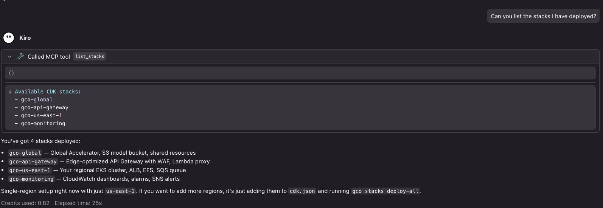
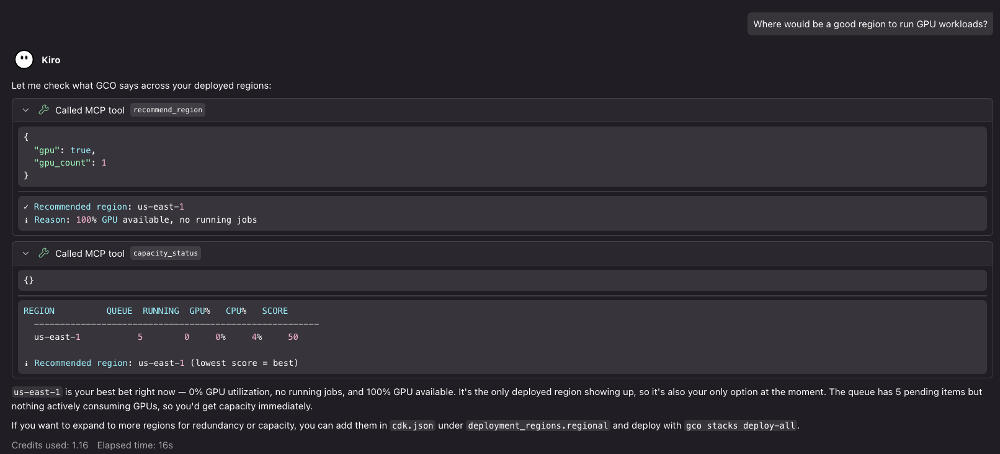
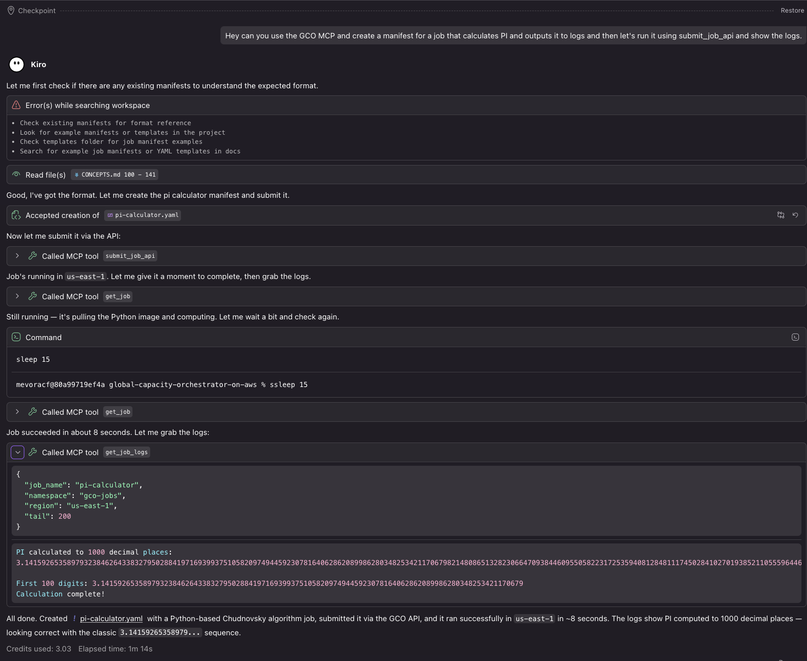
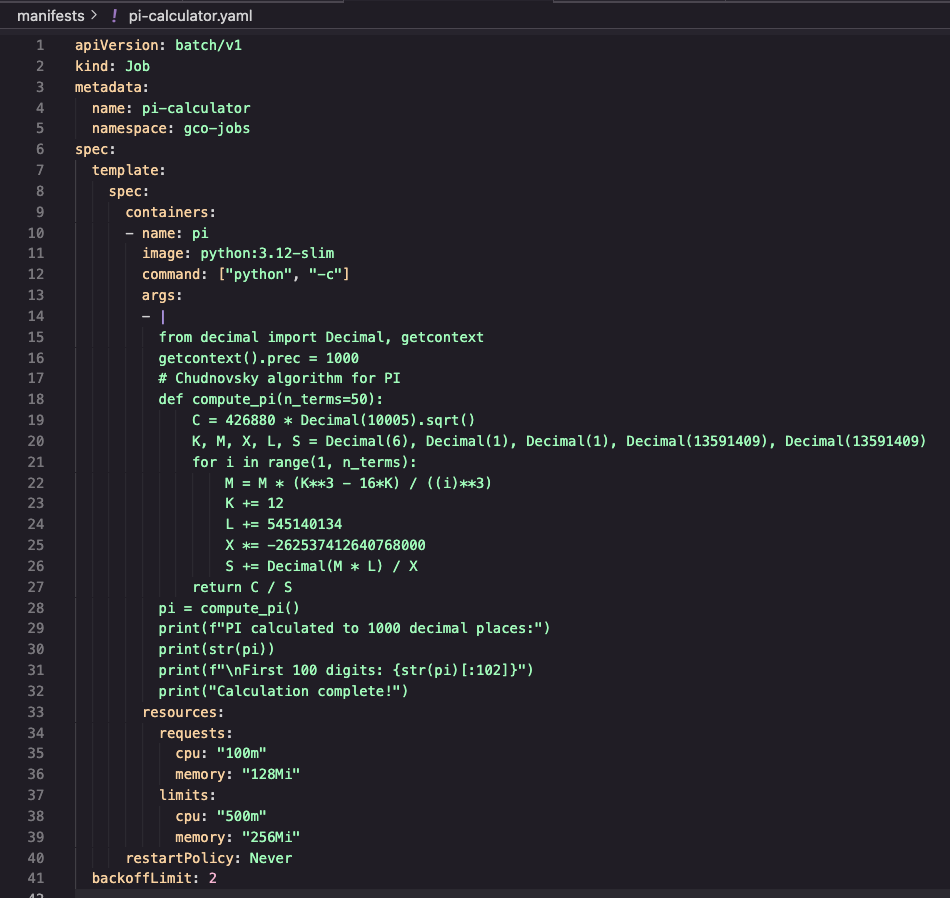
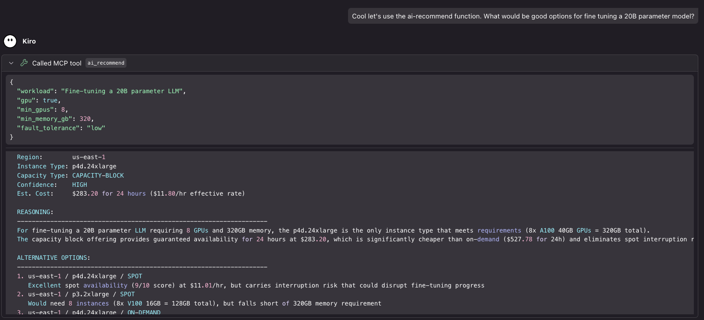
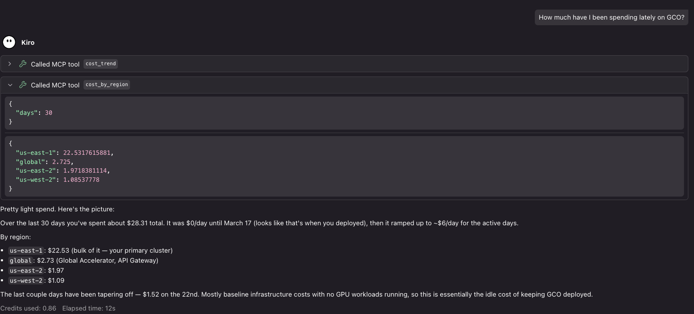

# GCO MCP Server

Some MCP tools are disabled by default and gated behind environment-variable feature flags — see [Feature Flags](#feature-flags) before enabling deploys, destroys, capacity purchases, model uploads, image publishes, or destructive operations.

An MCP (Model Context Protocol) server that exposes the GCO CLI as tools for LLM interaction. This lets you manage your multi-region EKS infrastructure through natural language in an AI-powered IDE with MCP support like [Kiro](https://kiro.dev).

## Table of Contents

- [Overview](#overview)
  - [Screenshots](#screenshots)
- [Prerequisites](#prerequisites)
- [Setup](#setup)
  - [Kiro](#kiro)
  - [Claude Desktop](#claude-desktop)
  - [Cursor](#cursor)
  - [Other MCP Clients](#other-mcp-clients)
- [Feature Flags](#feature-flags)
- [Available Tools](#available-tools)
  - [Job Management](#job-management)
  - [Queue Management](#queue-management)
  - [Capacity](#capacity)
  - [Inference Endpoints](#inference-endpoints)
  - [Cost Tracking](#cost-tracking)
  - [Infrastructure](#infrastructure)
  - [Storage](#storage)
  - [Model Weights](#model-weights)
  - [Templates](#templates)
  - [Webhooks](#webhooks)
  - [DAG Pipelines](#dag-pipelines)
  - [NodePools](#nodepools)
  - [Analytics](#analytics)
  - [Config](#config)
  - [Image Registry](#image-registry)
  - [Examples Discovery](#examples-discovery)
  - [Docs Discovery](#docs-discovery)
  - [Live State](#live-state)
- [Available Resources](#available-resources)
  - [Documentation](#documentation-docs)
  - [Kubernetes Manifests](#kubernetes-manifests-k8s)
  - [IAM Policies](#iam-policies-iam)
  - [Infrastructure](#infrastructure-infra)
  - [Source Code](#source-code-source)
  - [Demos & Walkthroughs](#demos--walkthroughs-demos)
  - [API Client Examples](#api-client-examples-clients)
  - [Utility Scripts](#utility-scripts-scripts)
  - [Test Suite](#test-suite-tests)
  - [Configuration](#configuration-config)
- [Getting Started with the MCP Server](#getting-started-with-the-mcp-server)
- [Architecture](#architecture)
- [Examples](#examples)
- [Recommended Companion MCP Servers](#recommended-companion-mcp-servers)
  - [AWS-focused](#aws-focused)
  - [Development \& docs](#development--docs)
  - [Reasoning \& workflow](#reasoning--workflow)
  - [Utilities](#utilities)
- [Troubleshooting](#troubleshooting)

## Overview

The MCP server wraps the `gco` CLI, exposing 90 tools by default (up to 111 with all flags enabled) that cover the full lifecycle of GPU workload management:

- Submit and monitor jobs across regions
- Deploy and manage inference endpoints with canary deployments
- Check GPU capacity and get region recommendations
- Track costs by service, region, and workload
- Manage infrastructure stacks and storage
- Build, push, and replicate container images across regions

### Screenshots

<details>
<summary>GCO MCP tools connected in Kiro</summary>


</details>

<details>
<summary>Listing stacks via natural language</summary>


</details>

<details>
<summary>Checking GPU capacity</summary>


</details>

<details>
<summary>Calculating PI on available capacity</summary>


</details>

<details>
<summary>PI calculation manifest</summary>


</details>

<details>
<summary>AI-powered capacity recommendation</summary>


</details>

<details>
<summary>Viewing cost summary</summary>


</details>

## Prerequisites

The simplest setup is to use GCO's [dev container](../QUICKSTART.md#step-1-clone-and-build-the-dev-container) — it has the `gco` CLI and the `[mcp]` extras (including `fastmcp`) pre-installed at the right versions, so you only need to point your MCP client at `python3 mcp/run_mcp.py` running inside the container. This avoids the dependency-resolver issues that often hit users installing GCO's many pinned packages on top of an existing Python environment.

If you'd rather install on your host:

- Python 3.14+
- GCO CLI installed (`pipx install -e .` from the project root)
- AWS credentials configured (the CLI handles SigV4 auth)
- `fastmcp` package (`pip install -e ".[mcp]"` from the project root, in a fresh venv if possible)

> If `pip install -e ".[mcp]"` errors out with `ResolutionImpossible`, see [Troubleshooting → Installation Issues](../docs/TROUBLESHOOTING.md#pip-install-fails-with-dependency-conflicts).

## Setup

The most portable config — works across Kiro, Claude Desktop, Cursor, and anything else that speaks stdio MCP — passes the **absolute path** to `run_mcp.py` directly in `args`. This avoids relying on any client-specific `cwd` handling.

### Kiro

Add to your MCP config at `~/.kiro/settings/mcp.json`. Kiro additionally honors a `cwd` field, so you can either use the absolute-path form below or the `cwd` shorthand:

```json
{
  "mcpServers": {
    "gco": {
      "command": "python3",
      "args": ["mcp/run_mcp.py"],
      "cwd": "/path/to/global-capacity-orchestrator-on-aws"
    }
  }
}
```

To enable a feature flag, add an `env` block alongside `cwd`:

```json
{
  "mcpServers": {
    "gco": {
      "command": "python3",
      "args": ["mcp/run_mcp.py"],
      "cwd": "/path/to/global-capacity-orchestrator-on-aws",
      "env": {
        "GCO_ENABLE_INFRASTRUCTURE_DEPLOY": "true"
      }
    }
  }
}
```

If the server fails to start in Kiro, switch to the absolute-path form — `cwd` handling differs between clients.

### Claude Desktop

Add to your MCP config at `~/Library/Application Support/Claude/claude_desktop_config.json` (macOS) or `%APPDATA%\Claude\claude_desktop_config.json` (Windows):

```json
{
  "mcpServers": {
    "gco": {
      "command": "python3",
      "args": ["/path/to/global-capacity-orchestrator-on-aws/mcp/run_mcp.py"]
    }
  }
}
```

To enable a feature flag, add an `env` block:

```json
{
  "mcpServers": {
    "gco": {
      "command": "python3",
      "args": ["/path/to/global-capacity-orchestrator-on-aws/mcp/run_mcp.py"],
      "env": {
        "GCO_ENABLE_DESTRUCTIVE_OPERATIONS": "true"
      }
    }
  }
}
```

Replace `/path/to/global-capacity-orchestrator-on-aws` with the absolute path to your GCO clone, then fully quit and reopen Claude Desktop for the new server to be picked up.

### Cursor

Add to your MCP config at `~/.cursor/mcp.json`:

```json
{
  "mcpServers": {
    "gco": {
      "command": "python3",
      "args": ["/path/to/global-capacity-orchestrator-on-aws/mcp/run_mcp.py"]
    }
  }
}
```

To enable a feature flag, add an `env` block:

```json
{
  "mcpServers": {
    "gco": {
      "command": "python3",
      "args": ["/path/to/global-capacity-orchestrator-on-aws/mcp/run_mcp.py"],
      "env": {
        "GCO_ENABLE_CAPACITY_PURCHASE": "true"
      }
    }
  }
}
```

Replace `/path/to/global-capacity-orchestrator-on-aws` with the absolute path to your GCO clone. After saving, hit the reload icon next to the `gco` server in Cursor → Settings → MCP so the tool descriptors get picked up.

### Other MCP Clients

The server uses stdio transport (the MCP default). Any MCP client that supports stdio can launch it with:

```bash
python3 /absolute/path/to/global-capacity-orchestrator-on-aws/mcp/run_mcp.py
```

Set environment variables on the launching shell to enable any feature flags (see [Feature Flags](#feature-flags) for the full list).

## Feature Flags

A handful of GCO MCP tools can incur AWS charges, mutate live infrastructure, delete data, or run for tens of minutes at a time. Those tools are disabled by default and gated behind environment-variable feature flags so an LLM can't reach them through a stray prompt — you opt in only the categories you actually want enabled for a given client. Each flag is opt-in, defaults off, and is read fresh from the environment at server startup.

| Flag | Default | Tools Gated | Why It's Gated |
|------|---------|-------------|----------------|
| `GCO_ENABLE_ALL_TOOLS` | `false` | All flagged tools below | Umbrella switch. Setting this to `true` enables every gated tool at once and overrides any per-flag value (even per-flag values explicitly set to `false`). Use sparingly — prefer per-flag opt-in for production clients. |
| `GCO_ENABLE_CAPACITY_PURCHASE` | `false` | `reserve_capacity` | Purchases a Capacity Block offering and incurs immediate AWS charges. Once committed the reservation cannot be cancelled. |
| `GCO_ENABLE_MODEL_UPLOAD` | `false` | `models_upload` | Uploads model weights to S3, which can be many GB per call and takes minutes to finish. Network egress and storage costs apply. |
| `GCO_ENABLE_IMAGE_PUBLISH` | `false` | `images_build`, `images_push` | Builds and publishes container images to ECR. Each call runs a long-running build (FastMCP background task) and pushes binaries that get replicated across every deployed region. |
| `GCO_ENABLE_INFRASTRUCTURE_DEPLOY` | `false` | `deploy_stack`, `deploy_all`, `bootstrap_cdk` | Creates or updates CloudFormation stacks. A full `deploy_all` runs 30-60 minutes wall-clock and can provision EKS clusters, NodePools, and storage that incur ongoing charges. |
| `GCO_ENABLE_INFRASTRUCTURE_DESTROY` | `false` | `destroy_stack`, `destroy_all` | Tears down CloudFormation stacks. Cancellation mid-flight can leave partial state behind that has to be cleaned up by hand. |
| `GCO_ENABLE_DESTRUCTIVE_OPERATIONS` | `false` | `delete_job`, `delete_inference`, `delete_template`, `delete_webhook`, `delete_model`, `delete_nodepool`, `analytics_user_remove`, `cancel_queue_job`, `images_cleanup`, `images_prune`, `images_delete_tag`, `images_delete_repo` | Delete operations are irreversible — once data, jobs, models, or images are removed they can't be recovered without a backup. |

### Enabling a Flag

Set the flag in your MCP client's `env` block. The same JSON pattern works across Kiro, Claude Desktop, and Cursor:

#### Kiro (`~/.kiro/settings/mcp.json`)

```json
{
  "mcpServers": {
    "gco": {
      "command": "python3",
      "args": ["mcp/run_mcp.py"],
      "cwd": "/path/to/global-capacity-orchestrator-on-aws",
      "env": {
        "GCO_ENABLE_CAPACITY_PURCHASE": "true"
      }
    }
  }
}
```

#### Claude Desktop (`~/Library/Application Support/Claude/claude_desktop_config.json`)

```json
{
  "mcpServers": {
    "gco": {
      "command": "python3",
      "args": ["/path/to/global-capacity-orchestrator-on-aws/mcp/run_mcp.py"],
      "env": {
        "GCO_ENABLE_INFRASTRUCTURE_DEPLOY": "true"
      }
    }
  }
}
```

#### Cursor (`~/.cursor/mcp.json`)

```json
{
  "mcpServers": {
    "gco": {
      "command": "python3",
      "args": ["/path/to/global-capacity-orchestrator-on-aws/mcp/run_mcp.py"],
      "env": {
        "GCO_ENABLE_DESTRUCTIVE_OPERATIONS": "true"
      }
    }
  }
}
```

To enable everything for a development client, set the umbrella flag instead of every individual flag:

```json
{
  "env": {
    "GCO_ENABLE_ALL_TOOLS": "true"
  }
}
```

Multiple per-flag entries can be combined in the same `env` block — set only the flags you actually need.

### Non-Gating Environment Variables

These environment variables tune the MCP server's behaviour but **do not gate any tools** — they only control discovery and transport. They're called out here so they don't get conflated with the gating family above.

| Variable | Values | Default | What It Does |
|----------|--------|---------|--------------|
| `GCO_MCP_TOOL_SEARCH` | `off` \| `bm25` \| `regex` \| `code_mode` | `bm25` | Selects the catalog-replacement transform. `bm25` (default) replaces `list_tools()` with a BM25-ranked `search_tools` plus a small set of always-visible entry-point tools. `regex` swaps in a regex-based search. `code_mode` is experimental and exposes Code Mode meta-tools (`search` / `get_schemas` / `execute`). `off` returns the legacy full catalog. An unknown value falls back to `bm25`. |
| `FASTMCP_DOCKET_URL` | URL | `memory://` | Controls where FastMCP's background-task store lives. The default `memory://` keeps task state in-process for the lifetime of the server. Set to e.g. `redis://localhost:6379` to persist task state across restarts and share it with other consumers. |

### Breaking Change in This Version

Two tools that used to be available by default are now gated behind `GCO_ENABLE_DESTRUCTIVE_OPERATIONS`:

- `delete_job` — irreversibly deletes a Kubernetes job and its pods.
- `delete_inference` — irreversibly removes an inference endpoint and its DynamoDB record.

If your client relied on them, restore them by adding the flag to your `env` block:

```json
{
  "mcpServers": {
    "gco": {
      "command": "python3",
      "args": ["mcp/run_mcp.py"],
      "cwd": "/path/to/global-capacity-orchestrator-on-aws",
      "env": {
        "GCO_ENABLE_DESTRUCTIVE_OPERATIONS": "true"
      }
    }
  }
}
```

Setting the umbrella `GCO_ENABLE_ALL_TOOLS=true` also restores both tools alongside every other gated tool.

## Available Tools

Each table lists the `Risk Tier` and `Gated By` columns alongside the description so you can spot the operational impact of every tool at a glance. `—` in the Gated By column means the tool is registered by default and needs no flag.

### Job Management

| Tool | Description | Risk Tier | Gated By |
|------|-------------|-----------|----------|
| `list_jobs` | List jobs across GCO clusters (all regions or specific) | safe | — |
| `submit_job_sqs` | Submit a job via SQS queue (recommended for production) | low-risk | — |
| `submit_job_api` | Submit a job via API Gateway with SigV4 auth | low-risk | — |
| `get_job` | Get details of a specific job | safe | — |
| `get_job_logs` | Get logs from a job | safe | — |
| `get_job_events` | Get Kubernetes events for a job (debugging) | safe | — |
| `delete_job` | Delete a job (irreversible) | destructive | `GCO_ENABLE_DESTRUCTIVE_OPERATIONS` |
| `cluster_health` | Get health status of clusters | safe | — |
| `queue_status` | View SQS queue status (pending, in-flight, DLQ) | safe | — |

### Queue Management

| Tool | Description | Risk Tier | Gated By |
|------|-------------|-----------|----------|
| `queue_list` | List jobs in the global queue (filter by status, namespace, region) | safe | — |
| `queue_get` | Fetch a single job record from the global queue | safe | — |
| `queue_stats` | Aggregate queue stats per region | safe | — |
| `queue_submit` | Submit a manifest to the global queue | low-risk | — |
| `cancel_queue_job` | Cancel an in-flight queued job (irreversible) | destructive | `GCO_ENABLE_DESTRUCTIVE_OPERATIONS` |

### Capacity

| Tool | Description | Risk Tier | Gated By |
|------|-------------|-----------|----------|
| `check_capacity` | Check spot and on-demand capacity for an instance type | safe | — |
| `capacity_status` | View capacity across all deployed regions | safe | — |
| `recommend_region` | Get optimal region recommendation (supports instance-type-aware weighted scoring) | safe | — |
| `spot_prices` | Get current spot prices for an instance type | safe | — |
| `ai_recommend` | Get AI-powered capacity recommendation using Amazon Bedrock | safe | — |
| `list_reservations` | List On-Demand Capacity Reservations (ODCRs) across regions | safe | — |
| `reservation_check` | Check reservation availability and Capacity Block offerings | safe | — |
| `reserve_capacity` | Purchase a Capacity Block offering by ID (supports dry-run) | cost-incurring | `GCO_ENABLE_CAPACITY_PURCHASE` |

### Inference Endpoints

| Tool | Description | Risk Tier | Gated By |
|------|-------------|-----------|----------|
| `deploy_inference` | Deploy an inference endpoint across regions | low-risk | — |
| `list_inference_endpoints` | List all inference endpoints | safe | — |
| `inference_status` | Get detailed status with per-region breakdown | safe | — |
| `inference_health` | Health-check an inference endpoint | safe | — |
| `list_endpoint_models` | List models loaded on an inference endpoint | safe | — |
| `invoke_inference` | Send a prompt to an inference endpoint | safe | — |
| `chat_inference` | Send a multi-turn chat conversation to an inference endpoint | safe | — |
| `scale_inference` | Scale an endpoint's replica count | low-risk | — |
| `update_inference_image` | Rolling update to a new container image | low-risk | — |
| `stop_inference` | Stop an endpoint (scales to zero, keeps config) | low-risk | — |
| `start_inference` | Start a stopped endpoint | low-risk | — |
| `canary_deploy` | A/B test a new image version with weighted traffic | low-risk | — |
| `promote_canary` | Promote canary to primary (100% traffic) | low-risk | — |
| `rollback_canary` | Rollback canary (100% traffic to primary) | low-risk | — |
| `delete_inference` | Delete an endpoint (irreversible) | destructive | `GCO_ENABLE_DESTRUCTIVE_OPERATIONS` |

### Cost Tracking

| Tool | Description | Risk Tier | Gated By |
|------|-------------|-----------|----------|
| `cost_summary` | Total spend broken down by AWS service | safe | — |
| `cost_by_region` | Cost breakdown by AWS region | safe | — |
| `cost_trend` | Daily cost trend | safe | — |
| `cost_forecast` | Forecast costs for the next N days | safe | — |

### Infrastructure

| Tool | Description | Risk Tier | Gated By |
|------|-------------|-----------|----------|
| `list_stacks` | List all GCO CDK stacks | safe | — |
| `stack_status` | Get detailed CloudFormation stack status | safe | — |
| `stack_diff` | Show CloudFormation diff for a stack | safe | — |
| `stack_outputs` | Fetch CloudFormation outputs for a stack | safe | — |
| `stack_synth` | Synthesize CloudFormation templates from CDK | safe | — |
| `valkey_status` | Show Valkey cache stack status | safe | — |
| `aurora_status` | Show Aurora database stack status | safe | — |
| `fsx_status` | Check FSx for Lustre configuration | safe | — |
| `setup_cluster_access` | Configure kubectl access to a GCO EKS cluster | low-risk | — |
| `enable_fsx` / `disable_fsx` | Toggle FSx Lustre in `cdk.json` (apply with `gco stacks deploy-all`) | low-risk | — |
| `enable_valkey` / `disable_valkey` | Toggle Valkey Serverless in `cdk.json` | low-risk | — |
| `enable_aurora` / `disable_aurora` | Toggle Aurora pgvector in `cdk.json` | low-risk | — |
| `bootstrap_cdk` | Bootstrap a region for CDK (long-running, 2-5 min) | infrastructure | `GCO_ENABLE_INFRASTRUCTURE_DEPLOY` |
| `deploy_stack` | Deploy a single stack via CDK (long-running, 15-30 min) | infrastructure | `GCO_ENABLE_INFRASTRUCTURE_DEPLOY` |
| `deploy_all` | Deploy every stack across every region (long-running, 30-60 min) | infrastructure | `GCO_ENABLE_INFRASTRUCTURE_DEPLOY` |
| `destroy_stack` | Destroy a single stack via CDK (long-running, 5-20 min) | infrastructure | `GCO_ENABLE_INFRASTRUCTURE_DESTROY` |
| `destroy_all` | Destroy every stack across every region (long-running, 20-40 min) | infrastructure | `GCO_ENABLE_INFRASTRUCTURE_DESTROY` |

### Storage

| Tool | Description | Risk Tier | Gated By |
|------|-------------|-----------|----------|
| `list_storage_contents` | List contents of shared EFS storage | safe | — |
| `list_file_systems` | List EFS and FSx file systems | safe | — |
| `files_get` | Fetch a single file from shared storage | safe | — |
| `files_access_points` | List EFS access points | safe | — |

### Model Weights

| Tool | Description | Risk Tier | Gated By |
|------|-------------|-----------|----------|
| `list_models` | List uploaded model weights in S3 | safe | — |
| `get_model_uri` | Get S3 URI for a model | safe | — |
| `models_upload` | Upload model weights to S3 (long-running, multi-GB) | data-upload | `GCO_ENABLE_MODEL_UPLOAD` |
| `delete_model` | Delete uploaded model weights (irreversible) | destructive | `GCO_ENABLE_DESTRUCTIVE_OPERATIONS` |

### Templates

| Tool | Description | Risk Tier | Gated By |
|------|-------------|-----------|----------|
| `templates_list` | List job templates available in the project | safe | — |
| `templates_get` | Read a single template definition | safe | — |
| `templates_create` | Create a new job template | low-risk | — |
| `templates_run` | Render a template into a job manifest and submit it | low-risk | — |
| `delete_template` | Delete a template (irreversible) | destructive | `GCO_ENABLE_DESTRUCTIVE_OPERATIONS` |

### Webhooks

| Tool | Description | Risk Tier | Gated By |
|------|-------------|-----------|----------|
| `webhooks_list` | List webhooks registered for job lifecycle events | safe | — |
| `webhooks_get` | Read a single webhook's configuration | safe | — |
| `webhooks_create` | Register a new webhook | low-risk | — |
| `delete_webhook` | Delete a webhook (irreversible) | destructive | `GCO_ENABLE_DESTRUCTIVE_OPERATIONS` |

### DAG Pipelines

| Tool | Description | Risk Tier | Gated By |
|------|-------------|-----------|----------|
| `dag_validate` | Validate a DAG manifest without submitting | safe | — |
| `dag_run` | Submit a DAG pipeline for execution | low-risk | — |

### NodePools

| Tool | Description | Risk Tier | Gated By |
|------|-------------|-----------|----------|
| `nodepools_list` | List Karpenter NodePools in a cluster | safe | — |
| `nodepools_describe` | Show one NodePool's full configuration | safe | — |
| `nodepools_create_odcr` | Create an ODCR-backed NodePool with weighted scheduling | low-risk | — |
| `delete_nodepool` | Delete a NodePool (irreversible) | destructive | `GCO_ENABLE_DESTRUCTIVE_OPERATIONS` |

### Analytics

| Tool | Description | Risk Tier | Gated By |
|------|-------------|-----------|----------|
| `analytics_doctor` | Diagnose the analytics environment's health | safe | — |
| `analytics_login_url` | Generate a login URL for an analytics user | safe | — |
| `analytics_users_list` | List users provisioned in the analytics environment | safe | — |
| `analytics_user_add` | Add a new analytics user | low-risk | — |
| `enable_analytics` | Toggle the analytics stack on in `cdk.json` (apply with `gco stacks deploy-all`) | low-risk | — |
| `disable_analytics` | Toggle the analytics stack off in `cdk.json` | low-risk | — |
| `analytics_user_remove` | Remove an analytics user (irreversible) | destructive | `GCO_ENABLE_DESTRUCTIVE_OPERATIONS` |

### Config

| Tool | Description | Risk Tier | Gated By |
|------|-------------|-----------|----------|
| `config_get` | Read the project's `cdk.json` config (whole document or one key) | safe | — |

### Image Registry

| Tool | Description | Risk Tier | Gated By |
|------|-------------|-----------|----------|
| `images_list` | List every `gco/*` repository in ECR | safe | — |
| `images_tags` | List tags within a repository | safe | — |
| `images_describe` | Full ECR details for a single image tag | safe | — |
| `images_uri` | Return the registry URI for an image | safe | — |
| `images_replication_get` | Read the current ECR replication configuration | safe | — |
| `images_replication_status` | Per-image replication status across project repos | safe | — |
| `images_orphans` | List `gco/*` tags older than the threshold with no references | safe | — |
| `images_init` | Create the project ECR repo idempotently with default lifecycle | low-risk | — |
| `images_lifecycle_get` | Read the lifecycle policy on a repository | low-risk | — |
| `images_lifecycle_set` | Replace the lifecycle policy on a repository | low-risk | — |
| `images_replication_sync` | Apply the standard `gco/*` replication rule | low-risk | — |
| `images_build` | Build a container image from a context (long-running, FastMCP background task) | image | `GCO_ENABLE_IMAGE_PUBLISH` |
| `images_push` | Push an already-built local image to ECR (long-running, data-upload) | image | `GCO_ENABLE_IMAGE_PUBLISH` |
| `images_cleanup` | Bulk-delete tags matching filters across one or all `gco/*` repos | destructive | `GCO_ENABLE_DESTRUCTIVE_OPERATIONS` |
| `images_prune` | Keep only the N most-recent tags in each repo | destructive | `GCO_ENABLE_DESTRUCTIVE_OPERATIONS` |
| `images_delete_tag` | Delete one tag from a repo (irreversible) | destructive | `GCO_ENABLE_DESTRUCTIVE_OPERATIONS` |
| `images_delete_repo` | Delete an entire repo (irreversible) | destructive | `GCO_ENABLE_DESTRUCTIVE_OPERATIONS` |

### Examples Discovery

| Tool | Description | Risk Tier | Gated By |
|------|-------------|-----------|----------|
| `find_examples` | Search the bundled example manifests by query, category, GPU, or use case | safe | — |

### Docs Discovery

| Tool | Description | Risk Tier | Gated By |
|------|-------------|-----------|----------|
| `find_docs` | Search documentation pages by query or topic | safe | — |

### Live State

The synthetic `read_resource` tool (added by FastMCP's Resources As Tools transform) reaches every resource path the server exposes — including the live-state paths below, which materialize current cluster state on demand. Tool-only clients (Cursor, etc.) can call `read_resource(uri="gco://jobs/my-job")` and get the same answer the resource handler would return directly.

| Tool / Resource Path | Description | Risk Tier | Gated By |
|----------------------|-------------|-----------|----------|
| `read_resource` (synthetic) | Read any MCP resource by URI — entry point for tool-only clients | safe | — |
| `gco://jobs/{job_name}` | Live YAML for a Kubernetes job in `gco-jobs` | safe | — |
| `gco://inference/{endpoint_name}` | Inference endpoint record from the DynamoDB store | safe | — |
| `gco://k8s/{namespace}/{kind}/{name}` | Live YAML for any cluster resource | safe | — |
| `gco://cluster/{region}/topology` | NodePools plus pending pods for a region | safe | — |
| `costs://gco/summary/{days_window}` | Cached cost summary scoped to the named window | safe | — |
| `tasks://gco/{task_id}` | Status of a FastMCP background task | safe | — |

## Available Resources

Beyond tools, the MCP server exposes documentation, source code, examples, and operational resources as MCP resources. This means an agent can read GCO's docs, code, manifests, and config on demand to answer in-depth questions about how the platform works.

### Documentation (`docs://`)

| Resource | Description |
|----------|-------------|
| `docs://gco/index` | Browse all available docs, examples, and resource groups |
| `docs://gco/README` | Project README and overview |
| `docs://gco/QUICKSTART` | Quick start guide — deploy in under 60 minutes |
| `docs://gco/CONTRIBUTING` | Contributing guide |
| `docs://gco/docs/{name}` | Any doc by name (ARCHITECTURE, CLI, INFERENCE, CONCEPTS, etc.) |
| `docs://gco/docs/by-topic/{topic}` | Listing of docs whose metadata mentions the given topic |
| `docs://gco/docs/by-related/{doc_name}` | Listing of docs that reference (or are referenced by) the named doc |
| `docs://gco/examples/README` | Examples overview with usage instructions |
| `docs://gco/examples/guide` | How to create new job manifests — patterns, metadata, submission methods |
| `docs://gco/examples/{name}` | Example manifests with metadata headers (category, GPU, opt-in, submission) |
| `docs://gco/examples/by-category/{category}` | Listing of examples filed under one category |
| `docs://gco/examples/by-use-case/{use_case}` | Listing of examples whose metadata names the given use case |

### Kubernetes Manifests (`k8s://`)

| Resource | Description |
|----------|-------------|
| `k8s://gco/manifests/index` | List all manifests applied during stack deployment |
| `k8s://gco/manifests/{filename}` | Read a specific manifest (RBAC, NodePools, services, etc.) |

### IAM Policies (`iam://`)

| Resource | Description |
|----------|-------------|
| `iam://gco/policies/index` | List IAM policy templates |
| `iam://gco/policies/{filename}` | Read a policy template (full-access, read-only, namespace-restricted) |

### Infrastructure (`infra://`)

| Resource | Description |
|----------|-------------|
| `infra://gco/index` | Browse Dockerfiles, Helm charts, CI/CD, and security config |
| `infra://gco/dockerfiles/{filename}` | Read a Dockerfile or its README |
| `infra://gco/helm/charts.yaml` | Helm chart versions and configuration |

### CI / GitHub Actions (`ci://`)

Everything under `.github/` — workflows, composite actions, issue/PR templates, scripts, and policy files. Useful when an agent needs to reason about or explain a CI job, debug a workflow failure, or look up which action caused a pipeline step to fail.

| Resource | Description |
|----------|-------------|
| `ci://gco/index` | Browse workflows, composite actions, scripts, templates, and policy files |
| `ci://gco/workflows/{filename}` | Read a workflow YAML (unit-tests.yml, security.yml, cve-scan.yml, etc.) |
| `ci://gco/actions/{name}` | Read a composite action's `action.yml` (e.g. `build-lambda-package`) |
| `ci://gco/scripts/{filename}` | Read a helper script invoked by the workflows (e.g. `dependency-scan.sh`) |
| `ci://gco/templates/{filename}` | Read an issue template or `pull_request_template.md` |
| `ci://gco/codeql/{filename}` | Read CodeQL configuration (query filters, scanned paths) |
| `ci://gco/kind/{filename}` | Read kind-cluster configuration used by integration tests |
| `ci://gco/config/{filename}` | Read a top-level config file (`CI.md`, `CODEOWNERS`, `SECURITY.md`, `release.yml`, `dependabot.yml`) |

### Source Code (`source://`)

| Resource | Description |
|----------|-------------|
| `source://gco/index` | Browse all source files grouped by package |
| `source://gco/config/{filename}` | Project config files (pyproject.toml, cdk.json, .gitlab-ci.yml, linter configs, etc.) |
| `source://gco/file/{path}` | Any source file by relative path |

Source code resources cover `gco/`, `cli/`, `lambda/`, `mcp/`, `scripts/`, `demo/`, and `dockerfiles/`. Build artifacts and caches are filtered out. Path traversal outside the project is blocked.

### Demos & Walkthroughs (`demos://`)

| Resource | Description |
|----------|-------------|
| `demos://gco/index` | Browse demo walkthroughs and scripts |
| `demos://gco/README` | Demo starter kit overview |
| `demos://gco/DEMO_WALKTHROUGH` | Step-by-step infrastructure and jobs demo |
| `demos://gco/INFERENCE_WALKTHROUGH` | End-to-end inference demo (deploy, invoke, scale, autoscale) |
| `demos://gco/LIVE_DEMO` | Automated live demo documentation |
| `demos://gco/{script}` | Demo scripts (live_demo.sh, lib_demo.sh, record_*.sh) |

### API Client Examples (`clients://`)

| Resource | Description |
|----------|-------------|
| `clients://gco/index` | Browse API client examples |
| `clients://gco/README` | Client examples overview, setup, and API reference |
| `clients://gco/python_boto3_example.py` | Python example code with boto3 + SigV4 |
| `clients://gco/aws_cli_examples.sh` | AWS CLI with manual SigV4 signing |
| `clients://gco/curl_sigv4_proxy_example.sh` | curl with aws-sigv4-proxy |

### Utility Scripts (`scripts://`)

| Resource | Description |
|----------|-------------|
| `scripts://gco/index` | Browse utility scripts |
| `scripts://gco/README` | Scripts overview and usage |
| `scripts://gco/setup-cluster-access.sh` | Configure kubectl access to EKS |
| `scripts://gco/bump_version.py` | Version bumping across all locations |
| `scripts://gco/dump_nag_findings.py` | cdk-nag compliance debugging helper |
| `scripts://gco/test_webhook_delivery.py` | Webhook dispatcher testing |

### Test Suite (`tests://`)

| Resource | Description |
|----------|-------------|
| `tests://gco/index` | Browse test files, infrastructure, and BATS shell tests |
| `tests://gco/README` | Test suite overview, patterns, mocking guide, and coverage requirements |
| `tests://gco/{filepath}` | Read any test file (e.g. `test_mcp_server.py`, `conftest.py`, `BATS/README.md`) |

### Configuration (`config://`)

| Resource | Description |
|----------|-------------|
| `config://gco/index` | Browse CDK configuration, feature toggles, and environment variables |
| `config://gco/cdk.json` | Current CDK deployment configuration |
| `config://gco/feature-toggles` | All feature toggles with their current values and defaults |
| `config://gco/env-vars` | Environment variables used by the MCP server and services |

### Try it

Ask your agent questions like:

- "How does GCO decide which region to recommend for a job?"
- "Walk me through the inference deployment flow"
- "What CDK stacks does GCO create and what's in each one?"
- "How does the manifest processor handle job submissions?"
- "Show me the RBAC configuration applied to the cluster"
- "What IAM policy do I need for read-only access?"
- "How do I set up the live demo?"
- "Show me the Python example for calling the API"

The agent will pull the relevant docs and source code to give you a grounded answer.

## Getting Started with the MCP Server

A great way to get familiar with GCO is through the capacity recommendation system. It touches several core concepts — multi-region awareness, GPU capacity, spot pricing, and job scheduling — and gives you a practical feel for how the platform thinks about workload placement.

Try asking:

1. **"Check GPU capacity for g5.xlarge across all regions"** — this calls `check_capacity` and shows you how GCO queries EC2 spot placement scores, spot price history, and on-demand availability.

2. **"Which region should I use for a GPU job?"** — this triggers `recommend_region`, which aggregates queue depth, GPU utilization, and running job counts across all deployed regions, then ranks them. Pass an instance type (e.g. `g5.xlarge`) for weighted multi-signal scoring that also factors in spot placement scores, pricing trends, and capacity block availability.

3. **"Explain how the capacity recommendation works under the hood"** — the agent will read `cli/capacity/` via the source resources and walk you through the three-layer architecture:
   - `CapacityChecker` — core AWS queries (spot scores, pricing, instance offerings)
   - `MultiRegionCapacityChecker` — cross-region aggregation and weighted scoring
   - `BedrockCapacityAdvisor` — optional AI-powered recommendations via Bedrock

From there, you can branch into job submission, inference deployments, or cost tracking — all through natural conversation.

## Architecture

The MCP server is organized as a modular package under `mcp/`:

```text
mcp/
├── run_mcp.py             — Thin entrypoint (python mcp/run_mcp.py)
├── server.py              — FastMCP instance, transforms, middleware
├── feature_flags.py       — Feature-flag evaluation (FLAG_* constants, is_enabled)
├── audit.py               — Audit logging, sanitization, decorator
├── audit_middleware.py    — Context-spy middleware that captures client_messages and elicitations
├── iam.py                 — IAM role assumption
├── cli_runner.py          — _run_cli() subprocess wrapper
├── version.py             — Project version management
├── tools/                 — MCP tool definitions (one file per domain)
│   ├── _long_task.py      — async subprocess runner for FastMCP Tasks (long-running tools)
│   ├── jobs.py            — Job submission, listing, logs, events
│   ├── queue.py           — Global queue inspection and submission
│   ├── capacity.py        — Capacity checking, recommendations, reservations
│   ├── inference.py       — Inference deployment, scaling, canary, invocation, chat
│   ├── costs.py           — Cost tracking and forecasting
│   ├── stacks.py          — CDK stack management (incl. long-running deploy/destroy)
│   ├── storage.py         — EFS/FSx file operations
│   ├── models.py          — Model weight management (incl. gated upload)
│   ├── images.py          — Image registry (build/push/lifecycle/replication/cleanup)
│   ├── templates.py       — Job templates
│   ├── webhooks.py        — Lifecycle webhooks
│   ├── dag.py             — DAG pipeline validation and submission
│   ├── nodepools.py       — Karpenter NodePool management
│   ├── analytics.py       — Analytics environment management
│   ├── config.py          — Read-only access to cdk.json
│   ├── examples.py        — find_examples discovery tool
│   └── docs.py            — find_docs discovery tool
└── resources/             — MCP resource definitions (one file per scheme)
    ├── docs.py            — docs:// (documentation + examples with metadata)
    ├── source.py          — source:// (full source code browser)
    ├── k8s.py             — k8s:// + live gco://k8s/{namespace}/{kind}/{name}
    ├── iam_policies.py    — iam:// (IAM policy templates)
    ├── infra.py           — infra:// (Dockerfiles, Helm, CI/CD)
    ├── ci.py              — ci:// (GitHub Actions, workflows)
    ├── demos.py           — demos:// (walkthroughs, scripts)
    ├── clients.py         — clients:// (API client examples)
    ├── scripts.py         — scripts:// (utility scripts)
    ├── tests.py           — tests:// (test suite docs and patterns)
    ├── config.py          — config:// (CDK config, feature toggles, env vars)
    ├── images.py          — images:// (image registry browse)
    ├── jobs.py            — gco://jobs/{job_name} (live job YAML)
    ├── inference.py       — gco://inference/{endpoint_name} (live endpoint state)
    ├── cluster.py         — gco://cluster/{region}/topology (NodePools + pending pods)
    ├── costs.py           — costs://gco/summary/{days_window} (cost summary cache)
    └── tasks.py           — tasks://gco/{task_id} (FastMCP background task status)
```

Long-running tools (`deploy_stack`, `destroy_stack`, `images_build`, etc.) use FastMCP Tasks — protocol-native background-task support — rather than an in-house operation registry. The shared `tools/_long_task.py` helper drives `asyncio.create_subprocess_exec`, streams progress messages back through the FastMCP `Progress` dependency, and converts mid-flight cancellation into a structured result (with a partial-CloudFormation-state disclaimer for stack ops).

Each tool shells out to the `gco` CLI. This approach:

- Reuses all existing auth (SigV4), error handling, and retry logic
- Stays in sync with CLI updates automatically
- Avoids duplicating complex AWS client setup
- Uses `--output json` for structured responses where supported

```text
LLM ←→ MCP Protocol (stdio) ←→ run_mcp.py ←→ gco CLI ←→ AWS APIs
```

## Examples

Once connected, you can interact naturally:

- "What jobs are running in us-east-1?"
- "Check GPU capacity for g5.xlarge in us-west-2"
- "Deploy a vLLM inference endpoint with 2 GPUs"
- "What's my cost this month?"
- "Scale my-llm endpoint to 3 replicas"
- "Submit examples/simple-job.yaml to the region with the most capacity"

## Recommended Companion MCP Servers

These are MCP servers we've found genuinely useful while developing GCO and while operating it day-to-day. None of them are required — the GCO MCP server is fully functional on its own — but each one has earned its spot by coming up often enough that we'd rather have it installed than not.

> **All of the servers listed below are free to use as of 2026-05-10** — no paid plans, API keys, or usage-based fees. A few (the AWS ones in particular) call APIs that themselves have free tiers / pay-per-call pricing on the AWS side, but the MCP servers wrapping them don't charge anything. Worth re-checking the upstream projects before relying on this for the long haul.

Add any of them to your MCP config (e.g. `~/.kiro/settings/mcp.json`) the same way you added the `gco` server. A full example combining several of them is at the bottom of this section.

### AWS-focused

The most natural companions, since GCO is an AWS-native platform.

| Server | Package | Why it pairs with GCO |
|--------|---------|----------------------|
| **AWS Documentation** | [`awslabs.aws-documentation-mcp-server`](https://awslabs.github.io/mcp/servers/aws-documentation-mcp-server/) | Look up AWS service docs (EKS, EC2 spot, FSx for Lustre, CDK, Bedrock) without leaving the chat. Helpful when an agent needs to verify an API option, a service quota, or a recently-released feature that isn't in its training data. |
| **AWS Pricing** | [`awslabs.aws-pricing-mcp-server`](https://awslabs.github.io/mcp/servers/aws-pricing-mcp-server/) | Cross-check the output of `cost_summary` / `cost_forecast` against the published rate cards. Also useful for "what does running 12× `p5.48xlarge` for 6 hours cost across `us-east-1` vs `us-west-2`?" style planning questions before you submit a job. |
| **EKS** | [`awslabs.eks-mcp-server`](https://awslabs.github.io/mcp/servers/eks-mcp-server/) | Drop down a layer when GCO's higher-level tools aren't enough — describe pods directly, tail logs from `kube-system`, inspect events on a NodePool, or apply a one-off manifest. Complements GCO's job/inference abstractions rather than replacing them. |

### Development & docs

For navigating code, docs, and the broader web while working on GCO itself.

| Server | Package | Why it pairs with GCO |
|--------|---------|----------------------|
| **Filesystem** | [`@modelcontextprotocol/server-filesystem`](https://github.com/modelcontextprotocol/servers/tree/main/src/filesystem) | Read/write project files outside the GCO MCP's resource scopes — editing CI configs, scaffolding new example manifests, dropping scratch notes into the repo. Pair with `${workspaceFolder}` so it's scoped to the current project. |
| **Fetch** | [`mcp-server-fetch`](https://github.com/modelcontextprotocol/servers/tree/main/src/fetch) | Pull a specific URL into context: a GitHub issue, an AWS release note, an external runbook, a CloudWatch console deep-link. Comes up constantly during incident analysis. |
| **DuckDuckGo Search** | [`duckduckgo-mcp-server`](https://github.com/nickclyde/duckduckgo-mcp-server) | General-purpose web search for "is this a known issue?" / "what does this CloudFormation error code mean?" investigations. No API key required, unlike most other search MCPs. |
| **DeepWiki** | [`mcp-deepwiki`](https://github.com/regenrek/deepwiki-mcp) | Ask questions against any public GitHub repo's DeepWiki — useful for digging into upstream projects GCO depends on (`fastmcp`, `aws-cdk`, EKS addons, vLLM, etc.) without cloning them. |
| **Documentation** | [`@andrea9293/mcp-documentation-server`](https://github.com/andrea9293/mcp-documentation-server) | Index local or remote documentation into a small vector store the agent can search semantically. Handy for long-form internal docs that are awkward to grep. |
| **Playwright** | [`@playwright/mcp`](https://github.com/microsoft/playwright-mcp) | Drive a browser for end-to-end testing of inference endpoints, exercising the AWS console, or scraping a page that doesn't expose a clean API. |

### Reasoning & workflow

These don't add new capabilities — they shape how the agent thinks and remembers.

| Server | Package | Why it pairs with GCO |
|--------|---------|----------------------|
| **Sequential Thinking** | [`@modelcontextprotocol/server-sequential-thinking`](https://github.com/modelcontextprotocol/servers/tree/main/src/sequentialthinking) | Encourages the agent to break complex GCO workflows (multi-region rollouts, canary promotions, incident postmortems) into explicit steps before taking action. Noticeably reduces "fire-and-pray" tool calls. |
| **Inner Monologue** | [`inner-monologue-mcp`](https://www.npmjs.com/package/inner-monologue-mcp) | Similar in spirit — gives the agent a scratchpad for reasoning when troubleshooting a stuck job or a failed deployment. |
| **Memory** | [`@modelcontextprotocol/server-memory`](https://github.com/modelcontextprotocol/servers/tree/main/src/memory) | Persists facts across sessions: "we always deploy to these three regions", "our SLO is X", "this account uses Capacity Blocks, not regular spot". Saves re-stating context every chat. |
| **MCP Tasks** | [`mcp-tasks`](https://www.npmjs.com/package/mcp-tasks) | Lightweight task list the agent can read/update while working through a multi-step plan — e.g. a full GCO bootstrap, a region cutover, or a long-running cost-optimization sweep. |

### Utilities

Small helpers that round out the toolbox.

| Server | Package | Why it pairs with GCO |
|--------|---------|----------------------|
| **Shell** | [`mcp-shell-server`](https://github.com/tumf/mcp-shell-server) | Run a small allowlist of read-only shell commands (`ls`, `cat`, `pwd`, `grep`, `wc`, `find`, `touch`) when the agent needs to inspect the working tree itself. Keep `ALLOW_COMMANDS` tight — don't add destructive commands like `rm` or `git`. |
| **Calculator** | [`mcp-server-calculator`](https://github.com/githejie/mcp-server-calculator) | Reliable arithmetic for cost / capacity math, e.g. "GPU-hours per month at 70% utilization for 12× H100s at the current `p5.48xlarge` spot price". Faster and more accurate than asking the model to do it in its head. |

### Example combined config

Here's a `~/.kiro/settings/mcp.json` that wires up the GCO MCP server alongside the companions above. Drop in only the ones you want and update the GCO path. The `gco` entry uses Kiro's `cwd` shorthand; the other clients (Claude Desktop, Cursor, etc.) need the absolute-path form shown earlier in [Setup](#setup) — everything else carries over as-is.

```json
{
  "mcpServers": {
    "gco": {
      "command": "python3",
      "args": ["mcp/run_mcp.py"],
      "cwd": "/path/to/global-capacity-orchestrator-on-aws"
    },
    "aws-docs": {
      "command": "uvx",
      "args": ["awslabs.aws-documentation-mcp-server@latest"],
      "env": { "FASTMCP_LOG_LEVEL": "ERROR" }
    },
    "awslabs.aws-pricing-mcp-server": {
      "command": "uvx",
      "args": ["awslabs.aws-pricing-mcp-server@latest"],
      "env": {
        "FASTMCP_LOG_LEVEL": "ERROR",
        "AWS_PROFILE": "your-aws-profile",
        "AWS_REGION": "us-east-1"
      }
    },
    "awslabs.eks-mcp-server": {
      "command": "uvx",
      "args": [
        "awslabs.eks-mcp-server@latest",
        "--allow-write",
        "--allow-sensitive-data-access"
      ],
      "env": { "FASTMCP_LOG_LEVEL": "ERROR" }
    },
    "filesystem": {
      "command": "npx",
      "args": [
        "-y",
        "@modelcontextprotocol/server-filesystem",
        "${workspaceFolder}"
      ]
    },
    "fetch": {
      "command": "uvx",
      "args": ["mcp-server-fetch"]
    },
    "ddg-search": {
      "command": "uvx",
      "args": ["duckduckgo-mcp-server"]
    },
    "sequential-thinking": {
      "command": "npx",
      "args": ["-y", "@modelcontextprotocol/server-sequential-thinking"]
    },
    "memory": {
      "command": "npx",
      "args": ["-y", "@modelcontextprotocol/server-memory"]
    },
    "shell": {
      "command": "uvx",
      "args": ["mcp-shell-server"],
      "env": { "ALLOW_COMMANDS": "ls,cat,pwd,grep,wc,touch,find" }
    },
    "calculator": {
      "command": "uvx",
      "args": ["mcp-server-calculator"]
    }
  }
}
```

> These are recommendations, not endorsements — each MCP server runs as a separate process with its own permissions. Review what a server does and which credentials it can see before you enable it, especially for anything with `--allow-write` or shell access.

## Troubleshooting

### Server not connecting

1. Verify the path in your MCP config is correct (case-sensitive on macOS)
2. Check that `python3 mcp/run_mcp.py` runs without errors from the project root
3. Ensure `fastmcp` is installed: `pip install -e ".[mcp]"` (from the project root)
4. Ensure `gco` CLI is on your PATH: `which gco`

### Tool not appearing in the MCP client

If a tool you expect to see is missing from your client's tool list, check these in order:

1. **Feature flag not set.** Many tools are disabled by default. The most common cause of a "missing" tool is that the feature flag gating it isn't set in the client's `env` block. See [Feature Flags](#feature-flags) for the flag-to-tool mapping. If you're looking for `delete_job`, `delete_inference`, or any other destructive operation, set `GCO_ENABLE_DESTRUCTIVE_OPERATIONS=true`. For `deploy_stack` / `destroy_stack`, set `GCO_ENABLE_INFRASTRUCTURE_DEPLOY` / `GCO_ENABLE_INFRASTRUCTURE_DESTROY`. For `reserve_capacity`, set `GCO_ENABLE_CAPACITY_PURCHASE`. For `models_upload`, set `GCO_ENABLE_MODEL_UPLOAD`. For `images_build` / `images_push`, set `GCO_ENABLE_IMAGE_PUBLISH`.
2. **Tool search mode is hiding it.** The default `GCO_MCP_TOOL_SEARCH=bm25` replaces the full tool listing with a search-based catalog and a small set of always-visible entry-point tools (`find_examples`, `find_docs`, `list_jobs`, `submit_job_sqs`, `list_inference_endpoints`). Every other tool is reachable through the synthetic `search_tools` tool — ask your agent to call `search_tools` with a query that matches the tool you want, and it will surface the candidates. To disable the search catalog and see the full list directly, set `GCO_MCP_TOOL_SEARCH=off` (legacy listing).

### Tools returning errors

- Check AWS credentials: `aws sts get-caller-identity`
- Verify infrastructure is deployed: `gco stacks list`
- Check the tool's error message — it includes the CLI's stderr output

### Timeout on long operations

The default subprocess timeout is 120 seconds. Long-running tools (`deploy_stack`, `deploy_all`, `destroy_stack`, `destroy_all`, `bootstrap_cdk`, `images_build`, `images_push`) bypass that limit by running through `_run_long_task`, which streams progress through FastMCP's Progress dependency rather than buffering output for a single 120 s response. They opt into the FastMCP task protocol with `mode="optional"` so clients can choose between two execution shapes:

- **Inline (synchronous)** — the call blocks for the full duration (15-60 minutes for a multi-stack deploy or destroy) and returns a JSON payload at the end. Progress messages stream through `await ctx.info(...)` / `await progress.set_message(...)` so a client that observes the same call can render them in real time, but a client that doesn't (e.g. a `call_tool` proxy) only sees the final result.
- **Background task** — when the client passes `task_meta` on the request, the tool returns a `task_id` immediately and runs the CDK process in the background. Any client (including a *different* client/session) can read `tasks://gco/{task_id}` to get the current status, message, and progress count without blocking on the original call.

### Observing a long-running call

Three observation paths exist depending on how the tool was invoked:

1. **FastMCP Progress (calling client only)** — for both inline and task-mode calls, every line of CDK stdout/stderr is forwarded through `await progress.set_message(line[:200])` and `await progress.increment()` is called on every `(CREATE|UPDATE|DELETE)_COMPLETE` line. Clients that observe the Progress channel render these inline. Clients that don't (synchronous proxies) only see the final return value.
2. **`tasks://gco/{task_id}` (any client, task-mode only)** — when the call was kicked off with `task_meta` set, the FastMCP docket store records status, message, and progress under that ID. Any MCP client can read the resource — including a different agent or a parallel session — without holding open the original call. Inline calls don't have a task_id and so don't populate this resource.
3. **CloudFormation / `stack_status` (any observer, any invocation)** — independent of the MCP layer entirely. Run `stack_status(stack_name="gco-us-east-1", region="us-east-1")` (read-only, no auth gate), `list_stacks`, or `aws cloudformation describe-stack-events --stack-name gco-us-east-1 --region us-east-1` from a terminal. This always works regardless of how the destroy/deploy was started — the source of truth is CloudFormation, not the MCP server's view of it — and is the recommended way for human operators or secondary agents to track a destroy/deploy that's already running.

When in doubt, the CloudFormation path is the most reliable because it observes the actual AWS-side state rather than the MCP server's view of it.
